<!-- README.md is generated from README.Rmd. Please edit that file -->

# sabrenet-rousettus-dynamics

[-MIT-green.svg)](https://opensource.org/licenses/MIT)
[-CC0_1.0-lightgrey.svg)](http://creativecommons.org/publicdomain/zero/1.0/)
[-CC_BY_4.0-blue.svg)](http://creativecommons.org/publicdomain/zero/1.0/)

This repository contains data and R code which are supplements to:

*Viral maintenance and excretion dynamics of coronaviruses within an
Egyptian rousette fruit bat maternal colony – considerations for
spillover*, by Marike Geldenhuys
,
Noam Ross
,
Muriel Dietrich
,
John L. de Vries
,
Marinda Mortlock
,
Jonathan H. Epstein
,
Jacqueline Weyer
,
Janusz T. Pawęska,

and Wanda Markotter
. _Scientific Reports 13, 15829 (2023). <https://doi.org/10.1038/s41598-023-42938-w>

If referring to the study or methods, please cite the publication. If you re-use these data and/or code in a publication please be sure to cite the Zenodo reference, as well (<https://doi.org/10.5281/zenodo.7709716>).

## Repository Structure and Reproducibility

- `data/` contains data from the study and a data dictionary describing
  all variables.
- `R/` contains functions used in this analysis.
- `reports/` contains literate code for R Markdown reports generated in
  the analysis
- `outputs/` contains compiled reports and figures.
- This project uses the
  [{targets}](https://wlandau.github.io/targets-manual/) framework to
  organize build steps for analysis pipeline. The steps are defined in
  the `_targets.R` file and the workflow can be executed by running
  `run.R` via `source("run.R")` in your R terminal or `Rscript run.R` in
  your system shell. The schematic figure below summarizes the steps.
  (The figure is generated using `mermaid.js` syntax and should display
  as a graph on GitHub. It can also be viewed by pasting the code into

``` mermaid
graph LR
subgraph Project Workflow
    direction LR
    x798304d337dd8ea1(["allplots"]):::queued --> x0b04ba823e0b5eec["png_plots"]:::queued
    x023bc1d70802c4e1(["multinomial_model"]):::queued --> xa8aa782838af3774(["partial_effect_plots"]):::queued
    x4a5cfaffa1d0e789(["dat_prepped"]):::queued --> xe3a4a17736576ba6(["fig_time_series"]):::queued
    xf22c729b71100575(["time_series"]):::queued --> xe3a4a17736576ba6(["fig_time_series"]):::queued
    x4a5cfaffa1d0e789(["dat_prepped"]):::queued --> x90dc8aa96b6ba82f(["repro_effects"]):::queued
    x89c8b8fe66c39f8c(["gam_posterior"]):::queued --> x90dc8aa96b6ba82f(["repro_effects"]):::queued
    x023bc1d70802c4e1(["multinomial_model"]):::queued --> x90dc8aa96b6ba82f(["repro_effects"]):::queued
    x89c8b8fe66c39f8c(["gam_posterior"]):::queued --> x48dd96190e644d8f(["posterior_stats"]):::queued
    x4a5cfaffa1d0e789(["dat_prepped"]):::queued --> x758ab9da0ef7a894(["day_age_repro_effects"]):::queued
    x89c8b8fe66c39f8c(["gam_posterior"]):::queued --> x758ab9da0ef7a894(["day_age_repro_effects"]):::queued
    x023bc1d70802c4e1(["multinomial_model"]):::queued --> x758ab9da0ef7a894(["day_age_repro_effects"]):::queued
    xb354ea9be719f8bb(["captures_xls"]):::queued --> xe05634441492d438(["dat_captures"]):::queued
    x4a5cfaffa1d0e789(["dat_prepped"]):::queued --> x36718e65b0da26db(["fig_day_age_repro_effects"]):::queued
    x758ab9da0ef7a894(["day_age_repro_effects"]):::queued --> x36718e65b0da26db(["fig_day_age_repro_effects"]):::queued
    x798304d337dd8ea1(["allplots"]):::queued --> xbbcceea2cdf8d3f7["svg_plots"]:::queued
    x4a5cfaffa1d0e789(["dat_prepped"]):::queued --> x26018ab47272d583(["multinomial_model_alt"]):::queued
    x4a5cfaffa1d0e789(["dat_prepped"]):::queued --> xdf15caacba83d075(["raw_prev"]):::queued
    x4a5cfaffa1d0e789(["dat_prepped"]):::queued --> x23873f9d63594e23(["fig_fmi_demo"]):::queued
    x4a5cfaffa1d0e789(["dat_prepped"]):::queued --> x4ee8fa2dac97ae88(["fig_fmi_demo_effects"]):::queued
    xc2117931d245afce(["dat_xls"]):::queued --> x733041ef94e8d4a9(["dat_fec"]):::queued
    xc2117931d245afce(["dat_xls"]):::queued --> x6cf5d6dc2e05a667(["dat_bat"]):::queued
    x023bc1d70802c4e1(["multinomial_model"]):::queued --> x89c8b8fe66c39f8c(["gam_posterior"]):::queued
    x4a5cfaffa1d0e789(["dat_prepped"]):::queued --> x50a3b768b5746682(["fig_pos_demo_timeseries"]):::queued
    xe415b5066c557652(["peak_dates"]):::queued --> x0905a3e9b9cae3b2(["fig_peak_dates"]):::queued
    x6cf5d6dc2e05a667(["dat_bat"]):::queued --> xba784c3a136c631a(["dat_cleaned"]):::queued
    x733041ef94e8d4a9(["dat_fec"]):::queued --> xba784c3a136c631a(["dat_cleaned"]):::queued
    x4a5cfaffa1d0e789(["dat_prepped"]):::queued --> xf268c53ef67145e5(["table_fmi_demo"]):::queued
    x2d7bbbb9a4c3fe9d(["flextable_gam_summary"]):::queued --> x7998bc630ab92bda(["gam_summary_docx"]):::queued
    x7a7f43da56388c67(["fig_bat_demographics"]):::queued --> x798304d337dd8ea1(["allplots"]):::queued
    x36718e65b0da26db(["fig_day_age_repro_effects"]):::queued --> x798304d337dd8ea1(["allplots"]):::queued
    x90f3a96af7e5a0fc(["fig_fa_cutoffs"]):::queued --> x798304d337dd8ea1(["allplots"]):::queued
    x23873f9d63594e23(["fig_fmi_demo"]):::queued --> x798304d337dd8ea1(["allplots"]):::queued
    x4ee8fa2dac97ae88(["fig_fmi_demo_effects"]):::queued --> x798304d337dd8ea1(["allplots"]):::queued
    x80ade130098abb0f(["fig_fmi_demo_timeseries"]):::queued --> x798304d337dd8ea1(["allplots"]):::queued
    x0905a3e9b9cae3b2(["fig_peak_dates"]):::queued --> x798304d337dd8ea1(["allplots"]):::queued
    x50a3b768b5746682(["fig_pos_demo_timeseries"]):::queued --> x798304d337dd8ea1(["allplots"]):::queued
    x9f1bab82f5a7def2(["fig_repro_effects"]):::queued --> x798304d337dd8ea1(["allplots"]):::queued
    xe3a4a17736576ba6(["fig_time_series"]):::queued --> x798304d337dd8ea1(["allplots"]):::queued
    x4a5cfaffa1d0e789(["dat_prepped"]):::queued --> xe415b5066c557652(["peak_dates"]):::queued
    x89c8b8fe66c39f8c(["gam_posterior"]):::queued --> xe415b5066c557652(["peak_dates"]):::queued
    x023bc1d70802c4e1(["multinomial_model"]):::queued --> xe415b5066c557652(["peak_dates"]):::queued
    xba784c3a136c631a(["dat_cleaned"]):::queued --> x4a5cfaffa1d0e789(["dat_prepped"]):::queued
    xe2bed16893714ed7(["model_terms_table_file"]):::queued --> x5ad18f0d36408418(["model_terms_table"]):::queued
    xa8aa782838af3774(["partial_effect_plots"]):::queued --> x4426e7f0707b13f1(["partial_effect_plots_png"]):::queued
    xa8aa782838af3774(["partial_effect_plots"]):::queued --> x62025a0def5a4707(["partial_effect_plots_svg"]):::queued
    x90dc8aa96b6ba82f(["repro_effects"]):::queued --> x9f1bab82f5a7def2(["fig_repro_effects"]):::queued
    x4a5cfaffa1d0e789(["dat_prepped"]):::queued --> x7a7f43da56388c67(["fig_bat_demographics"]):::queued
    x2d7bbbb9a4c3fe9d(["flextable_gam_summary"]):::queued --> xbda0fd67e19f73bc(["outputs_readme"]):::queued
    x67d4d2e6dfa8bf90(["model_prev"]):::queued --> xbda0fd67e19f73bc(["outputs_readme"]):::queued
    x4426e7f0707b13f1(["partial_effect_plots_png"]):::queued --> xbda0fd67e19f73bc(["outputs_readme"]):::queued
    x62025a0def5a4707(["partial_effect_plots_svg"]):::queued --> xbda0fd67e19f73bc(["outputs_readme"]):::queued
    x0b04ba823e0b5eec["png_plots"]:::queued --> xbda0fd67e19f73bc(["outputs_readme"]):::queued
    xdf15caacba83d075(["raw_prev"]):::queued --> xbda0fd67e19f73bc(["outputs_readme"]):::queued
    x07b56d1fbca21cf3(["summarized_quantities"]):::queued --> xbda0fd67e19f73bc(["outputs_readme"]):::queued
    xbbcceea2cdf8d3f7["svg_plots"]:::queued --> xbda0fd67e19f73bc(["outputs_readme"]):::queued
    xf268c53ef67145e5(["table_fmi_demo"]):::queued --> xbda0fd67e19f73bc(["outputs_readme"]):::queued
    x4a5cfaffa1d0e789(["dat_prepped"]):::queued --> x5f01ca798133c2d4(["table_gam_summary"]):::queued
    x89c8b8fe66c39f8c(["gam_posterior"]):::queued --> x5f01ca798133c2d4(["table_gam_summary"]):::queued
    x5ad18f0d36408418(["model_terms_table"]):::queued --> x5f01ca798133c2d4(["table_gam_summary"]):::queued
    x023bc1d70802c4e1(["multinomial_model"]):::queued --> x5f01ca798133c2d4(["table_gam_summary"]):::queued
    xba784c3a136c631a(["dat_cleaned"]):::queued --> x90f3a96af7e5a0fc(["fig_fa_cutoffs"]):::queued
    xe05634441492d438(["dat_captures"]):::queued --> x370906d20a0ac4c5(["captures_cleaned"]):::queued
    x4a5cfaffa1d0e789(["dat_prepped"]):::queued --> x023bc1d70802c4e1(["multinomial_model"]):::queued
    xba784c3a136c631a(["dat_cleaned"]):::queued --> xdb44d218f76593df(["dat_cleaned_csv"]):::queued
    x4a5cfaffa1d0e789(["dat_prepped"]):::queued --> x67d4d2e6dfa8bf90(["model_prev"]):::queued
    x89c8b8fe66c39f8c(["gam_posterior"]):::queued --> x67d4d2e6dfa8bf90(["model_prev"]):::queued
    x023bc1d70802c4e1(["multinomial_model"]):::queued --> x67d4d2e6dfa8bf90(["model_prev"]):::queued
    x5f01ca798133c2d4(["table_gam_summary"]):::queued --> x2d7bbbb9a4c3fe9d(["flextable_gam_summary"]):::queued
    x4a5cfaffa1d0e789(["dat_prepped"]):::queued --> x1e7dc8900c0252af(["model_diagnostics"]):::queued
    x89c8b8fe66c39f8c(["gam_posterior"]):::queued --> x1e7dc8900c0252af(["model_diagnostics"]):::queued
    x023bc1d70802c4e1(["multinomial_model"]):::queued --> x1e7dc8900c0252af(["model_diagnostics"]):::queued
    x26018ab47272d583(["multinomial_model_alt"]):::queued --> x1e7dc8900c0252af(["model_diagnostics"]):::queued
    x48dd96190e644d8f(["posterior_stats"]):::queued --> x1e7dc8900c0252af(["model_diagnostics"]):::queued
    xba784c3a136c631a(["dat_cleaned"]):::queued --> xf22c729b71100575(["time_series"]):::queued
    x4a5cfaffa1d0e789(["dat_prepped"]):::queued --> xf22c729b71100575(["time_series"]):::queued
    x89c8b8fe66c39f8c(["gam_posterior"]):::queued --> xf22c729b71100575(["time_series"]):::queued
    x023bc1d70802c4e1(["multinomial_model"]):::queued --> xf22c729b71100575(["time_series"]):::queued
    x4a5cfaffa1d0e789(["dat_prepped"]):::queued --> x80ade130098abb0f(["fig_fmi_demo_timeseries"]):::queued
  end
linkStyle 0 stroke-width:0px;
```

  <https://mermaid.live>.)

- This project requires R version 4.3.1 (2023-06-16). This project uses
  the [{renv}](https://rstudio.github.io/renv/) framework to record R
  package dependencies and versions. Packages and versions used are
  recorded in `renv.lock` and code used to manage dependencies is in
  `renv/` and other files in the root project directory. On starting an
  R session in the working directory, run `renv::restore()` to install R
  package dependencies.
- The package also requires
  [`cmdstan`](https://mc-stan.org/users/interfaces/cmdstan) to be
  installed. (Version 2.32.0 was used). If not already installed, run
  `cmdstanr::install_cmdstan(version = "2.32.0")` after
  `renv::restore()`
