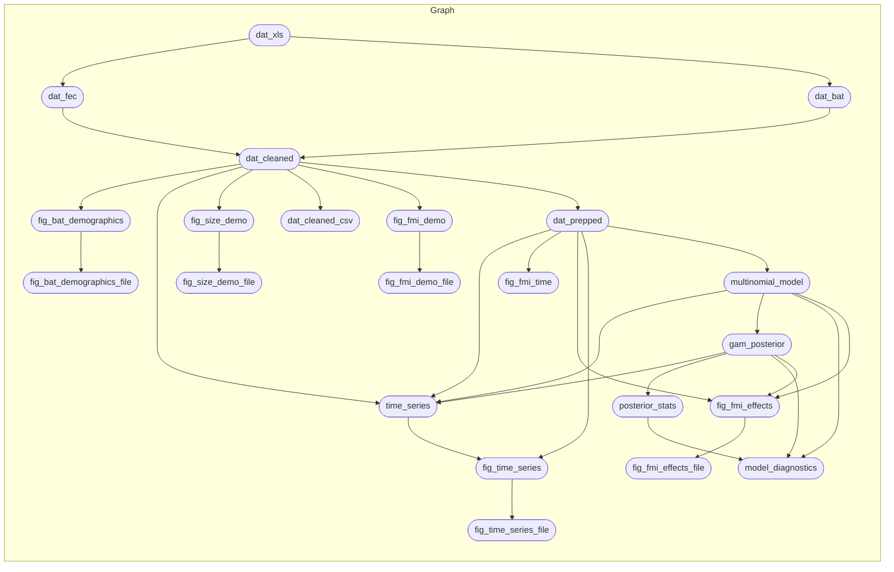

<!-- README.md is generated from README.Rmd. Please edit that file -->

# sabrenet-rousettus-dynamics

[-MIT-green.svg)](https://opensource.org/licenses/MIT)
[-CC0_1.0-lightgrey.svg)](http://creativecommons.org/publicdomain/zero/1.0/)
[-CC_BY_4.0-blue.svg)](http://creativecommons.org/publicdomain/zero/1.0/)

This repository contains data and R code which are supplements to:

*Viral maintenance and excretion dynamics of coronaviruses within an
Egyptian rousette fruit bat colony- considerations for spillover*, by
Geldenhuys et al. (2022)

Please cite that paper, and/or the Zenodo data reference
(<a href="https://doi.org/######" class="uri">https://doi.org/######</a>)
when using data or referring to this study.

## Repository Structure and Reproducibility

-   `data/` contains data from the study and a data dictionary
    describing all variables.
-   `R/` contains functions used in this analysis.
-   `reports/` contains literate code for R Markdown reports generated
    in the analysis
-   `outputs/` contains compiled reports and figures.
-   This project uses the
    [{targets}](https://wlandau.github.io/targets-manual/) framework to
    organize build steps for analysis pipeline. The steps are defined in
    the `_targets.R` file and the workflow can be executed by running
    `run.R` via `source("run.R")` in your R terminal or `Rscript run.R`
    in your system shell. The schematic figure below summarizes the
    steps. (The figure is generated using `mermaid.js` syntax and should
    display as a graph on GitHub. It can also be viewed by pasting the
    code into <https://mermaid.live>.)

-   This project requires R version 4.2.0 (2022-04-22). This project
    uses the [{renv}](https://rstudio.github.io/renv/) framework to
    record R package dependencies and versions. Packages and versions
    used are recorded in `renv.lock` and code used to manage
    dependencies is in `renv/` and other files in the root project
    directory. On starting an R session in the working directory, run
    `renv::restore()` to install R package dependencies.
