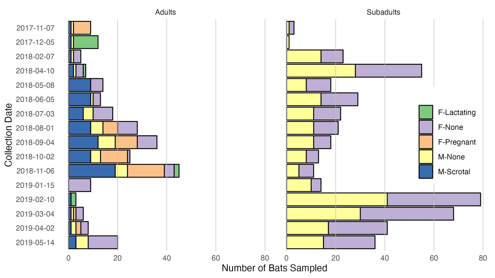
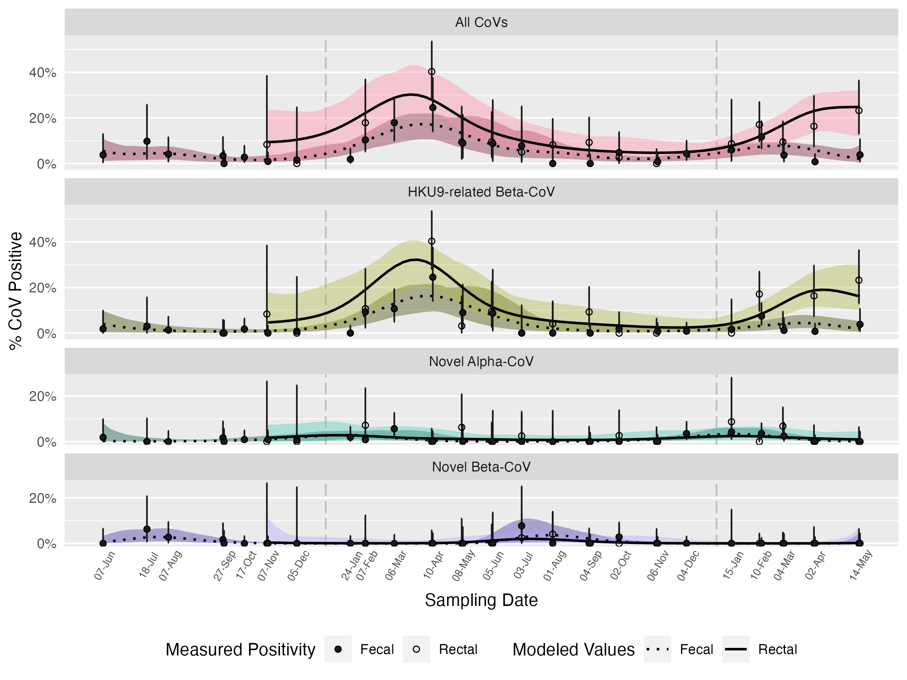

# Summarized Quantities

Here we extract all quantities reported in the text of the paper. Click
to expand

| Quantity   | Value |
|:-----------|------:|
| A quantity |     1 |

# Figures

## fig_bat_demographics.png

## fig_fmi_demo.png

## fig_fmi_effects.png

## fig_size_demo.png

## fig_time_series.png

