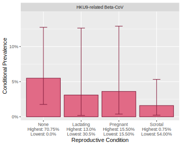
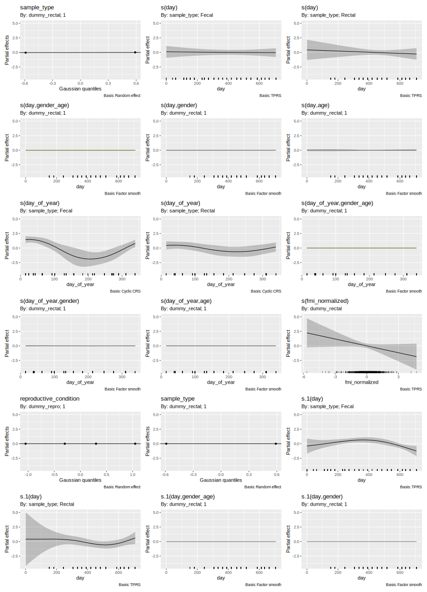
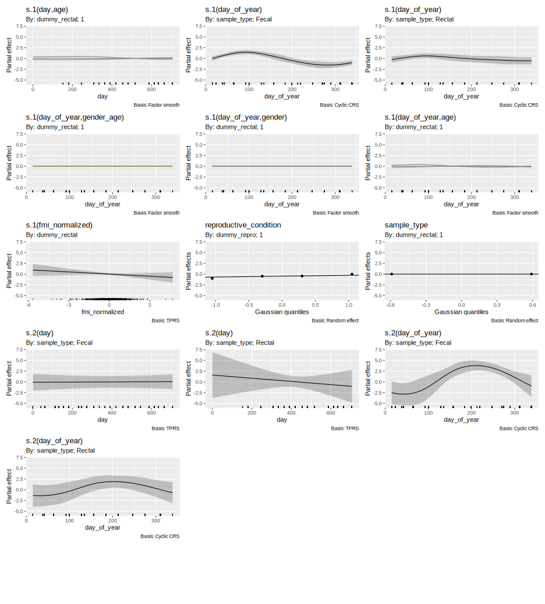

# Calculated Prevalences

## Raw

Prevalences calculated as a % of number of samples collected, with
corrected values for fecal samples

| sample_type | calcuation_type | virus                 | positives |   n | mean  | lower  | upper | mean_corrected | lower_corrected | upper_corrected |
|:------------|:----------------|:----------------------|----------:|----:|:------|:-------|:------|:---------------|:----------------|:----------------|
| Fecal       | raw             | All CoVs              |       106 | 720 | 14.7% | 12.2%  | 17.5% | 5.17%          | 4.25%           | 6.2%            |
| Fecal       | raw             | Novel Alpha-CoV       |        29 | 720 | 4.0%  | 2.7%   | 5.7%  | 1.36%          | 0.91%           | 1.9%            |
| Fecal       | raw             | HKU9-related Beta-CoV |        67 | 720 | 9.3%  | 7.3%   | 11.7% | 3.20%          | 2.49%           | 4.0%            |
| Fecal       | raw             | Novel Beta-CoV        |        10 | 720 | 1.4%  | 0.7%   | 2.5%  | 0.46%          | 0.22%           | 0.9%            |
| Rectal      | raw             | All CoVs              |        94 | 710 | 13.2% | 10.83% | 16.0% | NA             | NA              | NA              |
| Rectal      | raw             | Novel Alpha-CoV       |        13 | 710 | 1.8%  | 0.98%  | 3.1%  | NA             | NA              | NA              |
| Rectal      | raw             | HKU9-related Beta-CoV |        78 | 710 | 11.0% | 8.78%  | 13.5% | NA             | NA              | NA              |
| Rectal      | raw             | Novel Beta-CoV        |         3 | 710 | 0.4%  | 0.09%  | 1.2%  | NA             | NA              | NA              |

## Modeled

Prevalances calculated as baseline (intercept) probability of infection
of single samples from the Generalized Additive model, conditional on
mean bat and environment variables.

| virus                 | sample_type | mean | lower | upper | calculation_type | mean_corrected | lower_corrected | upper_corrected |
|:----------------------|:------------|:-----|:------|:------|:-----------------|:---------------|:----------------|:----------------|
| All CoVs              | Fecal       | 9.6% | 7.3%  | 11.9% | modeled          | 3.3%           | 2.5%            | 4.1%            |
| HKU9-related Beta-CoV | Fecal       | 1.7% | 1.0%  | 2.6%  | modeled          | 0.6%           | 0.3%            | 0.9%            |
| Novel Alpha-CoV       | Fecal       | 7.7% | 5.7%  | 9.7%  | modeled          | 2.6%           | 1.9%            | 3.3%            |
| Novel Beta-CoV        | Fecal       | 0.2% | 0.0%  | 0.4%  | modeled          | 0.0%           | 0.0%            | 0.1%            |
| All CoVs              | Rectal      | 9.6% | 7.4%  | 11.9% | modeled          | NA             | NA              | NA              |
| HKU9-related Beta-CoV | Rectal      | 1.7% | 1.0%  | 2.6%  | modeled          | NA             | NA              | NA              |
| Novel Alpha-CoV       | Rectal      | 7.7% | 5.7%  | 9.6%  | modeled          | NA             | NA              | NA              |
| Novel Beta-CoV        | Rectal      | 0.2% | 0.0%  | 0.4%  | modeled          | NA             | NA              | NA              |

## Tables

## Body Condition and Prevalence by demographic group

| Subgroup                                  | FMI (kg/m^2)            | Mass (g)             | Forearm (mm)            | CoV Prevalance      |
|:------------------------------------------|:------------------------|:---------------------|:------------------------|:--------------------|
| All Sampled Bats                          | 12.3, 12, (5.72-20.3)   | 95.2, 87, (45-179)   | 87.4, 86.6, (71.1-101)  | 13.2% (10.8%-16.0%) |
| Adults                                    | 13.6, 13.4, (5.72-20.3) | 119, 120, (51-179)   | 93.5, 93.2, (88.6-101)  | 6.6% (3.9%-10.3%)   |
| Subadults                                 | 11.6, 11.6, (5.88-16.7) | 81.7, 81.5, (45-127) | 84, 84, (71.1-88.8)     | 17.0% (13.7%-20.8%) |
| Subadults, Females                        | 11.5, 11.4, (6.82-16.7) | 80.8, 80, (51-127)   | 83.8, 83.6, (71.1-88.8) | 16.7% (12.1%-22.2%) |
| Subadults, Males                          | 11.6, 11.7, (5.88-14.6) | 82.7, 83, (45-114)   | 84.2, 84.5, (71.3-88.8) | 17.3% (12.6%-22.9%) |
| Adults, Not Pregrant or Lactating Females | 11.7, 12.1, (6.51-14.7) | 101, 102, (53-134)   | 92.6, 92.2, (89-99.1)   | 14.3% (7.1%-24.7%)  |
| Adults, Lactating Females                 | 16.9, 16.8, (13.1-20.3) | 147, 147, (121-179)  | 93.4, 93, (89.5-98.2)   | 0.0% (0.0%-21.8%)   |
| Adults, Pregnant Females                  | 14.7, 14.2, (8.71-19.2) | 129, 126, (74-175)   | 93.5, 93.6, (88.6-101)  | 5.9% (1.2%-16.2%)   |
| Adults, Nonscrotal Males                  | 12, 12, (7.23-15.7)     | 101, 98.5, (69-153)  | 91.6, 91, (89-99.1)     | 5.3% (0.6%-17.7%)   |
| Adults, Scrotal Males                     | 14.5, 14.5, (5.72-17.8) | 131, 133, (51-164)   | 95, 94.9, (89.9-101)    | 2.4% (0.3%-8.3%)    |

# Figures

## outputs/fig_bat_demographics.svg

## outputs/fig_fmi_demo.svg

## outputs/fig_time_series.svg

## outputs/fig_fmi_demo_timeseries.svg

## outputs/fig_pos_demo_timeseries.svg

## outputs/fig_fmi_demo_effects.svg

## outputs/fig_repro_effects.svg

## outputs/fig_fa_cutoffs.svg

## Partial Effect plots

