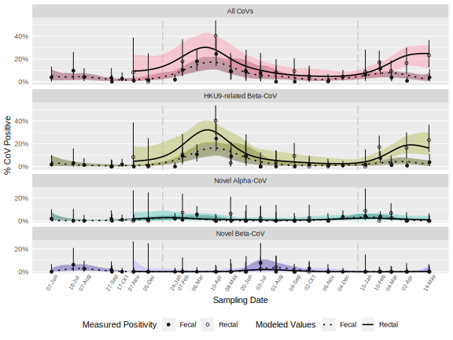
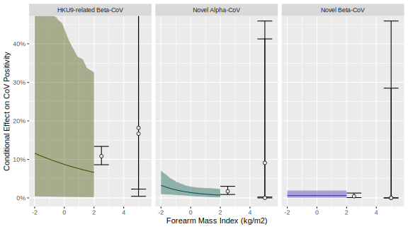

# Summarized Quantities

Here we extract all quantities reported in the text of the paper. Click
to expand

| Quantity   | Value |
|:-----------|------:|
| A quantity |     1 |

# Figures

## outputs/fig_bat_demographics.svg

## outputs/fig_fmi_demo.svg

## outputs/fig_time_series.svg

## outputs/fig_fmi_demo_timeseries.svg

## outputs/fig_pos_demo_timeseries.svg

## outputs/fig_fmi_effects.svg

## outputs/fig_fmi_demo_effects.svg

