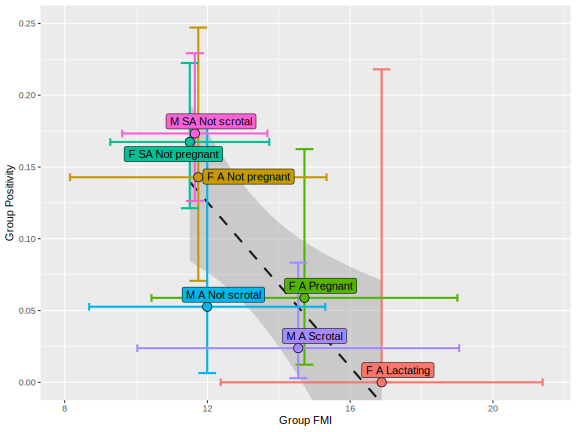

# Calculated Prevalences

## Raw

Prevalences calculated as a % of number of samples collected, with
corrected values for fecal samples

| sample_type | calcuation_type | virus                 | positives |   n | mean  | lower  | upper | mean_corrected | lower_corrected | upper_corrected |
|:------------|:----------------|:----------------------|----------:|----:|:------|:-------|:------|:---------------|:----------------|:----------------|
| Fecal       | raw             | All CoVs              |       106 | 720 | 14.7% | 12.2%  | 17.5% | 5.17%          | 4.25%           | 6.2%            |
| Fecal       | raw             | Novel Alpha-Cov       |        29 | 720 | 4.0%  | 2.7%   | 5.7%  | 1.36%          | 0.91%           | 1.9%            |
| Fecal       | raw             | HKU9-related Beta-CoV |        67 | 720 | 9.3%  | 7.3%   | 11.7% | 3.20%          | 2.49%           | 4.0%            |
| Fecal       | raw             | Novel Beta-CoV        |        10 | 720 | 1.4%  | 0.7%   | 2.5%  | 0.46%          | 0.22%           | 0.9%            |
| Rectal      | raw             | All CoVs              |        94 | 710 | 13.2% | 10.83% | 16.0% | NA             | NA              | NA              |
| Rectal      | raw             | Novel Alpha-Cov       |        13 | 710 | 1.8%  | 0.98%  | 3.1%  | NA             | NA              | NA              |
| Rectal      | raw             | HKU9-related Beta-CoV |        78 | 710 | 11.0% | 8.78%  | 13.5% | NA             | NA              | NA              |
| Rectal      | raw             | Novel Beta-CoV        |         3 | 710 | 0.4%  | 0.09%  | 1.2%  | NA             | NA              | NA              |

## Modeled

Prevalances calculated as baseline (intercept) probability of infection
of single samples from the Generalized Additive model, conditional on
mean bat and environment variables.

| virus                 | sample_type | mean | lower | upper | calculation_type | mean_corrected | lower_corrected | upper_corrected |
|:----------------------|:------------|:-----|:------|:------|:-----------------|:---------------|:----------------|:----------------|
| All CoVs              | Fecal       | 9.1% | 4.4%  | 15.0% | modeled          | 3.1%           | 1.5%            | 5.2%            |
| HKU9-related Beta-CoV | Fecal       | 6.2% | 1.8%  | 10.7% | modeled          | 2.1%           | 0.6%            | 3.6%            |
| Novel Alpha-Cov       | Fecal       | 2.9% | 0.9%  | 5.2%  | modeled          | 1.0%           | 0.3%            | 1.8%            |
| Novel Beta-CoV        | Fecal       | 0.1% | 0.0%  | 0.3%  | modeled          | 0.0%           | 0.0%            | 0.1%            |
| All CoVs              | Rectal      | 9.1% | 4.4%  | 15.0% | modeled          | NA             | NA              | NA              |
| HKU9-related Beta-CoV | Rectal      | 6.2% | 1.8%  | 10.6% | modeled          | NA             | NA              | NA              |
| Novel Alpha-Cov       | Rectal      | 2.9% | 0.9%  | 5.2%  | modeled          | NA             | NA              | NA              |
| Novel Beta-CoV        | Rectal      | 0.1% | 0.0%  | 0.3%  | modeled          | NA             | NA              | NA              |

# Figures

## outputs/fig_bat_demographics.svg

## outputs/fig_fmi_demo.svg

## outputs/fig_time_series.svg

## outputs/fig_fmi_demo_timeseries.svg

## outputs/fig_pos_demo_timeseries.svg

## outputs/fig_fmi_effects.svg

## outputs/fig_fmi_demo_effects.svg

