<style type="text/css">
.main-container {
  max-width: 1800px !important;
  margin-left: auto;
  margin-right: auto;
}
</style>

This document summarizes model diagnostics and checks.

First, we set up by loading packages and generated R objects.


```r
knitr::opts_chunk$set(echo = TRUE)
library(targets)
library(mgcv)
library(gt)
options(width = 250)
```


```r
tar_load(c(
  multinomial_model,
  multinomial_model_alt,
  gam_posterior,
  posterior_stats,
  dat_prepped
))
```

## Model Summary


```r
summary(multinomial_model)
```

```
## 
## Family: multinom 
## Link function: 
## 
## Formula:
## outcome ~ s(sample_type, bs = "re", by = dummy_rectal) + s(day, 
##     bs = "tp", k = 5, by = sample_type, m = 2) + s(day, gender_age, 
##     bs = "fs", k = 5, xt = list(bs = "tp"), by = dummy_rectal, 
##     m = 1) + s(day_of_year, bs = "cc", by = sample_type, k = 5, 
##     m = 2) + s(day_of_year, gender_age, bs = "fs", xt = list(bs = "cc"), 
##     k = 5, by = dummy_rectal, m = 1) + s(fmi_normalized, k = 5, 
##     bs = "tp", by = dummy_rectal) + s(reproductive_condition, 
##     bs = "re", by = dummy_repro)
## <environment: 0x7fac6c81cc48>
## ~s(sample_type, bs = "re", by = dummy_rectal) + s(day, bs = "tp", 
##     k = 5, by = sample_type, m = 2) + s(day, gender_age, bs = "fs", 
##     k = 5, xt = list(bs = "tp"), by = dummy_rectal, m = 1) + 
##     s(day_of_year, bs = "cc", by = sample_type, k = 5, m = 2) + 
##     s(day_of_year, gender_age, bs = "fs", xt = list(bs = "cc"), 
##         k = 5, by = dummy_rectal, m = 1) + s(fmi_normalized, 
##     k = 5, bs = "tp", by = dummy_rectal) + s(reproductive_condition, 
##     bs = "re", by = dummy_repro)
## <environment: 0x7fac6c81cc48>
## ~s(sample_type, bs = "re", by = dummy_rectal) + s(day, bs = "tp", 
##     k = 5, by = sample_type, m = 2) + s(day_of_year, bs = "cc", 
##     by = sample_type, k = 5, m = 2)
## <environment: 0x7fac6c81cc48>
## 
## Parametric coefficients:
##               Estimate Std. Error z value Pr(>|z|)    
## (Intercept)    -3.8526     0.2441 -15.784   <2e-16 ***
## (Intercept).1  -2.4051     0.1467 -16.391   <2e-16 ***
## (Intercept).2  -6.0192     0.6724  -8.953   <2e-16 ***
## ---
## Signif. codes:  0 '***' 0.001 '**' 0.01 '*' 0.05 '.' 0.1 ' ' 1
## 
## Approximate significance of smooth terms:
##                                                 edf Ref.df Chi.sq  p-value    
## s(sample_type):dummy_rectal1              1.807e-04  1.000  0.000 0.515589    
## s(day):sample_typeFecal                   2.574e+00  2.885  4.874 0.173261    
## s(day):sample_typeRectal                  1.000e+00  1.000  0.161 0.688685    
## s(day,gender_age):dummy_rectal1           1.219e-04 22.000  0.000 0.905557    
## s(day_of_year):sample_typeFecal           2.247e+00  3.000 24.721 7.52e-07 ***
## s(day_of_year):sample_typeRectal          1.351e+00  3.000  3.923 0.048421 *  
## s(day_of_year,gender_age):dummy_rectal1   1.902e-04 16.000  0.000 0.900047    
## s(fmi_normalized):dummy_rectal1           1.000e+00  1.000  3.184 0.074388 .  
## s(reproductive_condition):dummy_repro1    1.019e-04  3.000  0.000 0.911317    
## s.1(sample_type):dummy_rectal1            7.222e-05  1.000  0.000 0.458759    
## s.1(day):sample_typeFecal                 2.339e+00  2.689 13.628 0.001508 ** 
## s.1(day):sample_typeRectal                2.629e+00  2.873  6.911 0.055820 .  
## s.1(day,gender_age):dummy_rectal1         2.112e-04 20.000  0.000 0.866381    
## s.1(day_of_year):sample_typeFecal         2.412e+00  3.000 38.195  < 2e-16 ***
## s.1(day_of_year):sample_typeRectal        2.074e+00  3.000  9.862 0.000529 ***
## s.1(day_of_year,gender_age):dummy_rectal1 5.080e-04 16.000  0.000 0.802830    
## s.1(fmi_normalized):dummy_rectal1         1.000e+00  1.000  1.927 0.165134    
## s.1(reproductive_condition):dummy_repro1  1.833e+00  3.000  5.754 0.025429 *  
## s.2(sample_type):dummy_rectal1            1.475e-05  1.000  0.000 0.758139    
## s.2(day):sample_typeFecal                 1.000e+00  1.000  0.009 0.923636    
## s.2(day):sample_typeRectal                1.000e+00  1.000  0.344 0.557249    
## s.2(day_of_year):sample_typeFecal         2.073e+00  3.000 18.059 4.35e-05 ***
## s.2(day_of_year):sample_typeRectal        1.478e+00  3.000  4.624 0.036269 *  
## ---
## Signif. codes:  0 '***' 0.001 '**' 0.01 '*' 0.05 '.' 0.1 ' ' 1
## 
## Deviance explained = 14.6%
## -REML = -571.32  Scale est. = 1         n = 1430
```

### Alterate Model Summary

This is an alternate model fomulation with simple singel random effects of age/sex category
rather than time-varying ones.  This is used to check if there age/sex effects are
just insignificant because of the high complexity of the time-varying smooths.


```r
summary(multinomial_model_alt)
```

```
## 
## Family: multinom 
## Link function: 
## 
## Formula:
## outcome ~ s(sample_type, bs = "re", by = dummy_rectal) + s(day, 
##     bs = "tp", k = 5, by = sample_type, m = 2) + s(day_of_year, 
##     bs = "cc", by = sample_type, k = 5, m = 2) + s(gender_age, 
##     bs = "re", by = dummy_rectal) + s(fmi_normalized, k = 5, 
##     bs = "tp", by = dummy_rectal) + s(reproductive_condition, 
##     bs = "re", by = dummy_repro)
## <environment: 0x7fac6c39c2f8>
## ~s(sample_type, bs = "re", by = dummy_rectal) + s(day, bs = "tp", 
##     k = 5, by = sample_type, m = 2) + s(day_of_year, bs = "cc", 
##     by = sample_type, k = 5, m = 2) + s(gender_age, bs = "re", 
##     by = dummy_rectal) + s(fmi_normalized, k = 5, bs = "tp", 
##     by = dummy_rectal) + s(reproductive_condition, bs = "re", 
##     by = dummy_repro)
## <environment: 0x7fac6c39c2f8>
## ~s(sample_type, bs = "re", by = dummy_rectal) + s(day, bs = "tp", 
##     k = 5, by = sample_type, m = 2) + s(day_of_year, bs = "cc", 
##     by = sample_type, k = 5, m = 2)
## <environment: 0x7fac6c39c2f8>
## 
## Parametric coefficients:
##               Estimate Std. Error z value Pr(>|z|)    
## (Intercept)    -3.8528     0.2441 -15.782   <2e-16 ***
## (Intercept).1  -2.4051     0.1467 -16.391   <2e-16 ***
## (Intercept).2  -6.0192     0.6724  -8.953   <2e-16 ***
## ---
## Signif. codes:  0 '***' 0.001 '**' 0.01 '*' 0.05 '.' 0.1 ' ' 1
## 
## Approximate significance of smooth terms:
##                                                edf Ref.df Chi.sq  p-value    
## s(sample_type):dummy_rectal1             2.109e-04  2.000  0.000 0.516073    
## s(day):sample_typeFecal                  2.575e+00  2.886  4.878 0.172907    
## s(day):sample_typeRectal                 1.000e+00  1.000  0.160 0.688800    
## s(day_of_year):sample_typeFecal          2.247e+00  3.000 24.725 7.50e-07 ***
## s(day_of_year):sample_typeRectal         1.351e+00  3.000  3.923 0.048417 *  
## s(gender_age):dummy_rectal1              1.742e-04  4.000  0.000 0.976698    
## s(fmi_normalized):dummy_rectal1          1.000e+00  1.000  3.184 0.074371 .  
## s(reproductive_condition):dummy_repro1   9.877e-05  3.000  0.000 0.911349    
## s.1(sample_type):dummy_rectal1           2.896e-04  1.000  0.000 0.458759    
## s.1(day):sample_typeFecal                2.339e+00  2.689 13.628 0.001508 ** 
## s.1(day):sample_typeRectal               2.629e+00  2.873  6.909 0.055847 .  
## s.1(day_of_year):sample_typeFecal        2.412e+00  3.000 38.196  < 2e-16 ***
## s.1(day_of_year):sample_typeRectal       2.075e+00  3.000  9.863 0.000529 ***
## s.1(gender_age):dummy_rectal1            7.434e-04  4.000  0.000 0.659272    
## s.1(fmi_normalized):dummy_rectal1        1.000e+00  1.000  1.927 0.165131    
## s.1(reproductive_condition):dummy_repro1 1.833e+00  3.000  5.754 0.025432 *  
## s.2(sample_type):dummy_rectal1           1.858e-05  1.000  0.000 0.758138    
## s.2(day):sample_typeFecal                1.000e+00  1.000  0.009 0.923646    
## s.2(day):sample_typeRectal               1.000e+00  1.000  0.345 0.557247    
## s.2(day_of_year):sample_typeFecal        2.073e+00  3.000 18.059 4.35e-05 ***
## s.2(day_of_year):sample_typeRectal       1.478e+00  3.000  4.624 0.036270 *  
## ---
## Signif. codes:  0 '***' 0.001 '**' 0.01 '*' 0.05 '.' 0.1 ' ' 1
## 
## Deviance explained = 14.6%
## -REML = -571.32  Scale est. = 1         n = 1430
```

## GAM Checks

`gam.check()` provides convergence diagnostics. Basis dimension (k) results should all be above 0.05 to indicate
that there are not systematic patterns in the model residuals.  Four diagnostic
plot are provided. In the first (Q-Q) plot, we should see residuals and quantiles
line up on the 1-1 line.  Other plots are difficult to interpret in the multinomial
case. 


```r
gam.check(multinomial_model)
```

<!-- -->

```
## 
## Method: REML   Optimizer: efs
## $iter
## [1] 51
## 
## $score.hist
##  [1] -544.2658 -557.4188 -562.9083 -565.1258 -566.6785 -567.9323 -568.8746 -569.5572 -570.0543 -570.4158 -570.6714 -570.8419 -570.9473 -571.0080 -571.0413 -571.0592 -571.0687 -571.0738 -571.0768 -571.0786 -571.0799 -571.0811 -571.0822 -571.0835
## [25] -571.0850 -571.0868 -571.0888 -571.0913 -571.0942 -571.0977 -571.1019 -571.1070 -571.1131 -571.1206 -571.1296 -571.1405 -571.1536 -571.1693 -571.1874 -571.2077 -571.2293 -571.2507 -571.2699 -571.2855 -571.2971 -571.3049 -571.3098 -571.3127
## [49] -571.3144 -571.3152 -571.3160
## 
## $conv
## [1] "full convergence"
## 
## Model rank =  157 / 157 
## 
## Basis dimension (k) checking results. Low p-value (k-index<1) may
## indicate that k is too low, especially if edf is close to k'.
## 
##                                                 k'      edf k-index p-value
## s(sample_type):dummy_rectal1              2.00e+00 1.81e-04      NA      NA
## s(day):sample_typeFecal                   4.00e+00 2.57e+00    0.95    0.15
## s(day):sample_typeRectal                  4.00e+00 1.00e+00    0.95    0.25
## s(day,gender_age):dummy_rectal1           2.50e+01 1.22e-04    0.95    0.14
## s(day_of_year):sample_typeFecal           3.00e+00 2.25e+00    0.95    0.21
## s(day_of_year):sample_typeRectal          3.00e+00 1.35e+00    0.95    0.18
## s(day_of_year,gender_age):dummy_rectal1   2.00e+01 1.90e-04    0.95    0.20
## s(fmi_normalized):dummy_rectal1           4.00e+00 1.00e+00    0.97    0.39
## s(reproductive_condition):dummy_repro1    4.00e+00 1.02e-04      NA      NA
## s.1(sample_type):dummy_rectal1            2.00e+00 7.22e-05      NA      NA
## s.1(day):sample_typeFecal                 4.00e+00 2.34e+00    0.95    0.22
## s.1(day):sample_typeRectal                4.00e+00 2.63e+00    0.95    0.18
## s.1(day,gender_age):dummy_rectal1         2.50e+01 2.11e-04    0.95    0.21
## s.1(day_of_year):sample_typeFecal         3.00e+00 2.41e+00    0.95    0.18
## s.1(day_of_year):sample_typeRectal        3.00e+00 2.07e+00    0.95    0.21
## s.1(day_of_year,gender_age):dummy_rectal1 2.00e+01 5.08e-04    0.95    0.21
## s.1(fmi_normalized):dummy_rectal1         4.00e+00 1.00e+00    0.97    0.43
## s.1(reproductive_condition):dummy_repro1  4.00e+00 1.83e+00      NA      NA
## s.2(sample_type):dummy_rectal1            2.00e+00 1.48e-05      NA      NA
## s.2(day):sample_typeFecal                 4.00e+00 1.00e+00    0.95    0.16
## s.2(day):sample_typeRectal                4.00e+00 1.00e+00    0.95    0.15
## s.2(day_of_year):sample_typeFecal         3.00e+00 2.07e+00    0.95    0.24
## s.2(day_of_year):sample_typeRectal        3.00e+00 1.48e+00    0.95    0.20
```

## Individual Smooth terms

These are plots of the indivudal smooths in the model on the linear scale.
Inspect for strange behavior and check that their shape corresponds with
significance terms in in the model summary.


```r
for (i in seq_len(length(multinomial_model$smooth) + sum(multinomial_model$nsdf) - 3)) {
  plot(multinomial_model, scale = 0, select = i, all.terms = TRUE)
}
```

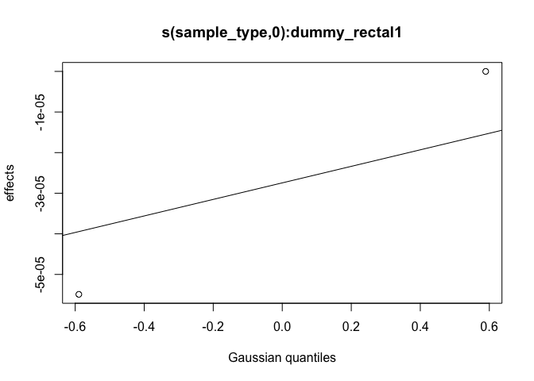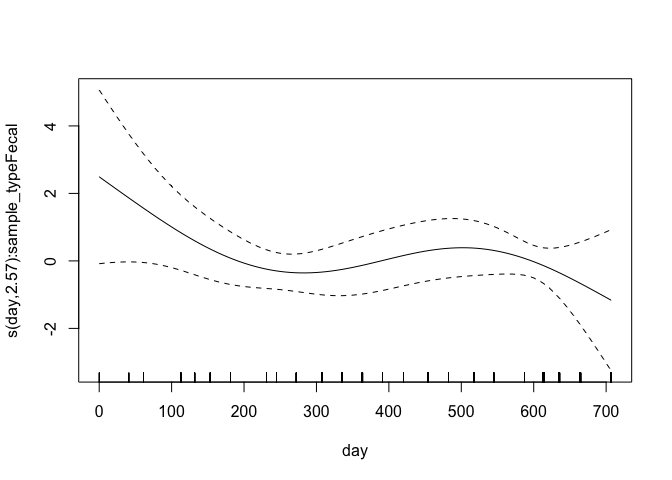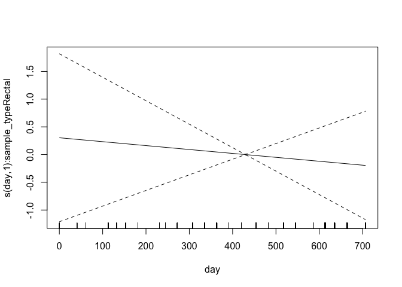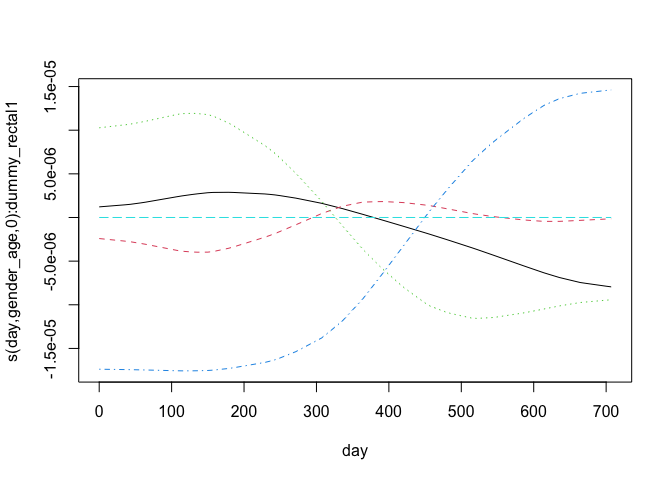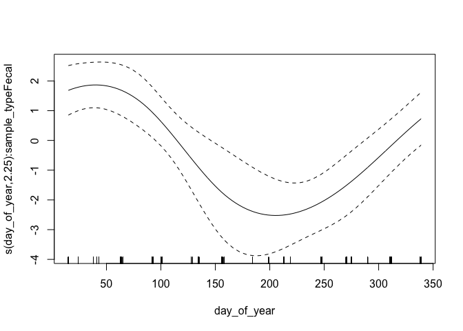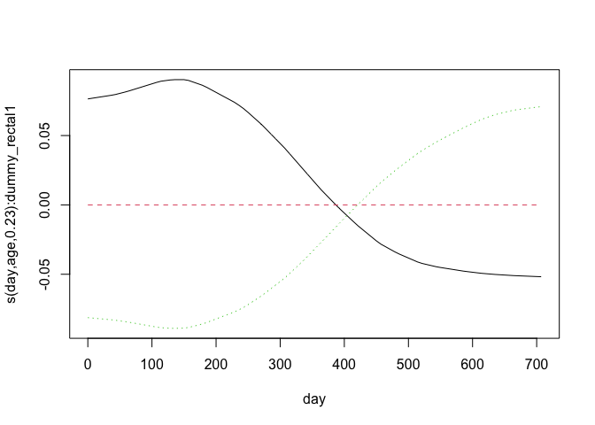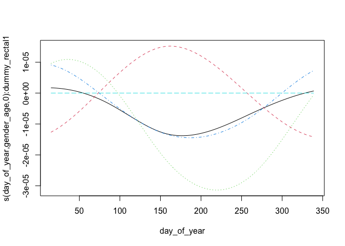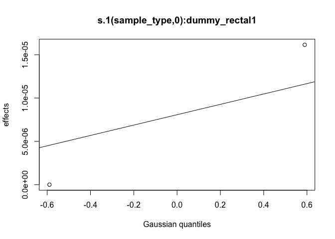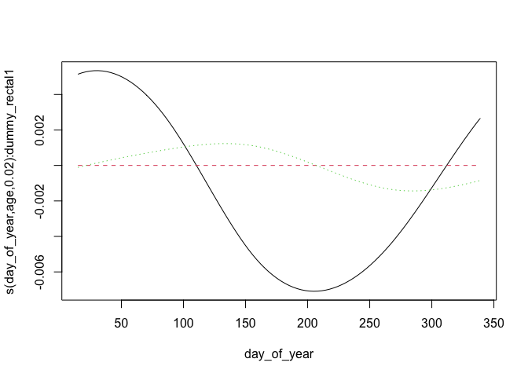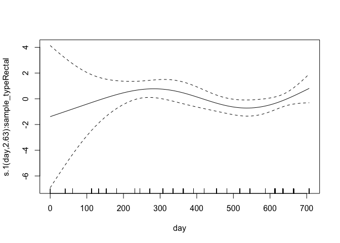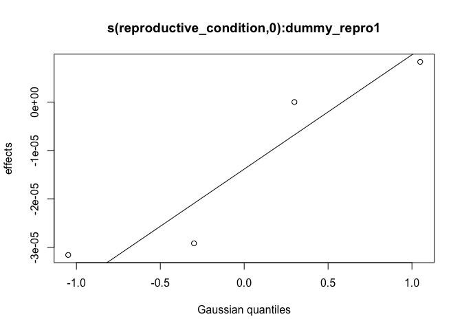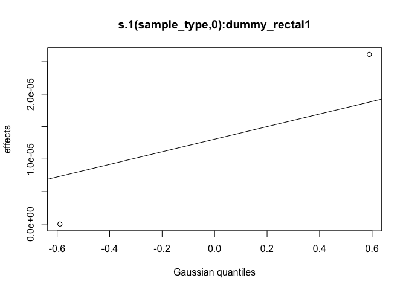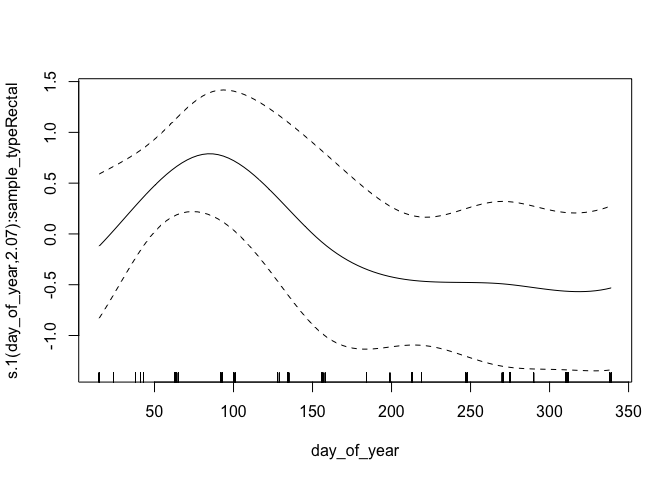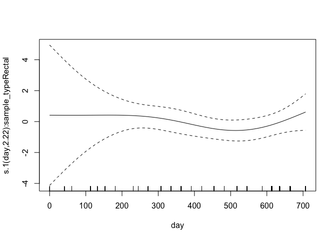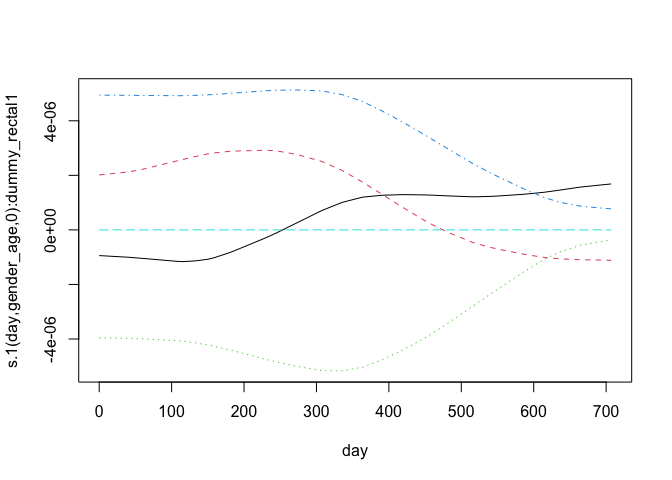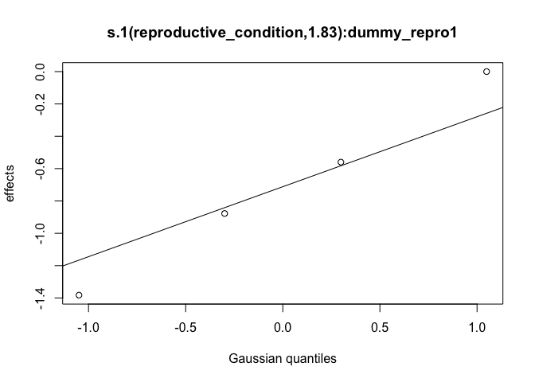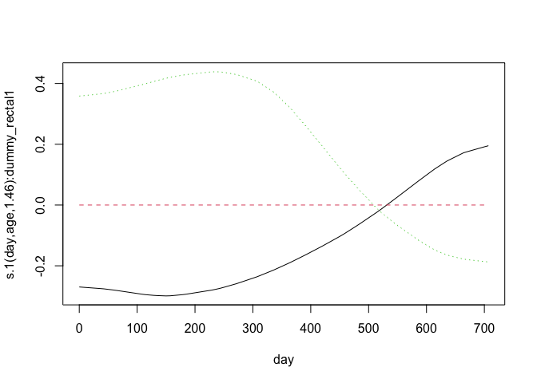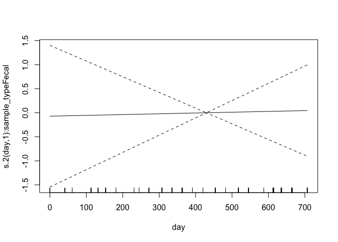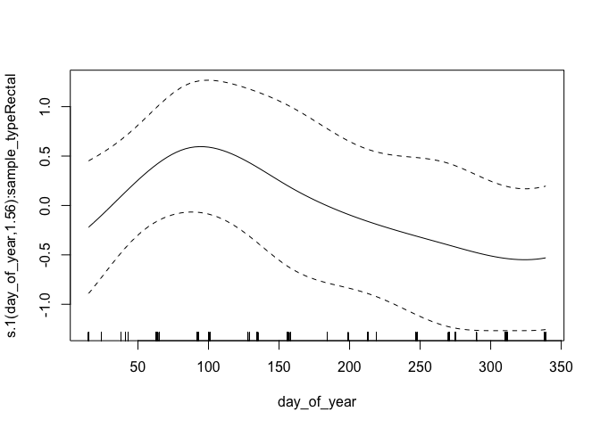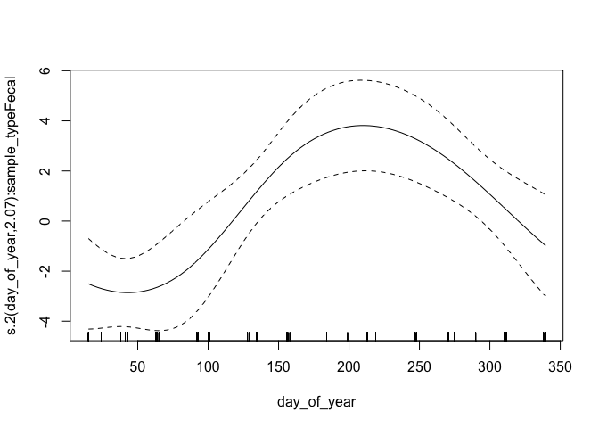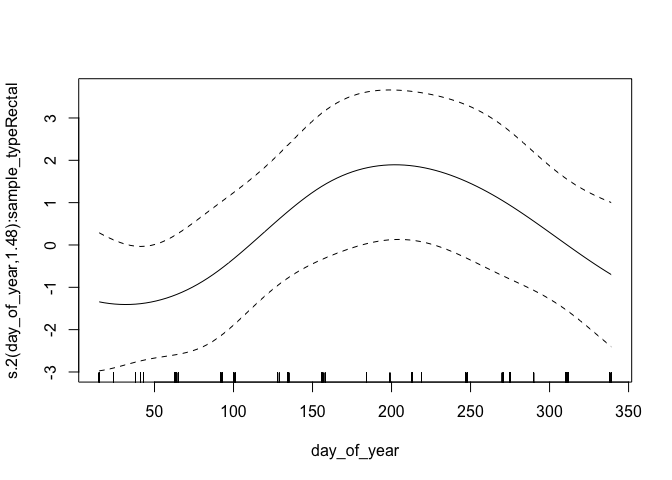

## MCMC diagnostics

These are acceptance ratios from the 4 MCMC chains
run.  

From `?gam.mh`:

> The function reports the acceptance rate of the two types of step. If the 
> random walk acceptance probability (`$rw.accept`) is higher than a quarter then `rw.step` 
> should probably be increased. Similarly if the acceptance rate (`$accept`) is too low,
> it should be decreased. The random walk steps can be turned off altogether
> (see above), but it is important to check the chains for stuck sections if
> this is done.


```r
attributes(gam_posterior)[c("accept", "rw.accept")]
```

```
## $accept
## [1] 0.15905 0.16605 0.17300 0.18320
## 
## $rw.accept
## [1] 0.16190 0.16190 0.16505 0.16145
```

Here is a summary of the dimensions of the MCMC chain output

```r
tibble::tibble(
  dimension = names(dimnames(gam_posterior)),
  value = dim(gam_posterior)
)
```

```
## # A tibble: 3 × 2
##   dimension value
##   <chr>     <int>
## 1 Iteration   100
## 2 Chain         4
## 3 Parameter   157
```


Here are Stan-type per-parameter chain diagnostics.  `Rhat` should be at or near
1 to indicate that the multiple MCMC chains are well-mixed.  `ess_bulk` and 
`ess_tail` are the effective sample sizes for posterior samples from the parameter
distributions and the tails of those distributions, respectively. From the Stan
manual:

> We recommend running at least four chains by default and only using the sample
> if R-hat is less than 1.05....
>
> Both bulk-ESS and tail-ESS should be at least 100 (approximately) per
> Markov Chain in order to be reliable and indicate that estimates of respective
> posterior quantiles are reliable

Note that for coefficient values < 1e-6, mixing isn't very relevant.


```r
options(scipen=12)
posterior_stats |> 
  mutate(across(c("ess_bulk", "ess_tail"), round)) |> 
  mutate(across(2:7, \(x) signif(x, 2))) |> 
  mutate(rhat = signif(rhat, 3)) |> 
  mutate(across(2:8, \(x) gt:::align_to_char(as.character(x)))) |> 
  knitr::kable(format.args = list(scientific = FALSE))
```


|variable                                     |mean        |median     |sd      |mad     |q5       |q95     |rhat  | ess_bulk| ess_tail|
|:--------------------------------------------|:-----------|:----------|:-------|:-------|:--------|:-------|:-----|--------:|--------:|
|(Intercept)                                  |-4          |-4         |0.25    |0.24    |-4.4     |-3.6    |1.01  |      407|      304|
|s(sample_type):dummy_rectal1.1               |-0.00011    |-0.00032   |0.007   |0.0066  |-0.012   | 0.011  |1     |      385|      348|
|s(sample_type):dummy_rectal1.2               |-0.00019    |-0.00067   |0.0067  |0.0069  |-0.011   | 0.011  |0.997 |      375|      412|
|s(day):sample_typeFecal.1                    | 2.2        | 2.2       |1.1     |1.2     | 0.23    | 3.9    |1     |      408|      369|
|s(day):sample_typeFecal.2                    | 0.46       | 0.41      |2.9     |3.1     |-4.2     | 5.2    |0.996 |      362|      413|
|s(day):sample_typeFecal.3                    |-0.92       |-1         |3.7     |4       |-7       | 5      |0.998 |      362|      403|
|s(day):sample_typeFecal.4                    |-2.6        |-2.7       |1.3     |1.3     |-4.6     |-0.44   |1     |      401|      416|
|s(day):sample_typeRectal.1                   |-0.0002     |-0.00033   |0.0035  |0.0038  |-0.0061  | 0.0052 |0.999 |      392|      336|
|s(day):sample_typeRectal.2                   | 0.000094   | 0.00032   |0.0056  |0.0057  |-0.009   | 0.0084 |1.01  |      422|      334|
|s(day):sample_typeRectal.3                   | 0.00034    | 0.00061   |0.01    |0.01    |-0.017   | 0.017  |1     |      399|      413|
|s(day):sample_typeRectal.4                   |-0.1        |-0.13      |0.35    |0.34    |-0.66    | 0.48   |1     |      423|      392|
|s(day,gender_age):dummy_rectal1.1            |-0.0000069  | 0.0000071 |0.0015  |0.0016  |-0.0026  | 0.0025 |1.01  |      423|      439|
|s(day,gender_age):dummy_rectal1.2            | 0.000056   | 0.000079  |0.0016  |0.0015  |-0.0026  | 0.0026 |0.998 |      456|      414|
|s(day,gender_age):dummy_rectal1.3            | 0.00018    | 0.00034   |0.0016  |0.0016  |-0.0025  | 0.0027 |0.999 |      425|      414|
|s(day,gender_age):dummy_rectal1.4            |-0.000044   |-0.0001    |0.0015  |0.0015  |-0.0024  | 0.0024 |1     |      572|      370|
|s(day,gender_age):dummy_rectal1.5            | 0.000037   | 0.00012   |0.0021  |0.002   |-0.0035  | 0.0035 |1.01  |      412|      375|
|s(day,gender_age):dummy_rectal1.6            | 0.000058   | 0.00005   |0.0015  |0.0014  |-0.0025  | 0.0024 |1.01  |      362|      373|
|s(day,gender_age):dummy_rectal1.7            | 0.00011    | 0.00024   |0.0015  |0.0016  |-0.0024  | 0.0025 |0.999 |      414|      415|
|s(day,gender_age):dummy_rectal1.8            | 0.000049   | 0.000046  |0.0015  |0.0017  |-0.0025  | 0.0025 |0.997 |      415|      349|
|s(day,gender_age):dummy_rectal1.9            | 0.000036   | 0.000074  |0.0015  |0.0015  |-0.0026  | 0.0022 |1     |      353|      372|
|s(day,gender_age):dummy_rectal1.10           |-0.0000075  | 0.000034  |0.0021  |0.0023  |-0.0034  | 0.0034 |1.01  |      383|      461|
|s(day,gender_age):dummy_rectal1.11           | 0.000068   | 0.000036  |0.0015  |0.0015  |-0.0023  | 0.0025 |1.01  |      340|      374|
|s(day,gender_age):dummy_rectal1.12           | 0.000024   | 0.000013  |0.0015  |0.0015  |-0.0023  | 0.0025 |0.999 |      401|      373|
|s(day,gender_age):dummy_rectal1.13           | 0.000037   | 0.000041  |0.0017  |0.0017  |-0.0026  | 0.0028 |0.996 |      332|      406|
|s(day,gender_age):dummy_rectal1.14           | 0.000041   | 0.000072  |0.0015  |0.0015  |-0.0024  | 0.0025 |1     |      327|      282|
|s(day,gender_age):dummy_rectal1.15           | 0.000057   |-0.0001    |0.0021  |0.0021  |-0.0033  | 0.0035 |1     |      366|      373|
|s(day,gender_age):dummy_rectal1.16           |-0.000021   |-0.000013  |0.0015  |0.0014  |-0.0025  | 0.0024 |1.01  |      451|      297|
|s(day,gender_age):dummy_rectal1.17           | 0.000073   | 0.000034  |0.0016  |0.0016  |-0.0024  | 0.0027 |1     |      363|      446|
|s(day,gender_age):dummy_rectal1.18           |-0.000089   | 0.000041  |0.0015  |0.0014  |-0.0027  | 0.0021 |0.997 |      395|      375|
|s(day,gender_age):dummy_rectal1.19           | 0.0000071  | 0.000025  |0.0015  |0.0016  |-0.0024  | 0.0025 |1.01  |      432|      414|
|s(day,gender_age):dummy_rectal1.20           | 0.00019    | 0.000074  |0.0022  |0.0023  |-0.0033  | 0.004  |1     |      432|      414|
|s(day,gender_age):dummy_rectal1.21           | 0.000046   | 0.00015   |0.0015  |0.0015  |-0.0024  | 0.0022 |0.996 |      356|      447|
|s(day,gender_age):dummy_rectal1.22           | 0.000045   | 0.000081  |0.0015  |0.0015  |-0.0026  | 0.0024 |0.997 |      394|      394|
|s(day,gender_age):dummy_rectal1.23           | 0.00015    | 0.00016   |0.0016  |0.0017  |-0.0025  | 0.0026 |1.01  |      368|      361|
|s(day,gender_age):dummy_rectal1.24           | 0.000095   |-0.000024  |0.0016  |0.0017  |-0.0025  | 0.0028 |0.998 |      430|      372|
|s(day,gender_age):dummy_rectal1.25           | 0.000089   | 0.00012   |0.0022  |0.0022  |-0.0035  | 0.0038 |1.01  |      482|      371|
|s(day_of_year):sample_typeFecal.1            | 0.66       | 0.66      |0.53    |0.51    |-0.2     | 1.7    |1     |      403|      332|
|s(day_of_year):sample_typeFecal.2            |-2.2        |-2.2       |0.81    |0.79    |-3.6     |-0.89   |0.999 |      438|      412|
|s(day_of_year):sample_typeFecal.3            |-2          |-2         |0.59    |0.57    |-3       |-1      |1     |      405|      414|
|s(day_of_year):sample_typeRectal.1           | 0.22       | 0.22      |0.4     |0.42    |-0.38    | 0.82   |0.999 |      466|      416|
|s(day_of_year):sample_typeRectal.2           |-0.5        |-0.51      |0.45    |0.44    |-1.2     | 0.24   |1.01  |      360|      388|
|s(day_of_year):sample_typeRectal.3           |-0.69       |-0.72      |0.44    |0.47    |-1.4     | 0.043  |1     |      444|      374|
|s(day_of_year,gender_age):dummy_rectal1.1    | 0.000049   | 0.00019   |0.0022  |0.0021  |-0.0036  | 0.0036 |0.996 |      394|      394|
|s(day_of_year,gender_age):dummy_rectal1.2    |-0.0004     |-0.0005    |0.0023  |0.0025  |-0.0039  | 0.0033 |1     |      375|      407|
|s(day_of_year,gender_age):dummy_rectal1.3    | 0.00007    | 0.000046  |0.0022  |0.002   |-0.0032  | 0.0036 |0.999 |      404|      413|
|s(day_of_year,gender_age):dummy_rectal1.4    | 0.00014    | 0.00013   |0.0022  |0.0021  |-0.0032  | 0.0041 |1     |      377|      364|
|s(day_of_year,gender_age):dummy_rectal1.5    |-0.000071   |-0.00025   |0.0023  |0.0022  |-0.0038  | 0.0038 |1     |      398|      394|
|s(day_of_year,gender_age):dummy_rectal1.6    | 0.00008    | 0.00013   |0.0022  |0.0022  |-0.0037  | 0.0036 |1     |      419|      458|
|s(day_of_year,gender_age):dummy_rectal1.7    |-0.00012    |-0.00014   |0.0022  |0.0022  |-0.0039  | 0.0036 |0.998 |      320|      248|
|s(day_of_year,gender_age):dummy_rectal1.8    | 0.00018    | 0.00018   |0.0022  |0.0021  |-0.0033  | 0.0038 |1     |      460|      333|
|s(day_of_year,gender_age):dummy_rectal1.9    |-0.000089   | 0.0000028 |0.002   |0.002   |-0.0035  | 0.003  |0.995 |      441|      416|
|s(day_of_year,gender_age):dummy_rectal1.10   |-0.00014    |-0.00011   |0.0021  |0.002   |-0.0037  | 0.0034 |1     |      468|      291|
|s(day_of_year,gender_age):dummy_rectal1.11   | 0.00014    | 0.000038  |0.0021  |0.0019  |-0.0032  | 0.0037 |1.01  |      447|      413|
|s(day_of_year,gender_age):dummy_rectal1.12   | 0.000097   | 0.000073  |0.0022  |0.0021  |-0.0036  | 0.0035 |1.01  |      314|      339|
|s(day_of_year,gender_age):dummy_rectal1.13   | 0.000081   | 0.000014  |0.0021  |0.0021  |-0.0033  | 0.0038 |1.01  |      342|      376|
|s(day_of_year,gender_age):dummy_rectal1.14   |-0.00018    |-0.000085  |0.0022  |0.0022  |-0.0038  | 0.0034 |1.01  |      331|      312|
|s(day_of_year,gender_age):dummy_rectal1.15   | 0.000018   | 0.00016   |0.0022  |0.0021  |-0.0038  | 0.0036 |1     |      360|      327|
|s(day_of_year,gender_age):dummy_rectal1.16   |-0.0000021  |-0.0000038 |0.0021  |0.0023  |-0.0034  | 0.0032 |1.01  |      483|      402|
|s(day_of_year,gender_age):dummy_rectal1.17   | 0.0000036  |-0.0001    |0.0023  |0.0022  |-0.0038  | 0.0042 |1     |      316|      371|
|s(day_of_year,gender_age):dummy_rectal1.18   |-0.000043   |-0.00017   |0.0022  |0.0024  |-0.0035  | 0.0034 |0.998 |      407|      457|
|s(day_of_year,gender_age):dummy_rectal1.19   | 0.00014    | 0.00013   |0.0021  |0.0023  |-0.0033  | 0.0036 |1.01  |      364|      389|
|s(day_of_year,gender_age):dummy_rectal1.20   | 0.00011    |-0.000011  |0.0022  |0.0023  |-0.0033  | 0.0039 |0.998 |      406|      384|
|s(fmi_normalized):dummy_rectal1.1            |-0.000031   |-0.00012   |0.0014  |0.0013  |-0.0022  | 0.0023 |0.999 |      453|      372|
|s(fmi_normalized):dummy_rectal1.2            |-0.000029   |-0.000061  |0.00068 |0.00066 |-0.0011  | 0.0011 |1     |      457|      462|
|s(fmi_normalized):dummy_rectal1.3            | 0.0003     | 0.00037   |0.0086  |0.0083  |-0.014   | 0.014  |0.995 |      404|      341|
|s(fmi_normalized):dummy_rectal1.4            |-0.29       |-0.3       |0.16    |0.16    |-0.55    |-0.0083 |1.01  |      338|      283|
|s(reproductive_condition):dummy_repro1.1     |-0.000033   |-0.00039   |0.0066  |0.0066  |-0.011   | 0.012  |1.01  |      358|      330|
|s(reproductive_condition):dummy_repro1.2     | 0.00029    | 0.00033   |0.0072  |0.0068  |-0.011   | 0.012  |1.01  |      370|      285|
|s(reproductive_condition):dummy_repro1.3     | 0.00014    | 0.00048   |0.0072  |0.0076  |-0.012   | 0.012  |1     |      347|      416|
|s(reproductive_condition):dummy_repro1.4     |-0.00059    |-0.00069   |0.007   |0.0073  |-0.011   | 0.011  |0.998 |      438|      339|
|(Intercept).1                                |-2.5        |-2.5       |0.15    |0.15    |-2.8     |-2.3    |0.999 |      421|      373|
|s.1(sample_type):dummy_rectal1.1             |-0.0001     |-0.0002    |0.0031  |0.003   |-0.0054  | 0.005  |0.996 |      378|      411|
|s.1(sample_type):dummy_rectal1.2             |-0.000077   |-0.00013   |0.0029  |0.0029  |-0.0051  | 0.0047 |1.02  |      411|      372|
|s.1(day):sample_typeFecal.1                  | 0.3        | 0.33      |0.51    |0.47    |-0.52    | 1.1    |1     |      403|      373|
|s.1(day):sample_typeFecal.2                  | 0.18       | 0.13      |1.3     |1.4     |-2.1     | 2.3    |0.999 |      406|      415|
|s.1(day):sample_typeFecal.3                  | 1.5        | 1.4       |1.8     |1.8     |-1.7     | 4.3    |1     |      406|      375|
|s.1(day):sample_typeFecal.4                  |-0.47       |-0.51      |0.56    |0.49    |-1.4     | 0.52   |1     |      420|      373|
|s.1(day):sample_typeRectal.1                 |-2.3        |-2.3       |1.5     |1.4     |-4.6     | 0.32   |1     |      440|      417|
|s.1(day):sample_typeRectal.2                 |-2          |-2.1       |3.3     |3.4     |-7       | 3.7    |1     |      381|      374|
|s.1(day):sample_typeRectal.3                 |-0.76       |-1.1       |4.9     |5.1     |-8.7     | 7.4    |1     |      418|      416|
|s.1(day):sample_typeRectal.4                 | 2.3        | 2.3       |1.9     |2       |-1.1     | 5.4    |1.01  |      491|      455|
|s.1(day,gender_age):dummy_rectal1.1          | 0.000035   |-0.000011  |0.00095 |0.00095 |-0.0015  | 0.0015 |1     |      476|      415|
|s.1(day,gender_age):dummy_rectal1.2          |-0.000033   |-0.000045  |0.00093 |0.00093 |-0.0016  | 0.0014 |1     |      358|      368|
|s.1(day,gender_age):dummy_rectal1.3          |-0.0000073  |-0.000005  |0.0009  |0.00096 |-0.0015  | 0.0014 |1.01  |      330|      311|
|s.1(day,gender_age):dummy_rectal1.4          |-0.000056   |-0.00006   |0.00095 |0.00092 |-0.0016  | 0.0015 |1.01  |      344|      408|
|s.1(day,gender_age):dummy_rectal1.5          |-0.00011    |-0.000091  |0.0013  |0.0013  |-0.0021  | 0.0021 |0.998 |      322|      399|
|s.1(day,gender_age):dummy_rectal1.6          |-0.000075   |-0.00011   |0.00095 |0.0009  |-0.0017  | 0.0015 |1.01  |      411|      291|
|s.1(day,gender_age):dummy_rectal1.7          | 0.000066   | 0.000019  |0.00095 |0.00092 |-0.0014  | 0.0018 |1.01  |      357|      375|
|s.1(day,gender_age):dummy_rectal1.8          |-0.0000043  | 0.000042  |0.00095 |0.001   |-0.0015  | 0.0014 |1.01  |      408|      375|
|s.1(day,gender_age):dummy_rectal1.9          |-0.000038   |-0.000037  |0.00095 |0.0009  |-0.0015  | 0.0016 |1     |      362|      411|
|s.1(day,gender_age):dummy_rectal1.10         |-0.0000085  |-0.000011  |0.0014  |0.0014  |-0.0022  | 0.0022 |1.01  |      358|      340|
|s.1(day,gender_age):dummy_rectal1.11         |-0.000029   |-0.000046  |0.001   |0.00096 |-0.0018  | 0.0017 |0.997 |      406|      412|
|s.1(day,gender_age):dummy_rectal1.12         | 0.0000013  | 0.000077  |0.00099 |0.00095 |-0.0018  | 0.0016 |1     |      400|      415|
|s.1(day,gender_age):dummy_rectal1.13         |-0.00005    |-0.000087  |0.00095 |0.001   |-0.0015  | 0.0016 |1.01  |      358|      338|
|s.1(day,gender_age):dummy_rectal1.14         |-0.000015   |-0.000067  |0.00094 |0.001   |-0.0017  | 0.0014 |1.01  |      384|      406|
|s.1(day,gender_age):dummy_rectal1.15         |-0.000011   | 0.000004  |0.0014  |0.0014  |-0.0024  | 0.0023 |1.01  |      370|      376|
|s.1(day,gender_age):dummy_rectal1.16         | 0.000011   | 0.000015  |0.00097 |0.00094 |-0.0016  | 0.0016 |0.998 |      393|      412|
|s.1(day,gender_age):dummy_rectal1.17         | 0.000011   | 0.000098  |0.00092 |0.00099 |-0.0015  | 0.0014 |1.01  |      350|      399|
|s.1(day,gender_age):dummy_rectal1.18         |-0.000028   |-0.000044  |0.00093 |0.00085 |-0.0015  | 0.0016 |1     |      448|      410|
|s.1(day,gender_age):dummy_rectal1.19         | 0.000023   | 0.00007   |0.00094 |0.00099 |-0.0016  | 0.0016 |1.01  |      384|      375|
|s.1(day,gender_age):dummy_rectal1.20         | 0.000054   | 0.000045  |0.0013  |0.0014  |-0.0021  | 0.0022 |1     |      322|      326|
|s.1(day,gender_age):dummy_rectal1.21         | 0.000016   | 0.000025  |0.00099 |0.00099 |-0.0015  | 0.0016 |1     |      454|      338|
|s.1(day,gender_age):dummy_rectal1.22         |-0.000019   |-0.000035  |0.00092 |0.001   |-0.0015  | 0.0014 |0.997 |      407|      414|
|s.1(day,gender_age):dummy_rectal1.23         |-0.0001     |-0.000047  |0.00099 |0.00091 |-0.0018  | 0.0015 |1     |      390|      375|
|s.1(day,gender_age):dummy_rectal1.24         | 0.000016   | 0.000034  |0.00091 |0.00088 |-0.0016  | 0.0014 |1     |      404|      330|
|s.1(day,gender_age):dummy_rectal1.25         |-0.000022   |-0.000014  |0.0014  |0.0016  |-0.0023  | 0.0022 |1     |      455|      296|
|s.1(day_of_year):sample_typeFecal.1          | 1.6        | 1.6       |0.31    |0.3     | 1.1     | 2.1    |1     |      369|      341|
|s.1(day_of_year):sample_typeFecal.2          | 0.55       | 0.56      |0.38    |0.37    |-0.097   | 1.2    |0.998 |      382|      374|
|s.1(day_of_year):sample_typeFecal.3          |-1.4        |-1.4       |0.39    |0.39    |-2       |-0.71   |1.01  |      355|      417|
|s.1(day_of_year):sample_typeRectal.1         | 0.93       | 0.9       |0.4     |0.38    | 0.31    | 1.6    |1.01  |      399|      191|
|s.1(day_of_year):sample_typeRectal.2         |-0.018      |-0.052     |0.49    |0.49    |-0.85    | 0.83   |1     |      370|      375|
|s.1(day_of_year):sample_typeRectal.3         |-0.47       |-0.43      |0.44    |0.45    |-1.2     | 0.21   |0.999 |      501|      463|
|s.1(day_of_year,gender_age):dummy_rectal1.1  | 0.00016    | 0.00013   |0.0016  |0.0017  |-0.0022  | 0.0028 |0.998 |      348|      397|
|s.1(day_of_year,gender_age):dummy_rectal1.2  | 0.00012    | 0.00013   |0.0017  |0.0016  |-0.0027  | 0.0027 |1.01  |      449|      279|
|s.1(day_of_year,gender_age):dummy_rectal1.3  | 0.000015   |-0.00002   |0.0018  |0.002   |-0.0029  | 0.0028 |0.999 |      383|      313|
|s.1(day_of_year,gender_age):dummy_rectal1.4  | 0.000066   | 0.00016   |0.0022  |0.0023  |-0.0036  | 0.0034 |1     |      438|      397|
|s.1(day_of_year,gender_age):dummy_rectal1.5  |-0.00000023 |-0.0000099 |0.0017  |0.0017  |-0.0027  | 0.0027 |1     |      361|      411|
|s.1(day_of_year,gender_age):dummy_rectal1.6  | 0.000083   | 0.00017   |0.0016  |0.0015  |-0.0026  | 0.0026 |1.01  |      320|      355|
|s.1(day_of_year,gender_age):dummy_rectal1.7  | 0.000063   | 0.000091  |0.0016  |0.0015  |-0.0026  | 0.0025 |0.997 |      425|      443|
|s.1(day_of_year,gender_age):dummy_rectal1.8  | 0.00013    | 0.00013   |0.0022  |0.0021  |-0.0034  | 0.0037 |0.999 |      393|      413|
|s.1(day_of_year,gender_age):dummy_rectal1.9  |-0.000059   |-0.00016   |0.0016  |0.0016  |-0.0027  | 0.0028 |1.01  |      406|      371|
|s.1(day_of_year,gender_age):dummy_rectal1.10 |-0.000076   |-0.00018   |0.0017  |0.0018  |-0.0028  | 0.0029 |1.01  |      368|      373|
|s.1(day_of_year,gender_age):dummy_rectal1.11 |-0.00006    |-0.00016   |0.0016  |0.0016  |-0.0029  | 0.0025 |1     |      387|      271|
|s.1(day_of_year,gender_age):dummy_rectal1.12 |-0.0001     |-0.000064  |0.0021  |0.0023  |-0.0036  | 0.0032 |1     |      452|      375|
|s.1(day_of_year,gender_age):dummy_rectal1.13 | 0.000048   |-0.000033  |0.0017  |0.0017  |-0.0029  | 0.0028 |1     |      367|      326|
|s.1(day_of_year,gender_age):dummy_rectal1.14 | 0.00016    | 0.00016   |0.0017  |0.0017  |-0.0027  | 0.0031 |1     |      370|      404|
|s.1(day_of_year,gender_age):dummy_rectal1.15 | 0.000036   |-0.000053  |0.0016  |0.0017  |-0.0025  | 0.0028 |1.01  |      447|      361|
|s.1(day_of_year,gender_age):dummy_rectal1.16 | 0.000064   | 0.00014   |0.0022  |0.0021  |-0.0036  | 0.0033 |1.01  |      387|      375|
|s.1(day_of_year,gender_age):dummy_rectal1.17 |-0.000075   |-0.00014   |0.0016  |0.0015  |-0.0026  | 0.0026 |0.994 |      411|      367|
|s.1(day_of_year,gender_age):dummy_rectal1.18 |-0.00007    |-0.00013   |0.0016  |0.0015  |-0.0025  | 0.0028 |0.996 |      373|      341|
|s.1(day_of_year,gender_age):dummy_rectal1.19 | 0.000042   | 0.000034  |0.0017  |0.0018  |-0.0027  | 0.0027 |1.01  |      309|      402|
|s.1(day_of_year,gender_age):dummy_rectal1.20 | 0.00005    | 0.00015   |0.0021  |0.0021  |-0.0032  | 0.0037 |0.997 |      371|      347|
|s.1(fmi_normalized):dummy_rectal1.1          | 0.000014   | 0.00008   |0.0012  |0.0012  |-0.002   | 0.0019 |0.996 |      440|      412|
|s.1(fmi_normalized):dummy_rectal1.2          | 0.000027   | 0.000016  |0.00065 |0.00062 |-0.00099 | 0.0011 |0.997 |      410|      469|
|s.1(fmi_normalized):dummy_rectal1.3          | 0.00018    | 0.00015   |0.0077  |0.0067  |-0.012   | 0.013  |1.01  |      476|      341|
|s.1(fmi_normalized):dummy_rectal1.4          |-0.14       |-0.14      |0.087   |0.089   |-0.28    | 0.0071 |1.01  |      287|      338|
|s.1(reproductive_condition):dummy_repro1.1   |-0.092      |-0.039     |1.3     |1.3     |-2.2     | 2.1    |1.01  |      366|      393|
|s.1(reproductive_condition):dummy_repro1.2   |-1.1        |-1.2       |0.91    |0.94    |-2.6     | 0.35   |1     |      422|      409|
|s.1(reproductive_condition):dummy_repro1.3   |-0.64       |-0.61      |0.73    |0.7     |-1.9     | 0.52   |1     |      382|      396|
|s.1(reproductive_condition):dummy_repro1.4   |-1.6        |-1.5       |0.67    |0.69    |-2.9     |-0.63   |1     |      388|      413|
|(Intercept).2                                |-6.6        |-6.6       |0.71    |0.65    |-7.8     |-5.4    |1.01  |      364|      218|
|s.2(sample_type):dummy_rectal1.1             |-0.000084   | 0.000026  |0.005   |0.005   |-0.0076  | 0.0086 |0.997 |      428|      313|
|s.2(sample_type):dummy_rectal1.2             |-0.000033   |-0.00033   |0.0055  |0.0055  |-0.0089  | 0.0092 |1     |      384|      342|
|s.2(day):sample_typeFecal.1                  | 0.000061   | 0.000032  |0.0032  |0.0033  |-0.0054  | 0.0056 |1.02  |      296|      332|
|s.2(day):sample_typeFecal.2                  |-0.0003     |-0.00024   |0.0056  |0.0057  |-0.01    | 0.0092 |0.994 |      410|      417|
|s.2(day):sample_typeFecal.3                  |-0.00019    |-0.00057   |0.0098  |0.0095  |-0.015   | 0.018  |0.998 |      406|      376|
|s.2(day):sample_typeFecal.4                  | 0.02       | 0.047     |0.36    |0.32    |-0.6     | 0.55   |0.997 |      458|      449|
|s.2(day):sample_typeRectal.1                 |-0.00019    | 0.00017   |0.0064  |0.0067  |-0.012   | 0.0097 |1.01  |      353|      416|
|s.2(day):sample_typeRectal.2                 | 0.00083    | 0.00095   |0.01    |0.01    |-0.016   | 0.018  |0.995 |      394|      375|
|s.2(day):sample_typeRectal.3                 | 0.0016     | 0.0023    |0.02    |0.019   |-0.033   | 0.034  |1     |      394|      417|
|s.2(day):sample_typeRectal.4                 |-0.82       |-0.84      |1.2     |1.1     |-2.5     | 0.96   |1.01  |      314|      196|
|s.2(day_of_year):sample_typeFecal.1          |-1.4        |-1.4       |1.4     |1.4     |-3.4     | 0.95   |0.998 |      377|      370|
|s.2(day_of_year):sample_typeFecal.2          | 3.2        | 3.2       |0.86    |0.8     | 1.8     | 4.7    |1.01  |      394|      398|
|s.2(day_of_year):sample_typeFecal.3          | 3.7        | 3.7       |0.96    |0.98    | 2.2     | 5.3    |0.995 |      391|      266|
|s.2(day_of_year):sample_typeRectal.1         |-0.33       |-0.32      |1       |1       |-2       | 1.2    |0.994 |      385|      305|
|s.2(day_of_year):sample_typeRectal.2         | 2          | 1.9       |1       |1       | 0.27    | 3.7    |0.999 |      420|      397|
|s.2(day_of_year):sample_typeRectal.3         | 1.7        | 1.7       |1       |1       |-0.043   | 3.4    |0.994 |      409|      447|

