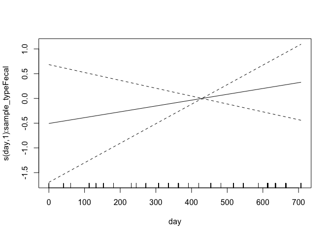

<style type="text/css">
.main-container {
  max-width: 1800px !important;
  margin-left: auto;
  margin-right: auto;
}
</style>

This document summarizes model diagnostics and checks.

First, we set up by loading packages and generated R objects.


```r
knitr::opts_chunk$set(echo = TRUE)
library(targets)
library(mgcv)
options(width = 250)
```


```r
tar_load(c(
  multinomial_model,
  gam_posterior,
  posterior_stats
))
```

## Model Summary


```r
summary(multinomial_model)
```

```
## 
## Family: multinom 
## Link function: 
## 
## Formula:
## outcome ~ s(sample_type, bs = "re", by = dummy_rectal) + s(day, 
##     bs = "tp", k = 5, by = sample_type, m = 2) + s(day, gender_age, 
##     bs = "fs", k = 5, xt = list(bs = "tp"), by = dummy_rectal, 
##     m = 2) + s(day_of_year, bs = "cc", by = sample_type, k = 5, 
##     m = 2) + s(day_of_year, gender_age, bs = "fs", xt = list(bs = "cc"), 
##     k = 5, by = dummy_rectal, m = 2) + s(fmi_kg_m2, k = 5, bs = "tp", 
##     by = dummy_rectal) + s(reproductive_condition, bs = "re", 
##     by = dummy_repro) + s(frac_subadult, bs = "tp", k = 5, by = dummy_any_rectal) + 
##     s(frac_subadult, sample_type, bs = "fs", k = 5, xt = list(bs = "tp"), 
##         by = dummy_any_rectal, m = 2)
## <environment: 0x7fdbce0e7ac0>
## ~s(sample_type, bs = "re", by = dummy_rectal) + s(day, bs = "tp", 
##     k = 5, by = sample_type, m = 2) + s(day, gender_age, bs = "fs", 
##     k = 5, xt = list(bs = "tp"), by = dummy_rectal, m = 2) + 
##     s(day_of_year, bs = "cc", by = sample_type, k = 5, m = 2) + 
##     s(day_of_year, gender_age, bs = "fs", xt = list(bs = "cc"), 
##         k = 5, by = dummy_rectal, m = 2) + s(fmi_kg_m2, k = 5, 
##     bs = "tp", by = dummy_rectal) + s(reproductive_condition, 
##     bs = "re", by = dummy_repro) + s(frac_subadult, bs = "tp", 
##     k = 5, by = dummy_any_rectal) + s(frac_subadult, sample_type, 
##     bs = "fs", k = 5, xt = list(bs = "tp"), by = dummy_any_rectal, 
##     m = 2)
## <environment: 0x7fdbce0e7ac0>
## ~s(sample_type, bs = "re", by = dummy_rectal) + s(day, bs = "tp", 
##     k = 5, by = sample_type, m = 2) + s(day_of_year, bs = "cc", 
##     by = sample_type, k = 5, m = 2)
## <environment: 0x7fdbce0e7ac0>
## 
## Parametric coefficients:
##               Estimate Std. Error z value Pr(>|z|)    
## (Intercept)    -2.6628     0.4240  -6.280 3.38e-10 ***
## (Intercept).1  -3.4124     0.4004  -8.522  < 2e-16 ***
## (Intercept).2  -6.4496     0.8494  -7.593 3.12e-14 ***
## ---
## Signif. codes:  0 '***' 0.001 '**' 0.01 '*' 0.05 '.' 0.1 ' ' 1
## 
## Approximate significance of smooth terms:
##                                                       edf Ref.df Chi.sq  p-value    
## s(sample_type):dummy_rectal1                    2.899e-05  2.000  0.000 0.789330    
## s(day):sample_typeFecal                         1.000e+00  1.000  0.724 0.394727    
## s(day):sample_typeRectal                        1.000e+00  1.000  0.394 0.530193    
## s(day,gender_age):dummy_rectal1                 2.987e-04 19.000  0.000 0.635107    
## s(day_of_year):sample_typeFecal                 1.965e+00  3.000 14.163 0.000225 ***
## s(day_of_year):sample_typeRectal                9.786e-01  3.000  2.132 0.098737 .  
## s(day_of_year,gender_age):dummy_rectal1         9.337e-05 16.000  0.000 0.838837    
## s(fmi_kg_m2):dummy_rectal1                      1.000e+00  1.000  2.517 0.112670    
## s(reproductive_condition):dummy_repro1          2.314e-05  3.000  0.000 0.815053    
## s(frac_subadult):dummy_any_rectal               3.948e+00  4.428 10.460 0.031024 *  
## s(frac_subadult,sample_type):dummy_any_rectal   1.442e-01  8.000  0.150 0.273131    
## s.1(sample_type):dummy_rectal1                  3.110e-05  1.000  0.000 0.645994    
## s.1(day):sample_typeFecal                       1.956e+00  2.275 29.559 1.16e-06 ***
## s.1(day):sample_typeRectal                      3.106e+00  3.503 30.700 7.16e-06 ***
## s.1(day,gender_age):dummy_rectal1               2.364e-04 19.000  0.000 0.858819    
## s.1(day_of_year):sample_typeFecal               2.191e+00  3.000 18.299 1.35e-05 ***
## s.1(day_of_year):sample_typeRectal              6.413e-04  3.000  0.001 0.214107    
## s.1(day_of_year,gender_age):dummy_rectal1       7.618e-05 16.000  0.000 0.812105    
## s.1(fmi_kg_m2):dummy_rectal1                    1.000e+00  1.001  5.909 0.015083 *  
## s.1(reproductive_condition):dummy_repro1        8.728e-01  3.000  1.223 0.235590    
## s.1(frac_subadult):dummy_any_rectal             4.773e+00  4.957 33.281 3.70e-06 ***
## s.1(frac_subadult,sample_type):dummy_any_rectal 1.628e-04  8.000  0.000 0.625941    
## s.2(sample_type):dummy_rectal1                  1.479e-05  1.000  0.000 0.606146    
## s.2(day):sample_typeFecal                       1.000e+00  1.000  0.029 0.864617    
## s.2(day):sample_typeRectal                      1.001e+00  1.001  0.246 0.620572    
## s.2(day_of_year):sample_typeFecal               2.192e+00  3.000 17.114 9.72e-05 ***
## s.2(day_of_year):sample_typeRectal              1.753e+00  3.000  5.547 0.032784 *  
## ---
## Signif. codes:  0 '***' 0.001 '**' 0.01 '*' 0.05 '.' 0.1 ' ' 1
## 
## Deviance explained = 16.9%
## -REML = -587.48  Scale est. = 1         n = 1430
```

## GAM Checks

`gam.check()` provides convergence diagnostics. Basis dimension (k) results should all be above 0.05 to indicate
that there are not systematic patterns in the model residuals.  Four diagnostic
plot are provided. In the first (Q-Q) plot, we should see residuals and quantiles
line up on the 1-1 line.  Other plots are difficult to interpret in the multinomial
case. 


```r
gam.check(multinomial_model)
```

<!-- -->

```
## 
## Method: REML   Optimizer: outer newton
## full convergence after 17 iterations.
## Gradient range [-0.0002321923,0.0001830841]
## (score -587.481 & scale 1).
## eigenvalue range [-1.650752e-05,1.092461].
## Model rank =  187 / 187 
## 
## Basis dimension (k) checking results. Low p-value (k-index<1) may
## indicate that k is too low, especially if edf is close to k'.
## 
##                                                       k'      edf k-index p-value
## s(sample_type):dummy_rectal1                    2.00e+00 2.90e-05      NA      NA
## s(day):sample_typeFecal                         4.00e+00 1.00e+00    0.96    0.21
## s(day):sample_typeRectal                        4.00e+00 1.00e+00    0.96    0.28
## s(day,gender_age):dummy_rectal1                 2.50e+01 2.99e-04    0.96    0.20
## s(day_of_year):sample_typeFecal                 3.00e+00 1.96e+00    0.96    0.26
## s(day_of_year):sample_typeRectal                3.00e+00 9.79e-01    0.96    0.20
## s(day_of_year,gender_age):dummy_rectal1         2.00e+01 9.34e-05    0.96    0.26
## s(fmi_kg_m2):dummy_rectal1                      4.00e+00 1.00e+00    0.98    0.61
## s(reproductive_condition):dummy_repro1          4.00e+00 2.31e-05      NA      NA
## s(frac_subadult):dummy_any_rectal               5.00e+00 3.95e+00    0.96    0.30
## s(frac_subadult,sample_type):dummy_any_rectal   1.00e+01 1.44e-01    0.96    0.21
## s.1(sample_type):dummy_rectal1                  2.00e+00 3.11e-05      NA      NA
## s.1(day):sample_typeFecal                       4.00e+00 1.96e+00    0.96    0.27
## s.1(day):sample_typeRectal                      4.00e+00 3.11e+00    0.96    0.26
## s.1(day,gender_age):dummy_rectal1               2.50e+01 2.36e-04    0.96    0.28
## s.1(day_of_year):sample_typeFecal               3.00e+00 2.19e+00    0.96    0.26
## s.1(day_of_year):sample_typeRectal              3.00e+00 6.41e-04    0.96    0.27
## s.1(day_of_year,gender_age):dummy_rectal1       2.00e+01 7.62e-05    0.96    0.26
## s.1(fmi_kg_m2):dummy_rectal1                    4.00e+00 1.00e+00    0.98    0.59
## s.1(reproductive_condition):dummy_repro1        4.00e+00 8.73e-01      NA      NA
## s.1(frac_subadult):dummy_any_rectal             5.00e+00 4.77e+00    0.96    0.29
## s.1(frac_subadult,sample_type):dummy_any_rectal 1.00e+01 1.63e-04    0.96    0.25
## s.2(sample_type):dummy_rectal1                  2.00e+00 1.48e-05      NA      NA
## s.2(day):sample_typeFecal                       4.00e+00 1.00e+00    0.96    0.23
## s.2(day):sample_typeRectal                      4.00e+00 1.00e+00    0.96    0.23
## s.2(day_of_year):sample_typeFecal               3.00e+00 2.19e+00    0.96    0.26
## s.2(day_of_year):sample_typeRectal              3.00e+00 1.75e+00    0.96    0.29
```

## Individual Smooth terms

These are plots of the indivudal smooths in the model on the linear scale.
Inspect for strange behavior and check that their shape corresponds with
significance terms in in the model summary.


```r
for (i in seq_len(length(multinomial_model$smooth))) {
  plot(multinomial_model, scale = 0, select = i)
}
```



## MCMC diagnostics

These are acceptance ratios from the 4 MCMC chains
run.  

From `?gam.mh`:

> The function reports the acceptance rate of the two types of step. If the 
> random walk acceptance probability (`$rw.accept`) is higher than a quarter then `rw.step` 
> should probably be increased. Similarly if the acceptance rate (`$accept`) is too low,
> it should be decreased. The random walk steps can be turned off altogether
> (see above), but it is important to check the chains for stuck sections if
> this is done.


```r
attributes(gam_posterior)[c("accept", "rw.accept")]
```

```
## $accept
## [1] 0.1299818 0.1296182 0.1299273 0.1214727
## 
## $rw.accept
## [1] 0.3325636 0.3357091 0.3301818 0.3318545
```

Here is a summary of the dimensions of the MCMC chain output

```r
tibble(
  dimension = names(dimnames(gam_posterior)),
  value = dim(gam_posterior)
)
```

```
## # A tibble: 3 × 2
##   dimension value
##   <chr>     <int>
## 1 Iteration   550
## 2 Chain         4
## 3 Parameter   187
```


Here are Stan-type per-parameter chain diagnostics.  `Rhat` should be at or near
1 to indicate that the multiple MCMC chains are well-mixed.  `ess_bulk` and 
`ess_tail` are the effective sample sizes for posterior samples from the parameter
distributions and the tails of those distributions, respectively. From the Stan
manual:

> We recommend running at least four chains by default and only using the sample
> if R-hat is less than 1.05....
>
> Both bulk-ESS and tail-ESS should be at least 100 (approximately) per
> Markov Chain in order to be reliable and indicate that estimates of respective
> posterior quantiles are reliable


```r
print(posterior_stats, n = Inf)
```

```
## # A tibble: 187 × 4
##     parameter                                           Rhat ess_bulk ess_tail
##     <chr>                                              <dbl>    <dbl>    <dbl>
##   1 (Intercept)                                        1.00     1237.    1891.
##   2 s(sample_type):dummy_rectal1.1                     1.00     1842.    1968.
##   3 s(sample_type):dummy_rectal1.2                     0.999    1547.    1623.
##   4 s(day):sample_typeFecal.1                          1.00     1663.    2111.
##   5 s(day):sample_typeFecal.2                          1.00     1916.    2077.
##   6 s(day):sample_typeFecal.3                          1.00     1873.    1994.
##   7 s(day):sample_typeFecal.4                          1.00     1633.    1842.
##   8 s(day):sample_typeRectal.1                         1.00     1761.    1929.
##   9 s(day):sample_typeRectal.2                         1.00     1957.    1681.
##  10 s(day):sample_typeRectal.3                         1.00     1869.    1787.
##  11 s(day):sample_typeRectal.4                         1.00     1729.    1946.
##  12 s(day,gender_age):dummy_rectal1.1                  1.00     2065.    2015.
##  13 s(day,gender_age):dummy_rectal1.2                  1.00     1740.    1868.
##  14 s(day,gender_age):dummy_rectal1.3                  1.00     1960.    2081.
##  15 s(day,gender_age):dummy_rectal1.4                  0.999    1913.    1765.
##  16 s(day,gender_age):dummy_rectal1.5                  1.00     1706.    1687.
##  17 s(day,gender_age):dummy_rectal1.6                  1.00     1658.    1806.
##  18 s(day,gender_age):dummy_rectal1.7                  1.00     1959.    2189.
##  19 s(day,gender_age):dummy_rectal1.8                  1.00     1755.    1694.
##  20 s(day,gender_age):dummy_rectal1.9                  1.00     1705.    2078.
##  21 s(day,gender_age):dummy_rectal1.10                 1.00     2030.    1998.
##  22 s(day,gender_age):dummy_rectal1.11                 1.00     1595.    1805.
##  23 s(day,gender_age):dummy_rectal1.12                 1.01     1943.    1877.
##  24 s(day,gender_age):dummy_rectal1.13                 1.00     1834.    2074.
##  25 s(day,gender_age):dummy_rectal1.14                 1.00     2002.    1955.
##  26 s(day,gender_age):dummy_rectal1.15                 1.00     1696.    2004.
##  27 s(day,gender_age):dummy_rectal1.16                 1.00     1756.    1794.
##  28 s(day,gender_age):dummy_rectal1.17                 1.00     1704.    1862.
##  29 s(day,gender_age):dummy_rectal1.18                 1.00     2003.    1858.
##  30 s(day,gender_age):dummy_rectal1.19                 1.00     1830.    2030.
##  31 s(day,gender_age):dummy_rectal1.20                 1.00     2005.    2113.
##  32 s(day,gender_age):dummy_rectal1.21                 0.999    1897.    1832.
##  33 s(day,gender_age):dummy_rectal1.22                 1.00     1888.    1943.
##  34 s(day,gender_age):dummy_rectal1.23                 1.00     1798.    1630.
##  35 s(day,gender_age):dummy_rectal1.24                 1.00     1805.    1865.
##  36 s(day,gender_age):dummy_rectal1.25                 0.999    1836.    1951.
##  37 s(day_of_year):sample_typeFecal.1                  0.999    2009.    2001.
##  38 s(day_of_year):sample_typeFecal.2                  0.999    1684.    1676.
##  39 s(day_of_year):sample_typeFecal.3                  1.00     1958.    1900.
##  40 s(day_of_year):sample_typeRectal.1                 1.00     1841.    1749.
##  41 s(day_of_year):sample_typeRectal.2                 1.00     1834.    1959.
##  42 s(day_of_year):sample_typeRectal.3                 1.00     1685.    1812.
##  43 s(day_of_year,gender_age):dummy_rectal1.1          1.00     1835.    2111.
##  44 s(day_of_year,gender_age):dummy_rectal1.2          1.00     1691.    1921.
##  45 s(day_of_year,gender_age):dummy_rectal1.3          1.00     1909.    1828.
##  46 s(day_of_year,gender_age):dummy_rectal1.4          1.00     1773.    1935.
##  47 s(day_of_year,gender_age):dummy_rectal1.5          1.00     1564.    1893.
##  48 s(day_of_year,gender_age):dummy_rectal1.6          1.00     1813.    1846.
##  49 s(day_of_year,gender_age):dummy_rectal1.7          1.00     1468.    1682.
##  50 s(day_of_year,gender_age):dummy_rectal1.8          1.00     1758.    1925.
##  51 s(day_of_year,gender_age):dummy_rectal1.9          1.00     1836.    2150.
##  52 s(day_of_year,gender_age):dummy_rectal1.10         1.00     2107.    2055.
##  53 s(day_of_year,gender_age):dummy_rectal1.11         1.00     1781.    1769.
##  54 s(day_of_year,gender_age):dummy_rectal1.12         1.00     1508.    1972.
##  55 s(day_of_year,gender_age):dummy_rectal1.13         1.00     1735.    1901.
##  56 s(day_of_year,gender_age):dummy_rectal1.14         0.999    1740.    1767.
##  57 s(day_of_year,gender_age):dummy_rectal1.15         1.00     1899.    2145.
##  58 s(day_of_year,gender_age):dummy_rectal1.16         1.00     1801.    1882.
##  59 s(day_of_year,gender_age):dummy_rectal1.17         0.999    1809.    1697.
##  60 s(day_of_year,gender_age):dummy_rectal1.18         1.00     1892.    2018.
##  61 s(day_of_year,gender_age):dummy_rectal1.19         1.00     1940.    1808.
##  62 s(day_of_year,gender_age):dummy_rectal1.20         1.00     1958.    1966.
##  63 s(fmi_kg_m2):dummy_rectal1.1                       1.00     2111.    2152.
##  64 s(fmi_kg_m2):dummy_rectal1.2                       1.00     1680.    1924.
##  65 s(fmi_kg_m2):dummy_rectal1.3                       1.00     2045.    2093.
##  66 s(fmi_kg_m2):dummy_rectal1.4                       0.999    1537.    1863.
##  67 s(reproductive_condition):dummy_repro1.1           1.00     1737.    1655.
##  68 s(reproductive_condition):dummy_repro1.2           1.00     1575.    1725.
##  69 s(reproductive_condition):dummy_repro1.3           1.00     1739.    2072.
##  70 s(reproductive_condition):dummy_repro1.4           1.00     1768.    1944.
##  71 s(frac_subadult):dummy_any_rectal.1                1.00     1503.    1629.
##  72 s(frac_subadult):dummy_any_rectal.2                1.00     1902.    2003.
##  73 s(frac_subadult):dummy_any_rectal.3                1.00     1464.    1805.
##  74 s(frac_subadult):dummy_any_rectal.4                1.00     1709.    1728.
##  75 s(frac_subadult):dummy_any_rectal.5                1.00     1651.    1697.
##  76 s(frac_subadult,sample_type):dummy_any_rectal.1    1.00     1980.    1966.
##  77 s(frac_subadult,sample_type):dummy_any_rectal.2    1.00     1501.    1807.
##  78 s(frac_subadult,sample_type):dummy_any_rectal.3    1.00     1692.    1904.
##  79 s(frac_subadult,sample_type):dummy_any_rectal.4    1.00     1887.    2109.
##  80 s(frac_subadult,sample_type):dummy_any_rectal.5    0.999    1630.    1827.
##  81 s(frac_subadult,sample_type):dummy_any_rectal.6    1.00     1855.    2001.
##  82 s(frac_subadult,sample_type):dummy_any_rectal.7    0.999    1768.    2040.
##  83 s(frac_subadult,sample_type):dummy_any_rectal.8    1.00     1812.    1989.
##  84 s(frac_subadult,sample_type):dummy_any_rectal.9    1.00     1654.    1666.
##  85 s(frac_subadult,sample_type):dummy_any_rectal.10   1.00     1932.    2193.
##  86 (Intercept).1                                      1.00     1761.    2112.
##  87 s.1(sample_type):dummy_rectal1.1                   1.00     1836.    1651.
##  88 s.1(sample_type):dummy_rectal1.2                   1.00     1690.    2001.
##  89 s.1(day):sample_typeFecal.1                        1.00     1572.    1950.
##  90 s.1(day):sample_typeFecal.2                        1.00     2092.    1981.
##  91 s.1(day):sample_typeFecal.3                        1.00     2032.    1982.
##  92 s.1(day):sample_typeFecal.4                        1.00     1633.    1959.
##  93 s.1(day):sample_typeRectal.1                       1.00     1804.    1836.
##  94 s.1(day):sample_typeRectal.2                       1.00     1620.    1743.
##  95 s.1(day):sample_typeRectal.3                       1.00     1611.    1902.
##  96 s.1(day):sample_typeRectal.4                       1.00     1770.    2001.
##  97 s.1(day,gender_age):dummy_rectal1.1                1.00     1831.    2020.
##  98 s.1(day,gender_age):dummy_rectal1.2                1.00     1688.    1798.
##  99 s.1(day,gender_age):dummy_rectal1.3                1.00     1466.    1755.
## 100 s.1(day,gender_age):dummy_rectal1.4                1.00     1825.    1815.
## 101 s.1(day,gender_age):dummy_rectal1.5                1.00     1809.    1888.
## 102 s.1(day,gender_age):dummy_rectal1.6                1.00     2015.    1970.
## 103 s.1(day,gender_age):dummy_rectal1.7                0.999    2034.    1981.
## 104 s.1(day,gender_age):dummy_rectal1.8                1.00     1786.    1951.
## 105 s.1(day,gender_age):dummy_rectal1.9                1.00     1725.    1923.
## 106 s.1(day,gender_age):dummy_rectal1.10               1.00     1954.    1941.
## 107 s.1(day,gender_age):dummy_rectal1.11               1.00     1781.    1546.
## 108 s.1(day,gender_age):dummy_rectal1.12               1.00     1849.    1969.
## 109 s.1(day,gender_age):dummy_rectal1.13               0.999    1782.    1905.
## 110 s.1(day,gender_age):dummy_rectal1.14               1.00     1607.    1945.
## 111 s.1(day,gender_age):dummy_rectal1.15               1.00     1759.    1919.
## 112 s.1(day,gender_age):dummy_rectal1.16               1.00     2102.    1973.
## 113 s.1(day,gender_age):dummy_rectal1.17               1.00     1855.    2018.
## 114 s.1(day,gender_age):dummy_rectal1.18               1.00     1939.    1881.
## 115 s.1(day,gender_age):dummy_rectal1.19               1.00     1900.    1970.
## 116 s.1(day,gender_age):dummy_rectal1.20               1.00     1728.    1966.
## 117 s.1(day,gender_age):dummy_rectal1.21               0.999    1973.    2061.
## 118 s.1(day,gender_age):dummy_rectal1.22               1.00     2111.    2041.
## 119 s.1(day,gender_age):dummy_rectal1.23               1.00     1678.    1780.
## 120 s.1(day,gender_age):dummy_rectal1.24               1.00     1857.    1665.
## 121 s.1(day,gender_age):dummy_rectal1.25               1.00     1908.    1933.
## 122 s.1(day_of_year):sample_typeFecal.1                1.00     1825.    1792.
## 123 s.1(day_of_year):sample_typeFecal.2                1.00     2070.    2072.
## 124 s.1(day_of_year):sample_typeFecal.3                1.00     1895.    1925.
## 125 s.1(day_of_year):sample_typeRectal.1               1.00     1936.    1901.
## 126 s.1(day_of_year):sample_typeRectal.2               0.999    1810.    1913.
## 127 s.1(day_of_year):sample_typeRectal.3               1.01     1857.    1886.
## 128 s.1(day_of_year,gender_age):dummy_rectal1.1        1.00     1897.    2113.
## 129 s.1(day_of_year,gender_age):dummy_rectal1.2        1.00     1998.    1648.
## 130 s.1(day_of_year,gender_age):dummy_rectal1.3        1.00     1978.    2019.
## 131 s.1(day_of_year,gender_age):dummy_rectal1.4        1.00     1792.    2002.
## 132 s.1(day_of_year,gender_age):dummy_rectal1.5        1.00     1995.    1948.
## 133 s.1(day_of_year,gender_age):dummy_rectal1.6        1.00     2159.    2107.
## 134 s.1(day_of_year,gender_age):dummy_rectal1.7        0.999    1762.    2075.
## 135 s.1(day_of_year,gender_age):dummy_rectal1.8        1.00     1803.    1986.
## 136 s.1(day_of_year,gender_age):dummy_rectal1.9        1.00     1688.    1769.
## 137 s.1(day_of_year,gender_age):dummy_rectal1.10       1.00     1940.    1964.
## 138 s.1(day_of_year,gender_age):dummy_rectal1.11       1.00     2042.    1836.
## 139 s.1(day_of_year,gender_age):dummy_rectal1.12       1.00     1869.    1844.
## 140 s.1(day_of_year,gender_age):dummy_rectal1.13       1.00     1685.    2039.
## 141 s.1(day_of_year,gender_age):dummy_rectal1.14       1.00     1872.    2001.
## 142 s.1(day_of_year,gender_age):dummy_rectal1.15       1.00     1735.    1966.
## 143 s.1(day_of_year,gender_age):dummy_rectal1.16       1.00     1937.    1832.
## 144 s.1(day_of_year,gender_age):dummy_rectal1.17       1.00     1919.    1880.
## 145 s.1(day_of_year,gender_age):dummy_rectal1.18       1.00     1945.    1955.
## 146 s.1(day_of_year,gender_age):dummy_rectal1.19       1.00     1967.    1997.
## 147 s.1(day_of_year,gender_age):dummy_rectal1.20       1.00     2038.    1828.
## 148 s.1(fmi_kg_m2):dummy_rectal1.1                     1.00     1710.    1858.
## 149 s.1(fmi_kg_m2):dummy_rectal1.2                     1.00     1644.    1920.
## 150 s.1(fmi_kg_m2):dummy_rectal1.3                     1.00     1867.    1943.
## 151 s.1(fmi_kg_m2):dummy_rectal1.4                     1.00     1795.    2000.
## 152 s.1(reproductive_condition):dummy_repro1.1         1.00     1911.    1826.
## 153 s.1(reproductive_condition):dummy_repro1.2         1.00     1660.    1898.
## 154 s.1(reproductive_condition):dummy_repro1.3         1.00     1732.    1926.
## 155 s.1(reproductive_condition):dummy_repro1.4         1.00     1868.    2114.
## 156 s.1(frac_subadult):dummy_any_rectal.1              1.00     1917.    1916.
## 157 s.1(frac_subadult):dummy_any_rectal.2              1.00     1567.    1744.
## 158 s.1(frac_subadult):dummy_any_rectal.3              1.00     1984.    1991.
## 159 s.1(frac_subadult):dummy_any_rectal.4              1.00     1931.    2036.
## 160 s.1(frac_subadult):dummy_any_rectal.5              1.00     1634.    1519.
## 161 s.1(frac_subadult,sample_type):dummy_any_rectal.1  1.00     1831.    1892.
## 162 s.1(frac_subadult,sample_type):dummy_any_rectal.2  1.00     2088.    2234.
## 163 s.1(frac_subadult,sample_type):dummy_any_rectal.3  1.00     1407.    1907.
## 164 s.1(frac_subadult,sample_type):dummy_any_rectal.4  1.00     1853.    2151.
## 165 s.1(frac_subadult,sample_type):dummy_any_rectal.5  1.01     1600.    2039.
## 166 s.1(frac_subadult,sample_type):dummy_any_rectal.6  1.00     1828.    1770.
## 167 s.1(frac_subadult,sample_type):dummy_any_rectal.7  1.00     1878.    1918.
## 168 s.1(frac_subadult,sample_type):dummy_any_rectal.8  1.00     1971.    2002.
## 169 s.1(frac_subadult,sample_type):dummy_any_rectal.9  1.00     2028.    1729.
## 170 s.1(frac_subadult,sample_type):dummy_any_rectal.10 1.00     1803.    1932.
## 171 (Intercept).2                                      1.00     1328.    1063.
## 172 s.2(sample_type):dummy_rectal1.1                   1.00     1788.    1961.
## 173 s.2(sample_type):dummy_rectal1.2                   1.00     1913.    2075.
## 174 s.2(day):sample_typeFecal.1                        1.00     1750.    1985.
## 175 s.2(day):sample_typeFecal.2                        1.00     1917.    2053.
## 176 s.2(day):sample_typeFecal.3                        1.00     2016.    1846.
## 177 s.2(day):sample_typeFecal.4                        1.00     1524.    1894.
## 178 s.2(day):sample_typeRectal.1                       1.00     2046.    1881.
## 179 s.2(day):sample_typeRectal.2                       1.00     1640.    1913.
## 180 s.2(day):sample_typeRectal.3                       1.00     1779.    1716.
## 181 s.2(day):sample_typeRectal.4                       1.00     1408.    1197.
## 182 s.2(day_of_year):sample_typeFecal.1                1.00     1583.    1644.
## 183 s.2(day_of_year):sample_typeFecal.2                1.00     1407.    1095.
## 184 s.2(day_of_year):sample_typeFecal.3                1.00     1366.    1276.
## 185 s.2(day_of_year):sample_typeRectal.1               1.00     1447.    1662.
## 186 s.2(day_of_year):sample_typeRectal.2               1.00     1390.    1443.
## 187 s.2(day_of_year):sample_typeRectal.3               1.01     1414.    1466.
```

