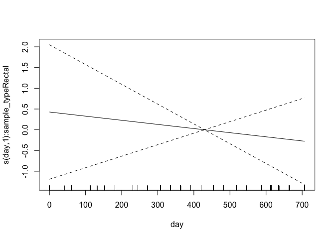
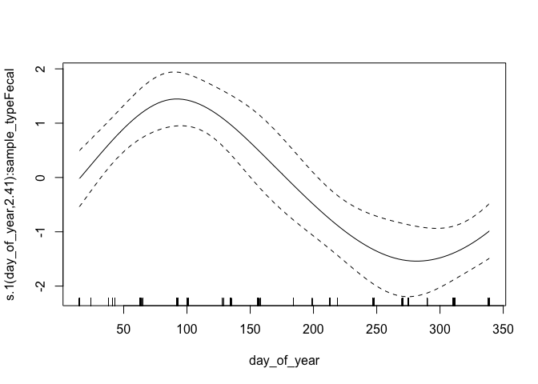

<style type="text/css">
.main-container {
  max-width: 1800px !important;
  margin-left: auto;
  margin-right: auto;
}
</style>

This document summarizes model diagnostics and checks.

First, we set up by loading packages and generated R objects.


```r
knitr::opts_chunk$set(echo = TRUE)
library(targets)
library(mgcv)
library(gt)
options(width = 250)
```


```r
tar_load(c(
  multinomial_model,
  multinomial_model_alt,
  gam_posterior,
  posterior_stats,
  dat_prepped
))
```

## Model Summary


```r
summary(multinomial_model)
```

```
## 
## Family: multinom 
## Link function: 
## 
## Formula:
## outcome ~ s(sample_type, bs = "re", by = dummy_rectal) + s(day, 
##     bs = "tp", k = 5, by = sample_type, m = 2) + s(day, gender_age, 
##     bs = "fs", k = 5, xt = list(bs = "tp"), by = dummy_rectal, 
##     m = 1) + s(day, gender, bs = "fs", k = 5, xt = list(bs = "tp"), 
##     by = dummy_rectal, m = 1) + s(day, age, bs = "fs", k = 5, 
##     xt = list(bs = "tp"), by = dummy_rectal, m = 1) + s(day_of_year, 
##     bs = "cc", by = sample_type, k = 5, m = 2) + s(day_of_year, 
##     gender_age, bs = "fs", xt = list(bs = "cc"), k = 5, by = dummy_rectal, 
##     m = 1) + s(day_of_year, gender, bs = "fs", k = 5, xt = list(bs = "cc"), 
##     by = dummy_rectal, m = 1) + s(day_of_year, age, bs = "fs", 
##     k = 5, xt = list(bs = "cc"), by = dummy_rectal, m = 1) + 
##     s(fmi_normalized, k = 5, bs = "tp", by = dummy_rectal) + 
##     s(reproductive_condition, bs = "re", by = dummy_repro)
## <environment: 0x7f83058e7da0>
## ~s(sample_type, bs = "re", by = dummy_rectal) + s(day, bs = "tp", 
##     k = 5, by = sample_type, m = 2) + s(day, gender_age, bs = "fs", 
##     k = 5, xt = list(bs = "tp"), by = dummy_rectal, m = 1) + 
##     s(day, gender, bs = "fs", k = 5, xt = list(bs = "tp"), by = dummy_rectal, 
##         m = 1) + s(day, age, bs = "fs", k = 5, xt = list(bs = "tp"), 
##     by = dummy_rectal, m = 1) + s(day_of_year, bs = "cc", by = sample_type, 
##     k = 5, m = 2) + s(day_of_year, gender_age, bs = "fs", xt = list(bs = "cc"), 
##     k = 5, by = dummy_rectal, m = 1) + s(day_of_year, gender, 
##     bs = "fs", k = 5, xt = list(bs = "cc"), by = dummy_rectal, 
##     m = 1) + s(day_of_year, age, bs = "fs", k = 5, xt = list(bs = "cc"), 
##     by = dummy_rectal, m = 1) + s(fmi_normalized, k = 5, bs = "tp", 
##     by = dummy_rectal) + s(reproductive_condition, bs = "re", 
##     by = dummy_repro)
## <environment: 0x7f83058e7da0>
## ~s(sample_type, bs = "re", by = dummy_rectal) + s(day, bs = "tp", 
##     k = 5, by = sample_type, m = 2) + s(day_of_year, bs = "cc", 
##     by = sample_type, k = 5, m = 2)
## <environment: 0x7f83058e7da0>
## 
## Parametric coefficients:
##               Estimate Std. Error z value Pr(>|z|)    
## (Intercept)    -3.7049     0.2333 -15.880   <2e-16 ***
## (Intercept).1  -2.4323     0.1530 -15.902   <2e-16 ***
## (Intercept).2  -6.0083     0.6685  -8.987   <2e-16 ***
## ---
## Signif. codes:  0 '***' 0.001 '**' 0.01 '*' 0.05 '.' 0.1 ' ' 1
## 
## Approximate significance of smooth terms:
##                                                 edf Ref.df Chi.sq  p-value    
## s(sample_type):dummy_rectal1              9.644e-02  1.000  0.118  0.24941    
## s(day):sample_typeFecal                   1.024e+00  1.047  0.028  0.93373    
## s(day):sample_typeRectal                  1.000e+00  1.000  0.279  0.59732    
## s(day,gender_age):dummy_rectal1           1.272e-04 21.000  0.000  0.91597    
## s(day,gender):dummy_rectal1               1.185e-04 10.000  0.000  0.91115    
## s(day,age):dummy_rectal1                  2.331e-01 10.000  0.251  0.29685    
## s(day_of_year):sample_typeFecal           2.110e+00  3.000 22.328 9.66e-06 ***
## s(day_of_year):sample_typeRectal          1.263e+00  3.000  3.329  0.05470 .  
## s(day_of_year,gender_age):dummy_rectal1   2.134e-04 16.000  0.000  0.93041    
## s(day_of_year,gender):dummy_rectal1       9.047e-02  8.000  0.067  0.42981    
## s(day_of_year,age):dummy_rectal1          2.312e-02  8.000  0.015  0.47548    
## s(fmi_normalized):dummy_rectal1           1.000e+00  1.000  2.952  0.08578 .  
## s(reproductive_condition):dummy_repro1    1.525e-04  3.000  0.000  0.87671    
## s.1(sample_type):dummy_rectal1            1.760e-04  1.000  0.000  0.60270    
## s.1(day):sample_typeFecal                 2.331e+00  2.681 13.822  0.00137 ** 
## s.1(day):sample_typeRectal                2.221e+00  2.414  2.516  0.50264    
## s.1(day,gender_age):dummy_rectal1         1.211e-04 20.000  0.000  0.95722    
## s.1(day,gender):dummy_rectal1             1.604e-04 10.000  0.000  0.99355    
## s.1(day,age):dummy_rectal1                1.457e+00 10.000  3.201  0.04168 *  
## s.1(day_of_year):sample_typeFecal         2.414e+00  3.000 37.765  < 2e-16 ***
## s.1(day_of_year):sample_typeRectal        1.563e+00  3.000  3.809  0.00171 ** 
## s.1(day_of_year,gender_age):dummy_rectal1 4.410e-04 16.000  0.000  0.79915    
## s.1(day_of_year,gender):dummy_rectal1     4.751e-04  8.000  0.000  0.94760    
## s.1(day_of_year,age):dummy_rectal1        1.610e+00  8.000  2.346  0.06867 .  
## s.1(fmi_normalized):dummy_rectal1         1.000e+00  1.001  1.807  0.17885    
## s.1(reproductive_condition):dummy_repro1  1.466e+00  3.000  3.373  0.06813 .  
## s.2(sample_type):dummy_rectal1            1.353e-05  1.000  0.000  0.76680    
## s.2(day):sample_typeFecal                 1.000e+00  1.000  0.011  0.91642    
## s.2(day):sample_typeRectal                1.005e+00  1.009  0.347  0.55771    
## s.2(day_of_year):sample_typeFecal         2.071e+00  3.000 18.048 4.35e-05 ***
## s.2(day_of_year):sample_typeRectal        1.466e+00  3.000  4.573  0.03630 *  
## ---
## Signif. codes:  0 '***' 0.001 '**' 0.01 '*' 0.05 '.' 0.1 ' ' 1
## 
## Deviance explained = 14.4%
## -REML = -571.34  Scale est. = 1         n = 1430
```

### Alterate Model Summary

This is an alternate model fomulation with simple singel random effects of age/sex category
rather than time-varying ones.  This is used to check if there age/sex effects are
just insignificant because of the high complexity of the time-varying smooths.


```r
summary(multinomial_model_alt)
```

```
## 
## Family: multinom 
## Link function: 
## 
## Formula:
## outcome ~ s(sample_type, bs = "re", by = dummy_rectal) + s(day, 
##     bs = "tp", k = 5, by = sample_type, m = 2) + s(day_of_year, 
##     bs = "cc", by = sample_type, k = 5, m = 2) + s(gender_age, 
##     bs = "re", by = dummy_rectal) + s(fmi_normalized, k = 5, 
##     bs = "tp", by = dummy_rectal) + s(reproductive_condition, 
##     bs = "re", by = dummy_repro)
## <environment: 0x7f82d0f4bf20>
## ~s(sample_type, bs = "re", by = dummy_rectal) + s(day, bs = "tp", 
##     k = 5, by = sample_type, m = 2) + s(day_of_year, bs = "cc", 
##     by = sample_type, k = 5, m = 2) + s(gender_age, bs = "re", 
##     by = dummy_rectal) + s(fmi_normalized, k = 5, bs = "tp", 
##     by = dummy_rectal) + s(reproductive_condition, bs = "re", 
##     by = dummy_repro)
## <environment: 0x7f82d0f4bf20>
## ~s(sample_type, bs = "re", by = dummy_rectal) + s(day, bs = "tp", 
##     k = 5, by = sample_type, m = 2) + s(day_of_year, bs = "cc", 
##     by = sample_type, k = 5, m = 2)
## <environment: 0x7f82d0f4bf20>
## 
## Parametric coefficients:
##               Estimate Std. Error z value Pr(>|z|)    
## (Intercept)    -3.8528     0.2441 -15.782   <2e-16 ***
## (Intercept).1  -2.4051     0.1467 -16.391   <2e-16 ***
## (Intercept).2  -6.0192     0.6724  -8.953   <2e-16 ***
## ---
## Signif. codes:  0 '***' 0.001 '**' 0.01 '*' 0.05 '.' 0.1 ' ' 1
## 
## Approximate significance of smooth terms:
##                                                edf Ref.df Chi.sq  p-value    
## s(sample_type):dummy_rectal1             2.109e-04  2.000  0.000 0.516073    
## s(day):sample_typeFecal                  2.575e+00  2.886  4.878 0.172907    
## s(day):sample_typeRectal                 1.000e+00  1.000  0.160 0.688800    
## s(day_of_year):sample_typeFecal          2.247e+00  3.000 24.725 7.50e-07 ***
## s(day_of_year):sample_typeRectal         1.351e+00  3.000  3.923 0.048417 *  
## s(gender_age):dummy_rectal1              1.742e-04  4.000  0.000 0.976698    
## s(fmi_normalized):dummy_rectal1          1.000e+00  1.000  3.184 0.074371 .  
## s(reproductive_condition):dummy_repro1   9.877e-05  3.000  0.000 0.911349    
## s.1(sample_type):dummy_rectal1           2.896e-04  1.000  0.000 0.458759    
## s.1(day):sample_typeFecal                2.339e+00  2.689 13.628 0.001508 ** 
## s.1(day):sample_typeRectal               2.629e+00  2.873  6.909 0.055847 .  
## s.1(day_of_year):sample_typeFecal        2.412e+00  3.000 38.196  < 2e-16 ***
## s.1(day_of_year):sample_typeRectal       2.075e+00  3.000  9.863 0.000529 ***
## s.1(gender_age):dummy_rectal1            7.434e-04  4.000  0.000 0.659272    
## s.1(fmi_normalized):dummy_rectal1        1.000e+00  1.000  1.927 0.165131    
## s.1(reproductive_condition):dummy_repro1 1.833e+00  3.000  5.754 0.025432 *  
## s.2(sample_type):dummy_rectal1           1.858e-05  1.000  0.000 0.758138    
## s.2(day):sample_typeFecal                1.000e+00  1.000  0.009 0.923646    
## s.2(day):sample_typeRectal               1.000e+00  1.000  0.345 0.557247    
## s.2(day_of_year):sample_typeFecal        2.073e+00  3.000 18.059 4.35e-05 ***
## s.2(day_of_year):sample_typeRectal       1.478e+00  3.000  4.624 0.036270 *  
## ---
## Signif. codes:  0 '***' 0.001 '**' 0.01 '*' 0.05 '.' 0.1 ' ' 1
## 
## Deviance explained = 14.6%
## -REML = -571.32  Scale est. = 1         n = 1430
```

## GAM Checks

`gam.check()` provides convergence diagnostics. Basis dimension (k) results should all be above 0.05 to indicate
that there are not systematic patterns in the model residuals.  Four diagnostic
plot are provided. In the first (Q-Q) plot, we should see residuals and quantiles
line up on the 1-1 line.  Other plots are difficult to interpret in the multinomial
case. 


```r
gam.check(multinomial_model)
```

<!-- -->

```
## 
## Method: REML   Optimizer: efs
## $iter
## [1] 15
## 
## $score.hist
##  [1] -545.0242 -559.4286 -565.0663 -567.0706 -568.2477 -569.1585 -569.8345 -570.2909 -570.6003 -570.8226 -570.9904 -571.1189 -571.2158 -571.2871 -571.3386
## 
## $conv
## [1] "full convergence"
## 
## Model rank =  265 / 265 
## 
## Basis dimension (k) checking results. Low p-value (k-index<1) may
## indicate that k is too low, especially if edf is close to k'.
## 
##                                                 k'      edf k-index p-value
## s(sample_type):dummy_rectal1              2.00e+00 9.64e-02      NA      NA
## s(day):sample_typeFecal                   4.00e+00 1.02e+00    0.95    0.13
## s(day):sample_typeRectal                  4.00e+00 1.00e+00    0.95    0.23
## s(day,gender_age):dummy_rectal1           2.50e+01 1.27e-04    0.95    0.14
## s(day,gender):dummy_rectal1               1.50e+01 1.18e-04    0.95    0.20
## s(day,age):dummy_rectal1                  1.50e+01 2.33e-01    0.95    0.17
## s(day_of_year):sample_typeFecal           3.00e+00 2.11e+00    0.95    0.19
## s(day_of_year):sample_typeRectal          3.00e+00 1.26e+00    0.95    0.17
## s(day_of_year,gender_age):dummy_rectal1   2.00e+01 2.13e-04    0.95    0.20
## s(day_of_year,gender):dummy_rectal1       1.20e+01 9.05e-02    0.95    0.17
## s(day_of_year,age):dummy_rectal1          1.20e+01 2.31e-02    0.95    0.20
## s(fmi_normalized):dummy_rectal1           4.00e+00 1.00e+00    0.97    0.42
## s(reproductive_condition):dummy_repro1    4.00e+00 1.52e-04      NA      NA
## s.1(sample_type):dummy_rectal1            2.00e+00 1.76e-04      NA      NA
## s.1(day):sample_typeFecal                 4.00e+00 2.33e+00    0.95    0.20
## s.1(day):sample_typeRectal                4.00e+00 2.22e+00    0.95    0.20
## s.1(day,gender_age):dummy_rectal1         2.50e+01 1.21e-04    0.95    0.17
## s.1(day,gender):dummy_rectal1             1.50e+01 1.60e-04    0.95    0.14
## s.1(day,age):dummy_rectal1                1.50e+01 1.46e+00    0.95    0.14
## s.1(day_of_year):sample_typeFecal         3.00e+00 2.41e+00    0.95    0.23
## s.1(day_of_year):sample_typeRectal        3.00e+00 1.56e+00    0.95    0.18
## s.1(day_of_year,gender_age):dummy_rectal1 2.00e+01 4.41e-04    0.95    0.17
## s.1(day_of_year,gender):dummy_rectal1     1.20e+01 4.75e-04    0.95    0.18
## s.1(day_of_year,age):dummy_rectal1        1.20e+01 1.61e+00    0.95    0.16
## s.1(fmi_normalized):dummy_rectal1         4.00e+00 1.00e+00    0.97    0.39
## s.1(reproductive_condition):dummy_repro1  4.00e+00 1.47e+00      NA      NA
## s.2(sample_type):dummy_rectal1            2.00e+00 1.35e-05      NA      NA
## s.2(day):sample_typeFecal                 4.00e+00 1.00e+00    0.95    0.18
## s.2(day):sample_typeRectal                4.00e+00 1.01e+00    0.95    0.21
## s.2(day_of_year):sample_typeFecal         3.00e+00 2.07e+00    0.95    0.18
## s.2(day_of_year):sample_typeRectal        3.00e+00 1.47e+00    0.95    0.17
```

## Individual Smooth terms

These are plots of the indivudal smooths in the model on the linear scale.
Inspect for strange behavior and check that their shape corresponds with
significance terms in in the model summary.


```r
for (i in seq_len(length(multinomial_model$smooth) + sum(multinomial_model$nsdf) - 3)) {
  plot(multinomial_model, scale = 0, select = i, all.terms = TRUE)
}
```



## MCMC diagnostics

These are acceptance ratios from the 4 MCMC chains
run.  

From `?gam.mh`:

> The function reports the acceptance rate of the two types of step. If the 
> random walk acceptance probability (`$rw.accept`) is higher than a quarter then `rw.step` 
> should probably be increased. Similarly if the acceptance rate (`$accept`) is too low,
> it should be decreased. The random walk steps can be turned off altogether
> (see above), but it is important to check the chains for stuck sections if
> this is done.


```r
attributes(gam_posterior)[c("accept", "rw.accept")]
```

```
## $accept
## [1] 0.14430 0.15245 0.14910 0.14675
## 
## $rw.accept
## [1] 0.06615 0.07105 0.06955 0.06775
```

Here is a summary of the dimensions of the MCMC chain output

```r
tibble::tibble(
  dimension = names(dimnames(gam_posterior)),
  value = dim(gam_posterior)
)
```

```
## # A tibble: 3 × 2
##   dimension value
##   <chr>     <int>
## 1 Iteration   100
## 2 Chain         4
## 3 Parameter   265
```


Here are Stan-type per-parameter chain diagnostics.  `Rhat` should be at or near
1 to indicate that the multiple MCMC chains are well-mixed.  `ess_bulk` and 
`ess_tail` are the effective sample sizes for posterior samples from the parameter
distributions and the tails of those distributions, respectively. From the Stan
manual:

> We recommend running at least four chains by default and only using the sample
> if R-hat is less than 1.05....
>
> Both bulk-ESS and tail-ESS should be at least 100 (approximately) per
> Markov Chain in order to be reliable and indicate that estimates of respective
> posterior quantiles are reliable

Note that for coefficient values < 1e-6, mixing isn't very relevant.


```r
options(scipen=12)
posterior_stats |> 
  mutate(across(c("ess_bulk", "ess_tail"), round)) |> 
  mutate(across(2:7, \(x) signif(x, 2))) |> 
  mutate(rhat = signif(rhat, 3)) |> 
  mutate(across(2:8, \(x) gt:::align_to_char(as.character(x)))) |> 
  knitr::kable(format.args = list(scientific = FALSE))
```


|variable                                     |mean         |median       |sd      |mad     |q5       |q95     |rhat  | ess_bulk| ess_tail|
|:--------------------------------------------|:------------|:------------|:-------|:-------|:--------|:-------|:-----|--------:|--------:|
|(Intercept)                                  |-3.8         |-3.8         |0.24    |0.25    |-4.2     |-3.4    |0.997 |      323|      339|
|s(sample_type):dummy_rectal1.1               | 0.015       | 0.0053      |0.14    |0.15    |-0.22    | 0.24   |1.01  |      419|      464|
|s(sample_type):dummy_rectal1.2               |-0.047       |-0.055       |0.14    |0.14    |-0.25    | 0.18   |1     |      361|      387|
|s(day):sample_typeFecal.1                    | 0.008       | 0.0008      |0.094   |0.092   |-0.14    | 0.16   |1.02  |      382|      307|
|s(day):sample_typeFecal.2                    |-0.014       |-0.017       |0.16    |0.17    |-0.27    | 0.24   |1.01  |      350|      416|
|s(day):sample_typeFecal.3                    |-0.029       |-0.013       |0.29    |0.3     |-0.5     | 0.46   |1     |      393|      460|
|s(day):sample_typeFecal.4                    |-0.032       |-0.031       |0.25    |0.24    |-0.44    | 0.36   |1     |      406|      401|
|s(day):sample_typeRectal.1                   |-0.00014     |-0.000033    |0.0033  |0.003   |-0.0056  | 0.0051 |0.997 |      435|      370|
|s(day):sample_typeRectal.2                   |-0.00027     | 0.000013    |0.0051  |0.0051  |-0.0089  | 0.0079 |0.996 |      377|      374|
|s(day):sample_typeRectal.3                   |-0.00015     |-0.00033     |0.0089  |0.0094  |-0.016   | 0.014  |1     |      366|      361|
|s(day):sample_typeRectal.4                   |-0.18        |-0.18        |0.36    |0.39    |-0.75    | 0.44   |0.998 |      415|      396|
|s(day,gender_age):dummy_rectal1.1            | 0.00012     | 0.000052    |0.0016  |0.0016  |-0.0026  | 0.0028 |1     |      261|      415|
|s(day,gender_age):dummy_rectal1.2            | 0.00012     | 0.00017     |0.0016  |0.0016  |-0.0025  | 0.0029 |1.01  |      507|      378|
|s(day,gender_age):dummy_rectal1.3            |-0.0001      |-0.000049    |0.0017  |0.0017  |-0.0028  | 0.0026 |1.01  |      337|      201|
|s(day,gender_age):dummy_rectal1.4            | 0.00013     | 0.00023     |0.0017  |0.0018  |-0.0026  | 0.0029 |1     |      398|      340|
|s(day,gender_age):dummy_rectal1.5            |-0.00012     |-0.00012     |0.0018  |0.0018  |-0.0028  | 0.0027 |1     |      405|      378|
|s(day,gender_age):dummy_rectal1.6            | 0.000037    | 0.000012    |0.0016  |0.0017  |-0.0025  | 0.0028 |0.997 |      420|      469|
|s(day,gender_age):dummy_rectal1.7            |-0.000044    | 0.000022    |0.0017  |0.0017  |-0.0028  | 0.0029 |0.998 |      393|      340|
|s(day,gender_age):dummy_rectal1.8            |-0.00008     | 0.000044    |0.0016  |0.0015  |-0.0028  | 0.0026 |1.01  |      417|      416|
|s(day,gender_age):dummy_rectal1.9            |-0.000023    | 0.00014     |0.0017  |0.0016  |-0.0027  | 0.0026 |1.01  |      345|      400|
|s(day,gender_age):dummy_rectal1.10           | 0.0000059   | 0.000015    |0.0018  |0.0019  |-0.0031  | 0.0031 |1.01  |      413|      338|
|s(day,gender_age):dummy_rectal1.11           | 0.000049    |-0.0000068   |0.0017  |0.0016  |-0.0028  | 0.0027 |1     |      296|      300|
|s(day,gender_age):dummy_rectal1.12           |-0.000014    |-0.0001      |0.0016  |0.0016  |-0.0026  | 0.0028 |1     |      402|      416|
|s(day,gender_age):dummy_rectal1.13           | 0.00014     | 0.000086    |0.0017  |0.0017  |-0.0026  | 0.0032 |0.998 |      422|      415|
|s(day,gender_age):dummy_rectal1.14           |-0.000016    |-0.0000088   |0.0018  |0.0019  |-0.0029  | 0.0029 |1.01  |      397|      375|
|s(day,gender_age):dummy_rectal1.15           |-0.000041    |-0.000048    |0.0017  |0.0017  |-0.003   | 0.0028 |1     |      340|      341|
|s(day,gender_age):dummy_rectal1.16           | 0.00000028  |-0.00005     |0.0016  |0.0017  |-0.0024  | 0.0028 |1     |      389|      413|
|s(day,gender_age):dummy_rectal1.17           | 0.00019     | 0.00022     |0.0017  |0.0017  |-0.0028  | 0.0031 |1     |      415|      373|
|s(day,gender_age):dummy_rectal1.18           | 0.000097    |-0.000000073 |0.0017  |0.0017  |-0.0027  | 0.0026 |0.998 |      352|      367|
|s(day,gender_age):dummy_rectal1.19           | 0.000046    | 0.000099    |0.0016  |0.0015  |-0.0026  | 0.0025 |1     |      351|      359|
|s(day,gender_age):dummy_rectal1.20           |-0.000056    | 0.000081    |0.0018  |0.0019  |-0.0031  | 0.0027 |1     |      432|      393|
|s(day,gender_age):dummy_rectal1.21           |-0.000067    |-0.000063    |0.0017  |0.0016  |-0.0028  | 0.0024 |1     |      390|      398|
|s(day,gender_age):dummy_rectal1.22           | 0.000063    | 0.000031    |0.0016  |0.0016  |-0.0026  | 0.0028 |1.01  |      397|      340|
|s(day,gender_age):dummy_rectal1.23           |-0.000087    |-0.00014     |0.0015  |0.0015  |-0.0024  | 0.0023 |1.01  |      323|      392|
|s(day,gender_age):dummy_rectal1.24           |-0.000042    |-0.00011     |0.0017  |0.0017  |-0.0025  | 0.0026 |1     |      368|      366|
|s(day,gender_age):dummy_rectal1.25           | 0.0001      | 0.00018     |0.0018  |0.0017  |-0.0027  | 0.003  |1     |      368|      373|
|s(day,gender):dummy_rectal1.1                | 0.000075    | 0.00008     |0.0018  |0.0018  |-0.0029  | 0.0029 |1.01  |      366|      375|
|s(day,gender):dummy_rectal1.2                |-0.00019     |-0.00013     |0.0017  |0.0017  |-0.0029  | 0.0028 |1.01  |      363|      342|
|s(day,gender):dummy_rectal1.3                |-0.0001      |-0.000092    |0.0017  |0.0017  |-0.003   | 0.0025 |1.02  |      424|      342|
|s(day,gender):dummy_rectal1.4                | 0.000056    | 0.000085    |0.0017  |0.0017  |-0.0027  | 0.0027 |0.997 |      442|      455|
|s(day,gender):dummy_rectal1.5                | 0.000029    | 0.000024    |0.002   |0.0019  |-0.0029  | 0.0034 |1.01  |      370|      342|
|s(day,gender):dummy_rectal1.6                |-0.000026    |-0.000074    |0.0017  |0.0016  |-0.0028  | 0.0028 |0.999 |      424|      460|
|s(day,gender):dummy_rectal1.7                | 0.000085    | 0.000018    |0.0017  |0.0019  |-0.0028  | 0.0029 |0.999 |      496|      333|
|s(day,gender):dummy_rectal1.8                |-0.000082    |-0.0001      |0.0017  |0.0016  |-0.0028  | 0.0026 |1     |      376|      321|
|s(day,gender):dummy_rectal1.9                |-0.00012     |-0.000079    |0.0017  |0.0017  |-0.0028  | 0.0025 |0.997 |      354|      325|
|s(day,gender):dummy_rectal1.10               |-0.00028     |-0.00032     |0.002   |0.0021  |-0.0033  | 0.003  |0.996 |      438|      372|
|s(day,gender):dummy_rectal1.11               | 0.000014    |-0.000048    |0.0016  |0.0017  |-0.0026  | 0.0027 |1     |      412|      398|
|s(day,gender):dummy_rectal1.12               | 0.000025    | 0.000073    |0.0018  |0.0016  |-0.003   | 0.0029 |1.01  |      366|      325|
|s(day,gender):dummy_rectal1.13               | 0.0000098   |-0.000018    |0.0017  |0.0016  |-0.003   | 0.003  |0.999 |      399|      370|
|s(day,gender):dummy_rectal1.14               |-0.000088    |-0.000089    |0.0017  |0.0018  |-0.0028  | 0.0028 |1     |      352|      416|
|s(day,gender):dummy_rectal1.15               |-0.000066    |-0.000025    |0.0019  |0.0019  |-0.0033  | 0.0032 |1     |      424|      350|
|s(day,age):dummy_rectal1.1                   |-0.023       |-0.022       |0.1     |0.092   |-0.19    | 0.15   |1     |      377|      323|
|s(day,age):dummy_rectal1.2                   | 0.019       | 0.024       |0.11    |0.11    |-0.16    | 0.19   |0.999 |      321|      369|
|s(day,age):dummy_rectal1.3                   |-0.015       |-0.018       |0.1     |0.11    |-0.18    | 0.15   |1     |      285|      340|
|s(day,age):dummy_rectal1.4                   |-0.029       |-0.031       |0.1     |0.099   |-0.21    | 0.14   |1     |      562|      458|
|s(day,age):dummy_rectal1.5                   |-0.00044     |-0.00051     |0.0048  |0.0043  |-0.0077  | 0.0077 |1.01  |      405|      414|
|s(day,age):dummy_rectal1.6                   | 0.0044      | 0.011       |0.1     |0.11    |-0.17    | 0.16   |0.994 |      431|      417|
|s(day,age):dummy_rectal1.7                   | 0.0056      | 0.0075      |0.12    |0.12    |-0.21    | 0.18   |1.01  |      471|      357|
|s(day,age):dummy_rectal1.8                   | 0.0091      | 0.0042      |0.1     |0.1     |-0.15    | 0.18   |1     |      364|      371|
|s(day,age):dummy_rectal1.9                   | 0.013       | 0.013       |0.11    |0.11    |-0.17    | 0.19   |1     |      374|      259|
|s(day,age):dummy_rectal1.10                  |-0.00037     |-0.00032     |0.0051  |0.0055  |-0.0085  | 0.0078 |0.998 |      415|      358|
|s(day,age):dummy_rectal1.11                  | 0.008       | 0.0042      |0.12    |0.11    |-0.18    | 0.21   |1     |      326|      373|
|s(day,age):dummy_rectal1.12                  |-0.0038      |-0.0016      |0.11    |0.096   |-0.17    | 0.16   |1     |      397|      344|
|s(day,age):dummy_rectal1.13                  | 0.0083      | 0.0067      |0.1     |0.11    |-0.15    | 0.17   |1.01  |      397|      389|
|s(day,age):dummy_rectal1.14                  | 0.035       | 0.032       |0.11    |0.095   |-0.14    | 0.22   |1.01  |      398|      373|
|s(day,age):dummy_rectal1.15                  | 0.000052    | 0.00016     |0.0053  |0.0052  |-0.0082  | 0.0086 |0.996 |      493|      361|
|s(day_of_year):sample_typeFecal.1            | 0.19        | 0.2         |0.38    |0.35    |-0.42    | 0.79   |0.999 |      429|      341|
|s(day_of_year):sample_typeFecal.2            |-1.8         |-1.8         |0.69    |0.69    |-3       |-0.68   |1     |      365|      308|
|s(day_of_year):sample_typeFecal.3            |-1.6         |-1.6         |0.55    |0.56    |-2.5     |-0.74   |0.997 |      374|      375|
|s(day_of_year):sample_typeRectal.1           | 0.19        | 0.2         |0.37    |0.37    |-0.45    | 0.78   |0.996 |      291|      375|
|s(day_of_year):sample_typeRectal.2           |-0.42        |-0.44        |0.45    |0.46    |-1.1     | 0.36   |0.999 |      453|      400|
|s(day_of_year):sample_typeRectal.3           |-0.64        |-0.66        |0.43    |0.48    |-1.3     | 0.078  |0.999 |      413|      372|
|s(day_of_year,gender_age):dummy_rectal1.1    | 0.000012    |-0.000049    |0.0019  |0.0019  |-0.003   | 0.0032 |1     |      441|      328|
|s(day_of_year,gender_age):dummy_rectal1.2    | 0.000095    | 0.00016     |0.0021  |0.002   |-0.0036  | 0.0035 |1     |      355|      367|
|s(day_of_year,gender_age):dummy_rectal1.3    | 0.000061    | 0.00025     |0.0021  |0.0021  |-0.0034  | 0.0035 |0.999 |      325|      400|
|s(day_of_year,gender_age):dummy_rectal1.4    |-0.00014     |-0.000034    |0.0024  |0.0022  |-0.0045  | 0.0036 |0.999 |      410|      374|
|s(day_of_year,gender_age):dummy_rectal1.5    | 0.00013     | 0.00012     |0.002   |0.0021  |-0.0031  | 0.0034 |1.02  |      405|      331|
|s(day_of_year,gender_age):dummy_rectal1.6    |-0.000099    |-0.000062    |0.0021  |0.002   |-0.0037  | 0.0033 |1     |      416|      416|
|s(day_of_year,gender_age):dummy_rectal1.7    | 0.000038    | 0.000063    |0.0021  |0.002   |-0.0036  | 0.0035 |0.996 |      400|      352|
|s(day_of_year,gender_age):dummy_rectal1.8    | 0.0001      | 0.0000055   |0.0025  |0.0028  |-0.0042  | 0.0041 |1     |      325|      372|
|s(day_of_year,gender_age):dummy_rectal1.9    | 0.000096    | 0.00012     |0.002   |0.0019  |-0.0032  | 0.0036 |1.02  |      352|      293|
|s(day_of_year,gender_age):dummy_rectal1.10   | 0.0000013   | 0.000072    |0.0021  |0.0021  |-0.0034  | 0.0036 |1     |      414|      341|
|s(day_of_year,gender_age):dummy_rectal1.11   |-0.00022     |-0.00025     |0.0021  |0.0021  |-0.0036  | 0.0032 |1     |      452|      409|
|s(day_of_year,gender_age):dummy_rectal1.12   |-0.000024    | 0.000074    |0.0027  |0.0026  |-0.0044  | 0.0046 |1.01  |      405|      413|
|s(day_of_year,gender_age):dummy_rectal1.13   | 0.000064    |-0.000016    |0.0022  |0.0024  |-0.0036  | 0.0038 |1     |      418|      413|
|s(day_of_year,gender_age):dummy_rectal1.14   | 0.00017     | 0.00024     |0.0021  |0.0021  |-0.0033  | 0.0036 |0.997 |      400|      410|
|s(day_of_year,gender_age):dummy_rectal1.15   | 0.00012     | 0.0001      |0.0021  |0.0022  |-0.0034  | 0.0034 |0.994 |      349|      339|
|s(day_of_year,gender_age):dummy_rectal1.16   | 0.000044    |-0.00000073  |0.0027  |0.0026  |-0.0044  | 0.0046 |1.01  |      396|      374|
|s(day_of_year,gender_age):dummy_rectal1.17   |-0.000066    |-0.00021     |0.0021  |0.0022  |-0.0034  | 0.0035 |0.997 |      349|      417|
|s(day_of_year,gender_age):dummy_rectal1.18   | 0.00024     | 0.00017     |0.0021  |0.002   |-0.0029  | 0.0039 |1.01  |      378|      409|
|s(day_of_year,gender_age):dummy_rectal1.19   |-0.000094    | 0.000052    |0.002   |0.0018  |-0.0035  | 0.003  |1.01  |      430|      375|
|s(day_of_year,gender_age):dummy_rectal1.20   |-0.000084    |-0.000052    |0.0025  |0.0026  |-0.004   | 0.0041 |1     |      334|      331|
|s(day_of_year,gender):dummy_rectal1.1        | 0.0038      | 0.0049      |0.06    |0.058   |-0.098   | 0.1    |1.01  |      403|      370|
|s(day_of_year,gender):dummy_rectal1.2        | 0.0033      | 0.00023     |0.057   |0.06    |-0.084   | 0.089  |1.01  |      350|      375|
|s(day_of_year,gender):dummy_rectal1.3        |-0.0037      |-0.0021      |0.057   |0.058   |-0.095   | 0.09   |1.01  |      384|      375|
|s(day_of_year,gender):dummy_rectal1.4        |-0.00012     |-0.00015     |0.0028  |0.0029  |-0.0045  | 0.0046 |1.01  |      371|      340|
|s(day_of_year,gender):dummy_rectal1.5        |-0.00012     |-0.0036      |0.061   |0.06    |-0.1     | 0.11   |1.01  |      445|      411|
|s(day_of_year,gender):dummy_rectal1.6        |-0.015       |-0.012       |0.055   |0.053   |-0.11    | 0.069  |0.999 |      425|      416|
|s(day_of_year,gender):dummy_rectal1.7        |-0.01        |-0.013       |0.057   |0.058   |-0.098   | 0.088  |1     |      343|      305|
|s(day_of_year,gender):dummy_rectal1.8        |-0.000019    |-0.00024     |0.0025  |0.0024  |-0.0039  | 0.0042 |1.01  |      326|      292|
|s(day_of_year,gender):dummy_rectal1.9        |-0.0042      |-0.0061      |0.06    |0.057   |-0.099   | 0.099  |1.01  |      377|      322|
|s(day_of_year,gender):dummy_rectal1.10       |-0.00031     |-0.0027      |0.057   |0.056   |-0.096   | 0.096  |1     |      308|      258|
|s(day_of_year,gender):dummy_rectal1.11       | 0.0022      | 0.0015      |0.058   |0.055   |-0.091   | 0.098  |1.01  |      376|      443|
|s(day_of_year,gender):dummy_rectal1.12       | 0.00024     | 0.00028     |0.0027  |0.0025  |-0.0042  | 0.0047 |1     |      286|      330|
|s(day_of_year,age):dummy_rectal1.1           | 0.0016      | 0.0016      |0.032   |0.032   |-0.051   | 0.055  |0.998 |      413|      395|
|s(day_of_year,age):dummy_rectal1.2           |-0.0023      |-0.0039      |0.032   |0.032   |-0.053   | 0.051  |1.01  |      497|      396|
|s(day_of_year,age):dummy_rectal1.3           |-0.0034      |-0.0022      |0.032   |0.032   |-0.056   | 0.047  |1     |      366|      413|
|s(day_of_year,age):dummy_rectal1.4           | 0.000015    | 0.0000088   |0.0031  |0.0031  |-0.0054  | 0.0051 |1     |      421|      416|
|s(day_of_year,age):dummy_rectal1.5           |-0.00098     |-0.0012      |0.032   |0.032   |-0.052   | 0.052  |1     |      366|      290|
|s(day_of_year,age):dummy_rectal1.6           |-0.0014      |-0.002       |0.031   |0.032   |-0.049   | 0.051  |0.997 |      423|      292|
|s(day_of_year,age):dummy_rectal1.7           |-0.0014      |-0.0024      |0.031   |0.032   |-0.051   | 0.05   |1.01  |      302|      301|
|s(day_of_year,age):dummy_rectal1.8           | 0.000037    | 0.00018     |0.0029  |0.0029  |-0.0046  | 0.0051 |0.995 |      473|      365|
|s(day_of_year,age):dummy_rectal1.9           |-0.0005      |-0.0011      |0.032   |0.032   |-0.053   | 0.053  |1.01  |      373|      250|
|s(day_of_year,age):dummy_rectal1.10          |-0.00059     | 0.00018     |0.03    |0.031   |-0.049   | 0.046  |1.02  |      327|      411|
|s(day_of_year,age):dummy_rectal1.11          |-0.00054     |-0.00073     |0.03    |0.033   |-0.047   | 0.05   |1.01  |      419|      300|
|s(day_of_year,age):dummy_rectal1.12          |-0.000014    |-0.000078    |0.0028  |0.0028  |-0.0045  | 0.0046 |0.998 |      412|      416|
|s(fmi_normalized):dummy_rectal1.1            | 0.00006     | 0.000064    |0.0016  |0.0017  |-0.0025  | 0.0027 |1.02  |      377|      416|
|s(fmi_normalized):dummy_rectal1.2            |-0.00001     |-0.000049    |0.0009  |0.00081 |-0.0016  | 0.0015 |0.999 |      311|      370|
|s(fmi_normalized):dummy_rectal1.3            |-0.00022     |-0.00059     |0.01    |0.01    |-0.016   | 0.016  |1     |      362|      391|
|s(fmi_normalized):dummy_rectal1.4            |-0.26        |-0.27        |0.16    |0.14    |-0.51    | 0.027  |1.01  |      329|      201|
|s(reproductive_condition):dummy_repro1.1     |-0.00027     |-0.00031     |0.0085  |0.0092  |-0.014   | 0.014  |1     |      368|      333|
|s(reproductive_condition):dummy_repro1.2     | 0.00016     | 0.00025     |0.0079  |0.0083  |-0.012   | 0.013  |1.01  |      348|      374|
|s(reproductive_condition):dummy_repro1.3     |-0.0004      |-0.0001      |0.0084  |0.0089  |-0.014   | 0.013  |1.02  |      354|      361|
|s(reproductive_condition):dummy_repro1.4     |-0.000067    | 0.0003      |0.0074  |0.0071  |-0.012   | 0.012  |0.998 |      381|      371|
|(Intercept).1                                |-2.5         |-2.5         |0.16    |0.15    |-2.8     |-2.3    |1     |      352|      336|
|s.1(sample_type):dummy_rectal1.1             | 0.000053    |-0.00003     |0.005   |0.0047  |-0.0079  | 0.0077 |1     |      339|      411|
|s.1(sample_type):dummy_rectal1.2             |-0.00013     |-0.00049     |0.0054  |0.0057  |-0.0092  | 0.0088 |0.998 |      470|      367|
|s.1(day):sample_typeFecal.1                  | 0.32        | 0.35        |0.57    |0.52    |-0.6     | 1.2    |1.01  |      292|      375|
|s.1(day):sample_typeFecal.2                  | 0.13        | 0.18        |1.2     |1.2     |-1.9     | 2      |1     |      476|      415|
|s.1(day):sample_typeFecal.3                  | 1.5         | 1.5         |1.6     |1.7     |-1.2     | 4      |1     |      449|      373|
|s.1(day):sample_typeFecal.4                  |-0.49        |-0.52        |0.63    |0.56    |-1.5     | 0.48   |1.01  |      349|      413|
|s.1(day):sample_typeRectal.1                 |-1           |-1           |0.99    |1       |-2.7     | 0.57   |1.01  |      480|      416|
|s.1(day):sample_typeRectal.2                 |-1.5         |-1.4         |2       |1.8     |-5       | 1.9    |1     |      299|      382|
|s.1(day):sample_typeRectal.3                 |-1.9         |-1.8         |3       |2.9     |-7.1     | 3.2    |1.01  |      351|      275|
|s.1(day):sample_typeRectal.4                 | 0.79        | 0.78        |1.3     |1.4     |-1.3     | 2.9    |1     |      518|      460|
|s.1(day,gender_age):dummy_rectal1.1          | 0.0000063   | 0.000079    |0.00073 |0.00078 |-0.0012  | 0.0011 |0.998 |      469|      398|
|s.1(day,gender_age):dummy_rectal1.2          | 0.000027    | 0.000078    |0.00074 |0.00075 |-0.0012  | 0.0011 |1.02  |      181|      237|
|s.1(day,gender_age):dummy_rectal1.3          |-0.000026    |-0.000041    |0.00076 |0.00068 |-0.0013  | 0.0012 |0.998 |      375|      339|
|s.1(day,gender_age):dummy_rectal1.4          | 0.00001     | 0.000034    |0.00071 |0.00074 |-0.0012  | 0.0012 |1.01  |      346|      370|
|s.1(day,gender_age):dummy_rectal1.5          | 0.000028    |-0.000069    |0.0012  |0.0012  |-0.002   | 0.0021 |1     |      372|      355|
|s.1(day,gender_age):dummy_rectal1.6          |-0.000039    |-0.000047    |0.00078 |0.0008  |-0.0013  | 0.0013 |1.01  |      387|      369|
|s.1(day,gender_age):dummy_rectal1.7          | 0.000017    |-0.000012    |0.00072 |0.00074 |-0.0011  | 0.0013 |1     |      435|      337|
|s.1(day,gender_age):dummy_rectal1.8          |-0.000035    |-0.000018    |0.00072 |0.0007  |-0.0012  | 0.0012 |1.01  |      395|      408|
|s.1(day,gender_age):dummy_rectal1.9          | 0.0000049   |-0.000034    |0.00073 |0.00073 |-0.0011  | 0.0011 |0.997 |      511|      412|
|s.1(day,gender_age):dummy_rectal1.10         |-0.00001     | 0.0000027   |0.0012  |0.0012  |-0.002   | 0.0018 |1.01  |      489|      412|
|s.1(day,gender_age):dummy_rectal1.11         |-0.00003     |-0.000035    |0.00074 |0.00077 |-0.0013  | 0.0011 |0.995 |      371|      374|
|s.1(day,gender_age):dummy_rectal1.12         |-0.000013    |-0.0000051   |0.00074 |0.00074 |-0.0013  | 0.0012 |0.998 |      430|      411|
|s.1(day,gender_age):dummy_rectal1.13         |-0.000067    |-0.000034    |0.0007  |0.00074 |-0.0013  | 0.0011 |0.996 |      434|      395|
|s.1(day,gender_age):dummy_rectal1.14         |-0.000031    |-0.000049    |0.00072 |0.00066 |-0.0012  | 0.0011 |1     |      464|      413|
|s.1(day,gender_age):dummy_rectal1.15         |-0.000063    |-0.000096    |0.0012  |0.0012  |-0.0019  | 0.0019 |1     |      437|      441|
|s.1(day,gender_age):dummy_rectal1.16         | 0.000035    | 0.00011     |0.00074 |0.00069 |-0.0012  | 0.0011 |1.01  |      365|      371|
|s.1(day,gender_age):dummy_rectal1.17         | 0.000047    | 0.000039    |0.00071 |0.00071 |-0.0011  | 0.0012 |1.01  |      391|      318|
|s.1(day,gender_age):dummy_rectal1.18         | 0.000074    | 0.000079    |0.00073 |0.00071 |-0.0011  | 0.0013 |1     |      367|      369|
|s.1(day,gender_age):dummy_rectal1.19         |-0.000031    |-0.000084    |0.00075 |0.00076 |-0.0012  | 0.0014 |1     |      396|      413|
|s.1(day,gender_age):dummy_rectal1.20         | 0.0000075   | 0.0000065   |0.0012  |0.0012  |-0.0019  | 0.002  |1     |      346|      364|
|s.1(day,gender_age):dummy_rectal1.21         |-0.000035    |-0.0000087   |0.00074 |0.00075 |-0.0013  | 0.0011 |0.996 |      464|      413|
|s.1(day,gender_age):dummy_rectal1.22         | 0.000025    |-0.0000093   |0.00069 |0.00066 |-0.00098 | 0.0012 |1.01  |      401|      459|
|s.1(day,gender_age):dummy_rectal1.23         |-0.0000046   | 0.000029    |0.00074 |0.00066 |-0.0013  | 0.0012 |1     |      353|      415|
|s.1(day,gender_age):dummy_rectal1.24         |-0.0000035   |-0.00006     |0.00072 |0.00068 |-0.0012  | 0.0012 |1.01  |      312|      287|
|s.1(day,gender_age):dummy_rectal1.25         |-0.0000074   |-0.00013     |0.0012  |0.0012  |-0.0019  | 0.0021 |0.996 |      452|      347|
|s.1(day,gender):dummy_rectal1.1              | 0.000049    | 0.000000098 |0.00099 |0.00099 |-0.0015  | 0.0017 |0.997 |      485|      398|
|s.1(day,gender):dummy_rectal1.2              | 0.000042    | 0.0000058   |0.001   |0.0011  |-0.0016  | 0.0017 |1.01  |      368|      368|
|s.1(day,gender):dummy_rectal1.3              |-0.000034    |-0.00004     |0.001   |0.0011  |-0.0018  | 0.0016 |1     |      405|      351|
|s.1(day,gender):dummy_rectal1.4              |-0.000041    |-0.000091    |0.001   |0.00098 |-0.0016  | 0.0017 |0.997 |      372|      338|
|s.1(day,gender):dummy_rectal1.5              |-0.000025    | 0.000027    |0.001   |0.001   |-0.0016  | 0.0016 |0.999 |      338|      372|
|s.1(day,gender):dummy_rectal1.6              | 0.00012     | 0.00014     |0.0011  |0.001   |-0.0015  | 0.0019 |0.999 |      380|      352|
|s.1(day,gender):dummy_rectal1.7              | 0.000037    | 0.000015    |0.001   |0.0011  |-0.0016  | 0.0016 |0.995 |      392|      337|
|s.1(day,gender):dummy_rectal1.8              | 0.00012     | 0.000068    |0.001   |0.001   |-0.0015  | 0.0019 |1.01  |      443|      370|
|s.1(day,gender):dummy_rectal1.9              | 0.000004    | 0.00005     |0.0011  |0.0011  |-0.0017  | 0.0019 |1.01  |      419|      414|
|s.1(day,gender):dummy_rectal1.10             | 0.000000041 | 0.00006     |0.001   |0.0011  |-0.0018  | 0.0017 |0.999 |      268|      300|
|s.1(day,gender):dummy_rectal1.11             | 0.0000078   |-0.000049    |0.001   |0.0011  |-0.0015  | 0.0016 |0.994 |      368|      451|
|s.1(day,gender):dummy_rectal1.12             | 0.000022    | 0.000026    |0.0011  |0.0011  |-0.0016  | 0.0018 |1     |      422|      413|
|s.1(day,gender):dummy_rectal1.13             |-0.00011     |-0.00004     |0.0011  |0.0011  |-0.0019  | 0.0016 |1.01  |      394|      236|
|s.1(day,gender):dummy_rectal1.14             |-0.000057    |-0.00013     |0.001   |0.001   |-0.0017  | 0.0017 |1     |      366|      319|
|s.1(day,gender):dummy_rectal1.15             | 0.000047    | 0.000094    |0.00098 |0.001   |-0.0016  | 0.0017 |1     |      409|      396|
|s.1(day,age):dummy_rectal1.1                 | 0.022       | 0.028       |0.21    |0.22    |-0.32    | 0.35   |0.999 |      374|      341|
|s.1(day,age):dummy_rectal1.2                 | 0.014       | 0.022       |0.2     |0.19    |-0.32    | 0.35   |1     |      425|      376|
|s.1(day,age):dummy_rectal1.3                 |-0.041       |-0.037       |0.19    |0.18    |-0.35    | 0.25   |1     |      349|      364|
|s.1(day,age):dummy_rectal1.4                 | 0.12        | 0.12        |0.17    |0.17    |-0.15    | 0.42   |1.02  |      299|      340|
|s.1(day,age):dummy_rectal1.5                 |-0.086       |-0.083       |0.2     |0.21    |-0.43    | 0.25   |0.998 |      435|      394|
|s.1(day,age):dummy_rectal1.6                 |-0.013       |-0.0066      |0.19    |0.18    |-0.34    | 0.27   |0.997 |      479|      457|
|s.1(day,age):dummy_rectal1.7                 | 0.0023      |-0.00083     |0.2     |0.21    |-0.37    | 0.33   |1.01  |      374|      376|
|s.1(day,age):dummy_rectal1.8                 |-0.0086      |-0.0063      |0.2     |0.18    |-0.33    | 0.34   |0.997 |      464|      373|
|s.1(day,age):dummy_rectal1.9                 | 0.0012      |-0.0044      |0.19    |0.18    |-0.34    | 0.32   |0.998 |      259|      403|
|s.1(day,age):dummy_rectal1.10                |-0.0072      |-0.00013     |0.23    |0.22    |-0.38    | 0.35   |1     |      338|      412|
|s.1(day,age):dummy_rectal1.11                |-0.021       |-0.022       |0.19    |0.19    |-0.33    | 0.29   |1     |      422|      386|
|s.1(day,age):dummy_rectal1.12                | 0.074       | 0.071       |0.19    |0.2     |-0.22    | 0.37   |1     |      420|      357|
|s.1(day,age):dummy_rectal1.13                | 0.045       | 0.051       |0.18    |0.18    |-0.24    | 0.36   |0.998 |      369|      353|
|s.1(day,age):dummy_rectal1.14                |-0.14        |-0.13        |0.17    |0.17    |-0.42    | 0.13   |1     |      392|      381|
|s.1(day,age):dummy_rectal1.15                | 0.13        | 0.13        |0.2     |0.19    |-0.21    | 0.45   |0.993 |      356|      373|
|s.1(day_of_year):sample_typeFecal.1          | 1.6         | 1.6         |0.31    |0.3     | 1.1     | 2.1    |1     |      516|      423|
|s.1(day_of_year):sample_typeFecal.2          | 0.55        | 0.55        |0.36    |0.38    |-0.021   | 1.1    |1.01  |      334|      374|
|s.1(day_of_year):sample_typeFecal.3          |-1.4         |-1.4         |0.4     |0.42    |-2.1     |-0.77   |0.996 |      338|      314|
|s.1(day_of_year):sample_typeRectal.1         | 0.78        | 0.78        |0.39    |0.38    | 0.13    | 1.5    |0.999 |      480|      412|
|s.1(day_of_year):sample_typeRectal.2         | 0.29        | 0.26        |0.46    |0.45    |-0.42    | 1.1    |1     |      455|      357|
|s.1(day_of_year):sample_typeRectal.3         |-0.33        |-0.35        |0.42    |0.4     |-1       | 0.39   |1.01  |      545|      434|
|s.1(day_of_year,gender_age):dummy_rectal1.1  | 0.0001      | 0.000043    |0.0018  |0.0018  |-0.0029  | 0.003  |1     |      382|      281|
|s.1(day_of_year,gender_age):dummy_rectal1.2  | 0.000091    | 0.00026     |0.0018  |0.0017  |-0.0028  | 0.003  |1.01  |      432|      369|
|s.1(day_of_year,gender_age):dummy_rectal1.3  |-0.00011     |-0.00016     |0.0019  |0.0019  |-0.0031  | 0.003  |1.02  |      306|      401|
|s.1(day_of_year,gender_age):dummy_rectal1.4  | 0.000056    | 0.000019    |0.0017  |0.0017  |-0.0027  | 0.0028 |1.01  |      368|      372|
|s.1(day_of_year,gender_age):dummy_rectal1.5  | 0.000033    | 0.000075    |0.0018  |0.0017  |-0.003   | 0.0029 |1.01  |      366|      415|
|s.1(day_of_year,gender_age):dummy_rectal1.6  | 0.00011     | 0.000039    |0.0018  |0.0017  |-0.0028  | 0.0031 |1.01  |      334|      381|
|s.1(day_of_year,gender_age):dummy_rectal1.7  | 0.00015     | 0.00011     |0.0018  |0.002   |-0.0028  | 0.0029 |1.01  |      391|      371|
|s.1(day_of_year,gender_age):dummy_rectal1.8  | 0.0000069   |-0.000032    |0.0018  |0.0018  |-0.003   | 0.003  |1     |      395|      408|
|s.1(day_of_year,gender_age):dummy_rectal1.9  |-0.000089    |-0.00014     |0.0018  |0.0017  |-0.0028  | 0.0032 |1.01  |      408|      381|
|s.1(day_of_year,gender_age):dummy_rectal1.10 | 0.00015     | 0.00019     |0.0019  |0.002   |-0.0028  | 0.0032 |1.01  |      379|      288|
|s.1(day_of_year,gender_age):dummy_rectal1.11 |-0.000075    |-0.000038    |0.0018  |0.0017  |-0.003   | 0.0028 |1     |      427|      416|
|s.1(day_of_year,gender_age):dummy_rectal1.12 |-0.00012     | 0.00002     |0.0018  |0.0017  |-0.003   | 0.003  |1     |      437|      416|
|s.1(day_of_year,gender_age):dummy_rectal1.13 | 0.000049    | 0.000016    |0.0019  |0.0019  |-0.0032  | 0.0031 |1.01  |      411|      374|
|s.1(day_of_year,gender_age):dummy_rectal1.14 |-0.0000066   | 0.0001      |0.0019  |0.0018  |-0.0032  | 0.003  |0.996 |      443|      396|
|s.1(day_of_year,gender_age):dummy_rectal1.15 | 0.00016     | 0.00021     |0.0018  |0.0019  |-0.0028  | 0.0031 |1     |      389|      401|
|s.1(day_of_year,gender_age):dummy_rectal1.16 |-0.0002      |-0.00019     |0.0017  |0.0017  |-0.003   | 0.0026 |0.995 |      367|      375|
|s.1(day_of_year,gender_age):dummy_rectal1.17 | 0.000014    |-0.000082    |0.0019  |0.002   |-0.0031  | 0.0033 |1     |      445|      410|
|s.1(day_of_year,gender_age):dummy_rectal1.18 |-0.00011     |-0.00017     |0.0019  |0.002   |-0.0031  | 0.0031 |1.01  |      345|      414|
|s.1(day_of_year,gender_age):dummy_rectal1.19 |-0.000072    |-0.000069    |0.0018  |0.0017  |-0.0031  | 0.0029 |1     |      367|      356|
|s.1(day_of_year,gender_age):dummy_rectal1.20 | 0.000037    | 0.000023    |0.0017  |0.0017  |-0.0028  | 0.0028 |1     |      402|      337|
|s.1(day_of_year,gender):dummy_rectal1.1      |-0.000014    | 0.000011    |0.0017  |0.0017  |-0.0028  | 0.0029 |1     |      393|      371|
|s.1(day_of_year,gender):dummy_rectal1.2      | 0.00014     | 0.00016     |0.0018  |0.0018  |-0.0027  | 0.0031 |0.999 |      270|      365|
|s.1(day_of_year,gender):dummy_rectal1.3      | 0.000073    | 0.000023    |0.0017  |0.0017  |-0.0029  | 0.0029 |1     |      400|      340|
|s.1(day_of_year,gender):dummy_rectal1.4      |-0.00024     |-0.00041     |0.0023  |0.0023  |-0.0036  | 0.0039 |1     |      357|      417|
|s.1(day_of_year,gender):dummy_rectal1.5      | 0.0001      | 0.00012     |0.0018  |0.0016  |-0.0029  | 0.0032 |1     |      431|      374|
|s.1(day_of_year,gender):dummy_rectal1.6      | 0.00012     | 0.000058    |0.0017  |0.0017  |-0.0025  | 0.003  |0.996 |      453|      377|
|s.1(day_of_year,gender):dummy_rectal1.7      | 0.0001      | 0.0002      |0.0019  |0.0019  |-0.0031  | 0.0029 |0.996 |      345|      312|
|s.1(day_of_year,gender):dummy_rectal1.8      | 0.00013     | 0.00022     |0.0023  |0.0022  |-0.0037  | 0.0037 |1     |      416|      300|
|s.1(day_of_year,gender):dummy_rectal1.9      |-0.00013     |-0.00015     |0.0018  |0.0019  |-0.0031  | 0.0027 |1.01  |      365|      373|
|s.1(day_of_year,gender):dummy_rectal1.10     | 0.00024     | 0.00023     |0.0017  |0.0016  |-0.0025  | 0.0031 |1     |      395|      401|
|s.1(day_of_year,gender):dummy_rectal1.11     |-0.000052    |-0.00008     |0.0017  |0.0016  |-0.0027  | 0.0027 |1.01  |      342|      174|
|s.1(day_of_year,gender):dummy_rectal1.12     | 0.000031    |-0.000089    |0.0024  |0.0022  |-0.0036  | 0.0043 |1.01  |      383|      374|
|s.1(day_of_year,age):dummy_rectal1.1         |-0.051       |-0.06        |0.22    |0.19    |-0.4     | 0.34   |0.998 |      429|      414|
|s.1(day_of_year,age):dummy_rectal1.2         | 0.1         | 0.11        |0.19    |0.19    |-0.18    | 0.41   |1     |      369|      414|
|s.1(day_of_year,age):dummy_rectal1.3         | 0.067       | 0.068       |0.17    |0.16    |-0.21    | 0.36   |1     |      483|      375|
|s.1(day_of_year,age):dummy_rectal1.4         |-0.085       |-0.083       |0.18    |0.18    |-0.41    | 0.19   |1     |      372|      332|
|s.1(day_of_year,age):dummy_rectal1.5         | 0.0068      | 0.0068      |0.2     |0.21    |-0.34    | 0.34   |1     |      376|      411|
|s.1(day_of_year,age):dummy_rectal1.6         |-0.0071      |-0.011       |0.21    |0.2     |-0.32    | 0.33   |0.998 |      389|      317|
|s.1(day_of_year,age):dummy_rectal1.7         | 0.0076      |-0.006       |0.2     |0.2     |-0.31    | 0.34   |1     |      419|      356|
|s.1(day_of_year,age):dummy_rectal1.8         |-0.0079      |-0.0048      |0.2     |0.22    |-0.32    | 0.34   |0.993 |      352|      341|
|s.1(day_of_year,age):dummy_rectal1.9         |-0.083       |-0.091       |0.2     |0.21    |-0.43    | 0.26   |0.997 |      389|      339|
|s.1(day_of_year,age):dummy_rectal1.10        |-0.051       |-0.058       |0.17    |0.17    |-0.32    | 0.24   |1.01  |      387|      369|
|s.1(day_of_year,age):dummy_rectal1.11        |-0.16        |-0.16        |0.17    |0.18    |-0.44    | 0.091  |1     |      430|      376|
|s.1(day_of_year,age):dummy_rectal1.12        | 0.099       | 0.098       |0.18    |0.18    |-0.19    | 0.37   |0.999 |      389|      415|
|s.1(fmi_normalized):dummy_rectal1.1          |-0.00017     |-0.00017     |0.0027  |0.0028  |-0.0046  | 0.0041 |1.01  |      314|      413|
|s.1(fmi_normalized):dummy_rectal1.2          | 0.00012     | 0.00011     |0.0016  |0.0015  |-0.0025  | 0.0025 |1     |      371|      373|
|s.1(fmi_normalized):dummy_rectal1.3          |-0.00016     | 0.0009      |0.017   |0.018   |-0.028   | 0.026  |1     |      354|      369|
|s.1(fmi_normalized):dummy_rectal1.4          |-0.11        |-0.11        |0.093   |0.091   |-0.27    | 0.046  |1     |      344|      375|
|s.1(reproductive_condition):dummy_repro1.1   |-0.072       |-0.057       |0.98    |0.9     |-1.7     | 1.5    |1     |      487|      361|
|s.1(reproductive_condition):dummy_repro1.2   |-0.56        |-0.6         |0.82    |0.81    |-2       | 0.82   |1.01  |      340|      340|
|s.1(reproductive_condition):dummy_repro1.3   |-0.58        |-0.53        |0.71    |0.67    |-1.8     | 0.53   |1.01  |      386|      355|
|s.1(reproductive_condition):dummy_repro1.4   |-1.1         |-1.1         |0.62    |0.59    |-2.1     |-0.12   |1     |      425|      298|
|(Intercept).2                                |-6.6         |-6.5         |0.79    |0.73    |-8       |-5.5    |1     |      350|      154|
|s.2(sample_type):dummy_rectal1.1             |-0.00042     |-0.00022     |0.0048  |0.0048  |-0.0087  | 0.0075 |1     |      287|      341|
|s.2(sample_type):dummy_rectal1.2             | 0.00019     | 0.00019     |0.0048  |0.0048  |-0.0073  | 0.0076 |1.01  |      384|      416|
|s.2(day):sample_typeFecal.1                  |-0.000036    | 0.00012     |0.0032  |0.0031  |-0.0058  | 0.0053 |1.01  |      478|      159|
|s.2(day):sample_typeFecal.2                  | 0.00026     | 0.00026     |0.0054  |0.0059  |-0.0085  | 0.0092 |1     |      449|      374|
|s.2(day):sample_typeFecal.3                  | 0.00041     | 0.0011      |0.0097  |0.0098  |-0.016   | 0.015  |1     |      455|      376|
|s.2(day):sample_typeFecal.4                  | 0.038       | 0.039       |0.35    |0.36    |-0.55    | 0.62   |1.01  |      335|      228|
|s.2(day):sample_typeRectal.1                 | 0.012       | 0.021       |0.12    |0.12    |-0.19    | 0.2    |1.01  |      363|      366|
|s.2(day):sample_typeRectal.2                 |-0.0032      | 0.0098      |0.21    |0.2     |-0.38    | 0.34   |1     |      419|      331|
|s.2(day):sample_typeRectal.3                 |-0.0097      | 0.022       |0.41    |0.38    |-0.7     | 0.63   |1.01  |      405|      411|
|s.2(day):sample_typeRectal.4                 |-0.82        |-0.81        |1.1     |1.2     |-2.6     | 1      |1.01  |      308|      248|
|s.2(day_of_year):sample_typeFecal.1          |-1.4         |-1.5         |1.4     |1.3     |-3.7     | 0.62   |1     |      380|      369|
|s.2(day_of_year):sample_typeFecal.2          | 3.2         | 3.2         |0.93    |0.88    | 1.7     | 4.8    |1.01  |      318|      375|
|s.2(day_of_year):sample_typeFecal.3          | 3.7         | 3.6         |1       |0.97    | 2.2     | 5.4    |1     |      387|      225|
|s.2(day_of_year):sample_typeRectal.1         |-0.39        |-0.4         |0.89    |0.95    |-1.8     | 0.99   |0.999 |      357|      417|
|s.2(day_of_year):sample_typeRectal.2         | 1.9         | 1.9         |1.1     |1.1     | 0.28    | 3.8    |1     |      425|      332|
|s.2(day_of_year):sample_typeRectal.3         | 1.7         | 1.7         |1       |1       | 0.018   | 3.5    |1.01  |      390|      331|

