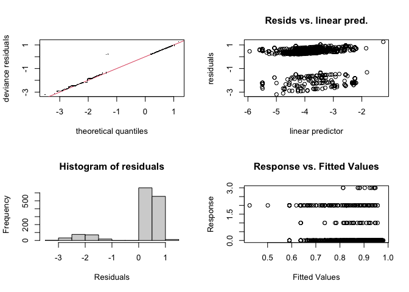
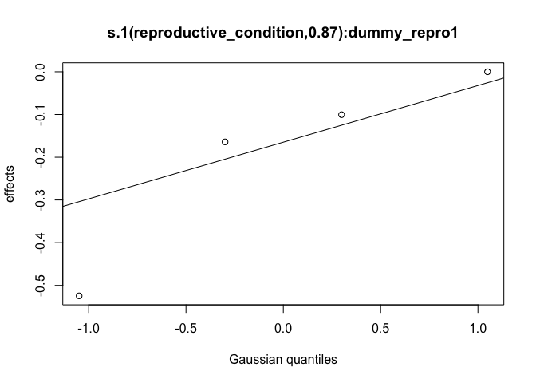
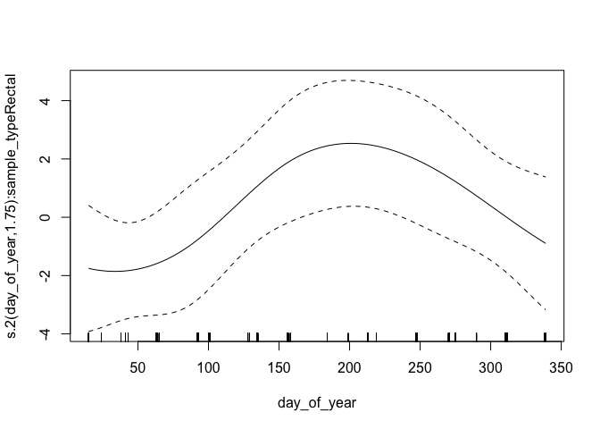

<style type="text/css">
.main-container {
  max-width: 1800px !important;
  margin-left: auto;
  margin-right: auto;
}
</style>

This document summarizes model diagnostics and checks.

First, we set up by loading packages and generated R objects.


```r
knitr::opts_chunk$set(echo = TRUE)
library(targets)
library(mgcv)
options(width = 250)
```


```r
tar_load(c(
  multinomial_model,
  gam_posterior,
  posterior_stats,
  dat_prepped
))
```

## Model Summary


```r
summary(multinomial_model)
```

```
## 
## Family: multinom 
## Link function: 
## 
## Formula:
## outcome ~ s(sample_type, bs = "re", by = dummy_rectal) + s(day, 
##     bs = "tp", k = 5, by = sample_type, m = 2) + s(day, gender_age, 
##     bs = "fs", k = 5, xt = list(bs = "tp"), by = dummy_rectal, 
##     m = 2) + s(day_of_year, bs = "cc", by = sample_type, k = 5, 
##     m = 2) + s(day_of_year, gender_age, bs = "fs", xt = list(bs = "cc"), 
##     k = 5, by = dummy_rectal, m = 2) + s(fmi_kg_m2, k = 5, bs = "tp", 
##     by = dummy_rectal) + s(reproductive_condition, bs = "re", 
##     by = dummy_repro) + s(frac_subadult, bs = "tp", k = 5, by = dummy_any_rectal) + 
##     s(frac_subadult, sample_type, bs = "fs", k = 5, xt = list(bs = "tp"), 
##         by = dummy_any_rectal, m = 2)
## <environment: 0x7fe540a36b48>
## ~s(sample_type, bs = "re", by = dummy_rectal) + s(day, bs = "tp", 
##     k = 5, by = sample_type, m = 2) + s(day, gender_age, bs = "fs", 
##     k = 5, xt = list(bs = "tp"), by = dummy_rectal, m = 2) + 
##     s(day_of_year, bs = "cc", by = sample_type, k = 5, m = 2) + 
##     s(day_of_year, gender_age, bs = "fs", xt = list(bs = "cc"), 
##         k = 5, by = dummy_rectal, m = 2) + s(fmi_kg_m2, k = 5, 
##     bs = "tp", by = dummy_rectal) + s(reproductive_condition, 
##     bs = "re", by = dummy_repro) + s(frac_subadult, bs = "tp", 
##     k = 5, by = dummy_any_rectal) + s(frac_subadult, sample_type, 
##     bs = "fs", k = 5, xt = list(bs = "tp"), by = dummy_any_rectal, 
##     m = 2)
## <environment: 0x7fe540a36b48>
## ~s(sample_type, bs = "re", by = dummy_rectal) + s(day, bs = "tp", 
##     k = 5, by = sample_type, m = 2) + s(day_of_year, bs = "cc", 
##     by = sample_type, k = 5, m = 2)
## <environment: 0x7fe540a36b48>
## 
## Parametric coefficients:
##               Estimate Std. Error z value Pr(>|z|)    
## (Intercept)    -2.6628     0.4240  -6.280 3.38e-10 ***
## (Intercept).1  -3.4124     0.4004  -8.522  < 2e-16 ***
## (Intercept).2  -6.4496     0.8494  -7.593 3.12e-14 ***
## ---
## Signif. codes:  0 '***' 0.001 '**' 0.01 '*' 0.05 '.' 0.1 ' ' 1
## 
## Approximate significance of smooth terms:
##                                                       edf Ref.df Chi.sq  p-value    
## s(sample_type):dummy_rectal1                    2.899e-05  2.000  0.000 0.789330    
## s(day):sample_typeFecal                         1.000e+00  1.000  0.724 0.394727    
## s(day):sample_typeRectal                        1.000e+00  1.000  0.394 0.530193    
## s(day,gender_age):dummy_rectal1                 2.987e-04 19.000  0.000 0.635107    
## s(day_of_year):sample_typeFecal                 1.965e+00  3.000 14.163 0.000225 ***
## s(day_of_year):sample_typeRectal                9.786e-01  3.000  2.132 0.098737 .  
## s(day_of_year,gender_age):dummy_rectal1         9.337e-05 16.000  0.000 0.838837    
## s(fmi_kg_m2):dummy_rectal1                      1.000e+00  1.000  2.517 0.112670    
## s(reproductive_condition):dummy_repro1          2.314e-05  3.000  0.000 0.815053    
## s(frac_subadult):dummy_any_rectal               3.948e+00  4.428 10.460 0.031024 *  
## s(frac_subadult,sample_type):dummy_any_rectal   1.442e-01  8.000  0.150 0.273131    
## s.1(sample_type):dummy_rectal1                  3.110e-05  1.000  0.000 0.645994    
## s.1(day):sample_typeFecal                       1.956e+00  2.275 29.559 1.16e-06 ***
## s.1(day):sample_typeRectal                      3.106e+00  3.503 30.700 7.16e-06 ***
## s.1(day,gender_age):dummy_rectal1               2.364e-04 19.000  0.000 0.858819    
## s.1(day_of_year):sample_typeFecal               2.191e+00  3.000 18.299 1.35e-05 ***
## s.1(day_of_year):sample_typeRectal              6.413e-04  3.000  0.001 0.214107    
## s.1(day_of_year,gender_age):dummy_rectal1       7.618e-05 16.000  0.000 0.812105    
## s.1(fmi_kg_m2):dummy_rectal1                    1.000e+00  1.001  5.909 0.015083 *  
## s.1(reproductive_condition):dummy_repro1        8.728e-01  3.000  1.223 0.235590    
## s.1(frac_subadult):dummy_any_rectal             4.773e+00  4.957 33.281 3.70e-06 ***
## s.1(frac_subadult,sample_type):dummy_any_rectal 1.628e-04  8.000  0.000 0.625941    
## s.2(sample_type):dummy_rectal1                  1.479e-05  1.000  0.000 0.606146    
## s.2(day):sample_typeFecal                       1.000e+00  1.000  0.029 0.864617    
## s.2(day):sample_typeRectal                      1.001e+00  1.001  0.246 0.620572    
## s.2(day_of_year):sample_typeFecal               2.192e+00  3.000 17.114 9.72e-05 ***
## s.2(day_of_year):sample_typeRectal              1.753e+00  3.000  5.547 0.032784 *  
## ---
## Signif. codes:  0 '***' 0.001 '**' 0.01 '*' 0.05 '.' 0.1 ' ' 1
## 
## Deviance explained = 16.9%
## -REML = -587.48  Scale est. = 1         n = 1430
```

## GAM Checks

`gam.check()` provides convergence diagnostics. Basis dimension (k) results should all be above 0.05 to indicate
that there are not systematic patterns in the model residuals.  Four diagnostic
plot are provided. In the first (Q-Q) plot, we should see residuals and quantiles
line up on the 1-1 line.  Other plots are difficult to interpret in the multinomial
case. 


```r
gam.check(multinomial_model)
```

<!-- -->

```
## 
## Method: REML   Optimizer: outer newton
## full convergence after 17 iterations.
## Gradient range [-0.0002321923,0.0001830841]
## (score -587.481 & scale 1).
## eigenvalue range [-1.650752e-05,1.092461].
## Model rank =  187 / 187 
## 
## Basis dimension (k) checking results. Low p-value (k-index<1) may
## indicate that k is too low, especially if edf is close to k'.
## 
##                                                       k'      edf k-index p-value
## s(sample_type):dummy_rectal1                    2.00e+00 2.90e-05      NA      NA
## s(day):sample_typeFecal                         4.00e+00 1.00e+00    0.96    0.21
## s(day):sample_typeRectal                        4.00e+00 1.00e+00    0.96    0.28
## s(day,gender_age):dummy_rectal1                 2.50e+01 2.99e-04    0.96    0.20
## s(day_of_year):sample_typeFecal                 3.00e+00 1.96e+00    0.96    0.26
## s(day_of_year):sample_typeRectal                3.00e+00 9.79e-01    0.96    0.20
## s(day_of_year,gender_age):dummy_rectal1         2.00e+01 9.34e-05    0.96    0.26
## s(fmi_kg_m2):dummy_rectal1                      4.00e+00 1.00e+00    0.98    0.61
## s(reproductive_condition):dummy_repro1          4.00e+00 2.31e-05      NA      NA
## s(frac_subadult):dummy_any_rectal               5.00e+00 3.95e+00    0.96    0.30
## s(frac_subadult,sample_type):dummy_any_rectal   1.00e+01 1.44e-01    0.96    0.21
## s.1(sample_type):dummy_rectal1                  2.00e+00 3.11e-05      NA      NA
## s.1(day):sample_typeFecal                       4.00e+00 1.96e+00    0.96    0.27
## s.1(day):sample_typeRectal                      4.00e+00 3.11e+00    0.96    0.26
## s.1(day,gender_age):dummy_rectal1               2.50e+01 2.36e-04    0.96    0.28
## s.1(day_of_year):sample_typeFecal               3.00e+00 2.19e+00    0.96    0.26
## s.1(day_of_year):sample_typeRectal              3.00e+00 6.41e-04    0.96    0.27
## s.1(day_of_year,gender_age):dummy_rectal1       2.00e+01 7.62e-05    0.96    0.26
## s.1(fmi_kg_m2):dummy_rectal1                    4.00e+00 1.00e+00    0.98    0.59
## s.1(reproductive_condition):dummy_repro1        4.00e+00 8.73e-01      NA      NA
## s.1(frac_subadult):dummy_any_rectal             5.00e+00 4.77e+00    0.96    0.29
## s.1(frac_subadult,sample_type):dummy_any_rectal 1.00e+01 1.63e-04    0.96    0.25
## s.2(sample_type):dummy_rectal1                  2.00e+00 1.48e-05      NA      NA
## s.2(day):sample_typeFecal                       4.00e+00 1.00e+00    0.96    0.23
## s.2(day):sample_typeRectal                      4.00e+00 1.00e+00    0.96    0.23
## s.2(day_of_year):sample_typeFecal               3.00e+00 2.19e+00    0.96    0.26
## s.2(day_of_year):sample_typeRectal              3.00e+00 1.75e+00    0.96    0.29
```

## Individual Smooth terms

These are plots of the indivudal smooths in the model on the linear scale.
Inspect for strange behavior and check that their shape corresponds with
significance terms in in the model summary.


```r
for (i in seq_len(length(multinomial_model$smooth) + sum(multinomial_model$nsdf) - 3)) {
  plot(multinomial_model, scale = 0, select = i, all.terms = TRUE)
}
```



## MCMC diagnostics

These are acceptance ratios from the 4 MCMC chains
run.  

From `?gam.mh`:

> The function reports the acceptance rate of the two types of step. If the 
> random walk acceptance probability (`$rw.accept`) is higher than a quarter then `rw.step` 
> should probably be increased. Similarly if the acceptance rate (`$accept`) is too low,
> it should be decreased. The random walk steps can be turned off altogether
> (see above), but it is important to check the chains for stuck sections if
> this is done.


```r
attributes(gam_posterior)[c("accept", "rw.accept")]
```

```
## $accept
## [1] 0.1327273 0.1224727 0.1336727 0.1122909
## 
## $rw.accept
## [1] 0.03309091 0.03280000 0.03243636 0.03258182
```

Here is a summary of the dimensions of the MCMC chain output

```r
tibble::tibble(
  dimension = names(dimnames(gam_posterior)),
  value = dim(gam_posterior)
)
```

```
## # A tibble: 3 × 2
##   dimension value
##   <chr>     <int>
## 1 Iteration   138
## 2 Chain         4
## 3 Parameter   187
```


Here are Stan-type per-parameter chain diagnostics.  `Rhat` should be at or near
1 to indicate that the multiple MCMC chains are well-mixed.  `ess_bulk` and 
`ess_tail` are the effective sample sizes for posterior samples from the parameter
distributions and the tails of those distributions, respectively. From the Stan
manual:

> We recommend running at least four chains by default and only using the sample
> if R-hat is less than 1.05....
>
> Both bulk-ESS and tail-ESS should be at least 100 (approximately) per
> Markov Chain in order to be reliable and indicate that estimates of respective
> posterior quantiles are reliable


```r
print(posterior_stats, n = Inf)
```

```
## # A tibble: 187 × 4
##     parameter                                           Rhat ess_bulk ess_tail
##     <chr>                                              <dbl>    <dbl>    <dbl>
##   1 (Intercept)                                        1.00      431.    406. 
##   2 s(sample_type):dummy_rectal1.1                     1.01      417.    455. 
##   3 s(sample_type):dummy_rectal1.2                     1.02      375.    226. 
##   4 s(day):sample_typeFecal.1                          1.00      419.    488. 
##   5 s(day):sample_typeFecal.2                          1.00      400.    504. 
##   6 s(day):sample_typeFecal.3                          1.01      336.    503. 
##   7 s(day):sample_typeFecal.4                          1.00      447.    440. 
##   8 s(day):sample_typeRectal.1                         1.01      254.    299. 
##   9 s(day):sample_typeRectal.2                         1.00      422.    470. 
##  10 s(day):sample_typeRectal.3                         1.01      382.    302. 
##  11 s(day):sample_typeRectal.4                         1.02      481.    406. 
##  12 s(day,gender_age):dummy_rectal1.1                  0.999     493.    507. 
##  13 s(day,gender_age):dummy_rectal1.2                  1.00      373.    388. 
##  14 s(day,gender_age):dummy_rectal1.3                  1.01      316.    239. 
##  15 s(day,gender_age):dummy_rectal1.4                  1.01      289.    165. 
##  16 s(day,gender_age):dummy_rectal1.5                  1.00      299.    625. 
##  17 s(day,gender_age):dummy_rectal1.6                  1.00      431.    404. 
##  18 s(day,gender_age):dummy_rectal1.7                  1.01      504.    512. 
##  19 s(day,gender_age):dummy_rectal1.8                  1.01      360.    329. 
##  20 s(day,gender_age):dummy_rectal1.9                  1.01      339.    368. 
##  21 s(day,gender_age):dummy_rectal1.10                 1.01      439.    504. 
##  22 s(day,gender_age):dummy_rectal1.11                 1.00      371.    389. 
##  23 s(day,gender_age):dummy_rectal1.12                 1.00      490.    471. 
##  24 s(day,gender_age):dummy_rectal1.13                 1.00      504.    427. 
##  25 s(day,gender_age):dummy_rectal1.14                 1.00      415.    462. 
##  26 s(day,gender_age):dummy_rectal1.15                 1.00      432.    473. 
##  27 s(day,gender_age):dummy_rectal1.16                 1.01      474.    467. 
##  28 s(day,gender_age):dummy_rectal1.17                 1.00      323.    320. 
##  29 s(day,gender_age):dummy_rectal1.18                 1.00      377.    423. 
##  30 s(day,gender_age):dummy_rectal1.19                 1.00      483.    575. 
##  31 s(day,gender_age):dummy_rectal1.20                 1.01      347.    320. 
##  32 s(day,gender_age):dummy_rectal1.21                 1.01      379.    384. 
##  33 s(day,gender_age):dummy_rectal1.22                 1.01      313.    155. 
##  34 s(day,gender_age):dummy_rectal1.23                 1.02      479.    501. 
##  35 s(day,gender_age):dummy_rectal1.24                 1.01      362.    353. 
##  36 s(day,gender_age):dummy_rectal1.25                 1.00      539.    448. 
##  37 s(day_of_year):sample_typeFecal.1                  1.02      162.    244. 
##  38 s(day_of_year):sample_typeFecal.2                  0.999     407.    373. 
##  39 s(day_of_year):sample_typeFecal.3                  1.00      390.    388. 
##  40 s(day_of_year):sample_typeRectal.1                 1.01      429.    444. 
##  41 s(day_of_year):sample_typeRectal.2                 0.998     384.    455. 
##  42 s(day_of_year):sample_typeRectal.3                 1.01      259.    186. 
##  43 s(day_of_year,gender_age):dummy_rectal1.1          1.00      429.    488. 
##  44 s(day_of_year,gender_age):dummy_rectal1.2          1.00      464.    296. 
##  45 s(day_of_year,gender_age):dummy_rectal1.3          1.00      403.    473. 
##  46 s(day_of_year,gender_age):dummy_rectal1.4          1.01      349.    442. 
##  47 s(day_of_year,gender_age):dummy_rectal1.5          1.01      439.    375. 
##  48 s(day_of_year,gender_age):dummy_rectal1.6          1.00      422.    429. 
##  49 s(day_of_year,gender_age):dummy_rectal1.7          1.01      354.    317. 
##  50 s(day_of_year,gender_age):dummy_rectal1.8          1.01      565.    541. 
##  51 s(day_of_year,gender_age):dummy_rectal1.9          0.999     497.    470. 
##  52 s(day_of_year,gender_age):dummy_rectal1.10         1.01      366.    380. 
##  53 s(day_of_year,gender_age):dummy_rectal1.11         1.00      457.    540. 
##  54 s(day_of_year,gender_age):dummy_rectal1.12         1.01      302.    231. 
##  55 s(day_of_year,gender_age):dummy_rectal1.13         1.01      318.    332. 
##  56 s(day_of_year,gender_age):dummy_rectal1.14         1.01      443.    365. 
##  57 s(day_of_year,gender_age):dummy_rectal1.15         1.01      427.    487. 
##  58 s(day_of_year,gender_age):dummy_rectal1.16         0.997     544.    301. 
##  59 s(day_of_year,gender_age):dummy_rectal1.17         1.00      274.    389. 
##  60 s(day_of_year,gender_age):dummy_rectal1.18         1.01      490.    412. 
##  61 s(day_of_year,gender_age):dummy_rectal1.19         1.00      412.    505. 
##  62 s(day_of_year,gender_age):dummy_rectal1.20         1.00      482.    470. 
##  63 s(fmi_kg_m2):dummy_rectal1.1                       1.01      386.    485. 
##  64 s(fmi_kg_m2):dummy_rectal1.2                       1.01      485.    496. 
##  65 s(fmi_kg_m2):dummy_rectal1.3                       1.01      447.    438. 
##  66 s(fmi_kg_m2):dummy_rectal1.4                       1.01      367.    460. 
##  67 s(reproductive_condition):dummy_repro1.1           1.01      314.    278. 
##  68 s(reproductive_condition):dummy_repro1.2           1.01      400.    505. 
##  69 s(reproductive_condition):dummy_repro1.3           1.01      315.    302. 
##  70 s(reproductive_condition):dummy_repro1.4           1.01      333.    339. 
##  71 s(frac_subadult):dummy_any_rectal.1                1.01      290.     89.4
##  72 s(frac_subadult):dummy_any_rectal.2                1.01      305.    152. 
##  73 s(frac_subadult):dummy_any_rectal.3                1.01      429.    181. 
##  74 s(frac_subadult):dummy_any_rectal.4                1.01      310.    109. 
##  75 s(frac_subadult):dummy_any_rectal.5                1.00      316.    194. 
##  76 s(frac_subadult,sample_type):dummy_any_rectal.1    1.00      312.    364. 
##  77 s(frac_subadult,sample_type):dummy_any_rectal.2    1.01      357.    305. 
##  78 s(frac_subadult,sample_type):dummy_any_rectal.3    1.01      351.    393. 
##  79 s(frac_subadult,sample_type):dummy_any_rectal.4    1.01      500.    472. 
##  80 s(frac_subadult,sample_type):dummy_any_rectal.5    1.00      384.    333. 
##  81 s(frac_subadult,sample_type):dummy_any_rectal.6    1.00      402.    504. 
##  82 s(frac_subadult,sample_type):dummy_any_rectal.7    0.999     446.    415. 
##  83 s(frac_subadult,sample_type):dummy_any_rectal.8    1.00      368.    474. 
##  84 s(frac_subadult,sample_type):dummy_any_rectal.9    1.00      430.    370. 
##  85 s(frac_subadult,sample_type):dummy_any_rectal.10   1.01      316.    383. 
##  86 (Intercept).1                                      1.00      410.    427. 
##  87 s.1(sample_type):dummy_rectal1.1                   1.00      426.    501. 
##  88 s.1(sample_type):dummy_rectal1.2                   1.01      375.    507. 
##  89 s.1(day):sample_typeFecal.1                        1.00      457.    507. 
##  90 s.1(day):sample_typeFecal.2                        1.00      543.    430. 
##  91 s.1(day):sample_typeFecal.3                        1.00      514.    442. 
##  92 s.1(day):sample_typeFecal.4                        1.02      433.    501. 
##  93 s.1(day):sample_typeRectal.1                       1.02      186.    109. 
##  94 s.1(day):sample_typeRectal.2                       1.01      474.    470. 
##  95 s.1(day):sample_typeRectal.3                       1.00      386.    260. 
##  96 s.1(day):sample_typeRectal.4                       1.01      203.    140. 
##  97 s.1(day,gender_age):dummy_rectal1.1                1.01      452.    491. 
##  98 s.1(day,gender_age):dummy_rectal1.2                1.00      294.    283. 
##  99 s.1(day,gender_age):dummy_rectal1.3                1.00      311.    304. 
## 100 s.1(day,gender_age):dummy_rectal1.4                1.01      345.    408. 
## 101 s.1(day,gender_age):dummy_rectal1.5                0.999     419.    506. 
## 102 s.1(day,gender_age):dummy_rectal1.6                1.00      398.    337. 
## 103 s.1(day,gender_age):dummy_rectal1.7                1.01      303.    257. 
## 104 s.1(day,gender_age):dummy_rectal1.8                1.01      340.    412. 
## 105 s.1(day,gender_age):dummy_rectal1.9                1.00      468.    504. 
## 106 s.1(day,gender_age):dummy_rectal1.10               1.00      402.    539. 
## 107 s.1(day,gender_age):dummy_rectal1.11               0.997     557.    585. 
## 108 s.1(day,gender_age):dummy_rectal1.12               1.00      523.    537. 
## 109 s.1(day,gender_age):dummy_rectal1.13               1.00      456.    345. 
## 110 s.1(day,gender_age):dummy_rectal1.14               1.01      437.    390. 
## 111 s.1(day,gender_age):dummy_rectal1.15               0.999     486.    516. 
## 112 s.1(day,gender_age):dummy_rectal1.16               1.01      270.    243. 
## 113 s.1(day,gender_age):dummy_rectal1.17               0.998     311.    465. 
## 114 s.1(day,gender_age):dummy_rectal1.18               1.00      513.    406. 
## 115 s.1(day,gender_age):dummy_rectal1.19               1.00      384.    345. 
## 116 s.1(day,gender_age):dummy_rectal1.20               1.00      381.    287. 
## 117 s.1(day,gender_age):dummy_rectal1.21               1.00      470.    482. 
## 118 s.1(day,gender_age):dummy_rectal1.22               1.00      452.    507. 
## 119 s.1(day,gender_age):dummy_rectal1.23               1.00      432.    348. 
## 120 s.1(day,gender_age):dummy_rectal1.24               1.00      358.    543. 
## 121 s.1(day,gender_age):dummy_rectal1.25               1.01      378.    466. 
## 122 s.1(day_of_year):sample_typeFecal.1                1.00      504.    308. 
## 123 s.1(day_of_year):sample_typeFecal.2                1.01      370.    455. 
## 124 s.1(day_of_year):sample_typeFecal.3                1.01      409.    439. 
## 125 s.1(day_of_year):sample_typeRectal.1               1.00      237.    311. 
## 126 s.1(day_of_year):sample_typeRectal.2               1.01      335.    425. 
## 127 s.1(day_of_year):sample_typeRectal.3               1.01      369.    458. 
## 128 s.1(day_of_year,gender_age):dummy_rectal1.1        1.02      255.    417. 
## 129 s.1(day_of_year,gender_age):dummy_rectal1.2        1.00      373.    424. 
## 130 s.1(day_of_year,gender_age):dummy_rectal1.3        1.00      497.    480. 
## 131 s.1(day_of_year,gender_age):dummy_rectal1.4        1.01      284.    145. 
## 132 s.1(day_of_year,gender_age):dummy_rectal1.5        1.01      351.    375. 
## 133 s.1(day_of_year,gender_age):dummy_rectal1.6        1.01      226.    198. 
## 134 s.1(day_of_year,gender_age):dummy_rectal1.7        1.00      350.    336. 
## 135 s.1(day_of_year,gender_age):dummy_rectal1.8        1.01      348.    486. 
## 136 s.1(day_of_year,gender_age):dummy_rectal1.9        1.00      519.    545. 
## 137 s.1(day_of_year,gender_age):dummy_rectal1.10       1.00      438.    420. 
## 138 s.1(day_of_year,gender_age):dummy_rectal1.11       1.00      389.    406. 
## 139 s.1(day_of_year,gender_age):dummy_rectal1.12       1.01      391.    493. 
## 140 s.1(day_of_year,gender_age):dummy_rectal1.13       1.00      346.    473. 
## 141 s.1(day_of_year,gender_age):dummy_rectal1.14       1.01      421.    459. 
## 142 s.1(day_of_year,gender_age):dummy_rectal1.15       0.999     390.    402. 
## 143 s.1(day_of_year,gender_age):dummy_rectal1.16       1.00      565.    544. 
## 144 s.1(day_of_year,gender_age):dummy_rectal1.17       1.01      324.    485. 
## 145 s.1(day_of_year,gender_age):dummy_rectal1.18       1.00      345.    433. 
## 146 s.1(day_of_year,gender_age):dummy_rectal1.19       1.00      424.    417. 
## 147 s.1(day_of_year,gender_age):dummy_rectal1.20       1.00      432.    501. 
## 148 s.1(fmi_kg_m2):dummy_rectal1.1                     0.998     294.    362. 
## 149 s.1(fmi_kg_m2):dummy_rectal1.2                     1.01      494.    415. 
## 150 s.1(fmi_kg_m2):dummy_rectal1.3                     1.00      437.    507. 
## 151 s.1(fmi_kg_m2):dummy_rectal1.4                     1.01      412.    512. 
## 152 s.1(reproductive_condition):dummy_repro1.1         1.00      508.    431. 
## 153 s.1(reproductive_condition):dummy_repro1.2         1.00      441.    449. 
## 154 s.1(reproductive_condition):dummy_repro1.3         1.00      457.    485. 
## 155 s.1(reproductive_condition):dummy_repro1.4         1.01      386.    400. 
## 156 s.1(frac_subadult):dummy_any_rectal.1              1.01      302.    330. 
## 157 s.1(frac_subadult):dummy_any_rectal.2              0.996     302.    272. 
## 158 s.1(frac_subadult):dummy_any_rectal.3              1.00      342.    330. 
## 159 s.1(frac_subadult):dummy_any_rectal.4              1.01      335.    305. 
## 160 s.1(frac_subadult):dummy_any_rectal.5              1.01      308.    321. 
## 161 s.1(frac_subadult,sample_type):dummy_any_rectal.1  1.00      393.    366. 
## 162 s.1(frac_subadult,sample_type):dummy_any_rectal.2  1.00      407.    543. 
## 163 s.1(frac_subadult,sample_type):dummy_any_rectal.3  1.00      461.    433. 
## 164 s.1(frac_subadult,sample_type):dummy_any_rectal.4  1.01      489.    465. 
## 165 s.1(frac_subadult,sample_type):dummy_any_rectal.5  1.00      389.    507. 
## 166 s.1(frac_subadult,sample_type):dummy_any_rectal.6  1.01      490.    532. 
## 167 s.1(frac_subadult,sample_type):dummy_any_rectal.7  1.01      435.    348. 
## 168 s.1(frac_subadult,sample_type):dummy_any_rectal.8  1.00      470.    504. 
## 169 s.1(frac_subadult,sample_type):dummy_any_rectal.9  1.02      325.    503. 
## 170 s.1(frac_subadult,sample_type):dummy_any_rectal.10 1.01      330.    364. 
## 171 (Intercept).2                                      1.01      310.    192. 
## 172 s.2(sample_type):dummy_rectal1.1                   1.00      432.    388. 
## 173 s.2(sample_type):dummy_rectal1.2                   1.00      430.    435. 
## 174 s.2(day):sample_typeFecal.1                        1.00      502.    516. 
## 175 s.2(day):sample_typeFecal.2                        1.02      322.    403. 
## 176 s.2(day):sample_typeFecal.3                        1.01      336.    495. 
## 177 s.2(day):sample_typeFecal.4                        1.01      264.    351. 
## 178 s.2(day):sample_typeRectal.1                       1.01      342.    418. 
## 179 s.2(day):sample_typeRectal.2                       1.01      291.    347. 
## 180 s.2(day):sample_typeRectal.3                       1.02      307.    248. 
## 181 s.2(day):sample_typeRectal.4                       1.01      338.    437. 
## 182 s.2(day_of_year):sample_typeFecal.1                1.01      413.    540. 
## 183 s.2(day_of_year):sample_typeFecal.2                1.04      151.    104. 
## 184 s.2(day_of_year):sample_typeFecal.3                1.02      244.    137. 
## 185 s.2(day_of_year):sample_typeRectal.1               1.03      232.    189. 
## 186 s.2(day_of_year):sample_typeRectal.2               1.03      203.     93.4
## 187 s.2(day_of_year):sample_typeRectal.3               1.01      240.    132.
```

