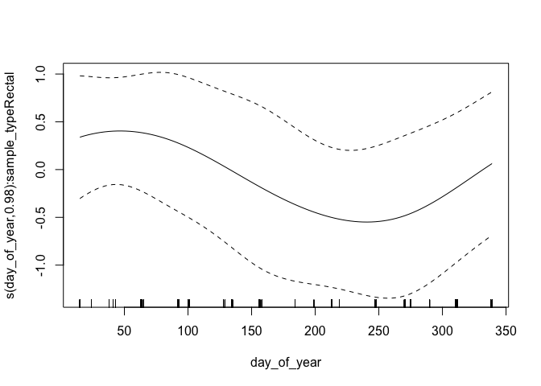

<style type="text/css">
.main-container {
  max-width: 1800px !important;
  margin-left: auto;
  margin-right: auto;
}
</style>

This document summarizes model diagnostics and checks.

First, we set up by loading packages and generated R objects.


```r
knitr::opts_chunk$set(echo = TRUE)
library(targets)
library(mgcv)
```


```r
tar_load(c(
  multinomial_model,
  gam_posterior,
  posterior_stats
))
```

## Model Summary


```r
summary(multinomial_model)
```

```
## 
## Family: multinom 
## Link function: 
## 
## Formula:
## outcome ~ s(day, bs = "ad", k = 15, m = 3, by = sample_type) + 
##     s(day_of_year, bs = "cc", by = sample_type, k = 5) + s(fmi_kg_m2, 
##     k = 5, by = dummy_rectal)
## <environment: 0x7fe398067580>
## ~s(day, bs = "ad", k = 15, m = 3, by = sample_type) + s(day_of_year, 
##     bs = "cc", by = sample_type, k = 5) + s(fmi_kg_m2, k = 5, 
##     by = dummy_rectal)
## <environment: 0x7fe398067580>
## ~s(day, bs = "ad", k = 15, m = 3, by = sample_type) + s(day_of_year, 
##     bs = "cc", by = sample_type, k = 5) + s(fmi_kg_m2, k = 5, 
##     by = dummy_rectal)
## <environment: 0x7fe398067580>
## 
## Parametric coefficients:
##               Estimate Std. Error z value Pr(>|z|)    
## (Intercept)    -3.7500     0.3737 -10.034  < 2e-16 ***
## (Intercept).1  -2.4656     0.1750 -14.091  < 2e-16 ***
## (Intercept).2  -5.9497     0.9923  -5.996 2.02e-09 ***
## ---
## Signif. codes:  0 '***' 0.001 '**' 0.01 '*' 0.05 '.' 0.1 ' ' 1
## 
## Approximate significance of smooth terms:
##                                          edf Ref.df Chi.sq  p-value    
## s(day):sample_typeFecal            3.084e+00  3.638  4.491 0.296499    
## s(day):sample_typeRectal           1.000e+00  1.000  0.282 0.595226    
## s(day_of_year):sample_typeFecal    2.026e+00  3.000  9.663 0.000609 ***
## s(day_of_year):sample_typeRectal   1.312e+00  3.000  3.559 0.059694 .  
## s(fmi_kg_m2):dummy_rectal          2.000e+00  2.000  2.674 0.262676    
## s.1(day):sample_typeFecal          2.557e+00  3.015 18.590 0.000338 ***
## s.1(day):sample_typeRectal         6.467e+00  7.442 43.128  < 2e-16 ***
## s.1(day_of_year):sample_typeFecal  2.463e+00  3.000 38.145  < 2e-16 ***
## s.1(day_of_year):sample_typeRectal 8.199e-06  3.000  0.000 0.119660    
## s.1(fmi_kg_m2):dummy_rectal        2.397e+00  2.700  8.420 0.019456 *  
## s.2(day):sample_typeFecal          1.000e+00  1.001  0.021 0.885151    
## s.2(day):sample_typeRectal         2.092e+00  2.407  0.195 0.927398    
## s.2(day_of_year):sample_typeFecal  2.093e+00  3.000 10.603 0.003558 ** 
## s.2(day_of_year):sample_typeRectal 2.750e-07  3.000  0.000 0.810569    
## s.2(fmi_kg_m2):dummy_rectal        2.920e+00  3.138  2.575 0.496824    
## ---
## Signif. codes:  0 '***' 0.001 '**' 0.01 '*' 0.05 '.' 0.1 ' ' 1
## 
## Deviance explained = 16.8%
## -REML = -598.57  Scale est. = 1         n = 1430
```

## GAM Checks

`gam.check()` provides convergence diagnostics. Basis dimension (k) results should all be above 0.05 to indicate
that there are not systematic patterns in the model residuals.  Four diagnostic
plot are provided. In the first (Q-Q) plot, we should see residuals and quantiles
line up on the 1-1 line.  Other plots are difficult to interpret in the multinomial
case. 


```r
gam.check(multinomial_model)
```

<!-- -->

```
## 
## Method: REML   Optimizer: outer newton
## full convergence after 14 iterations.
## Gradient range [-0.0001180344,1.096545e-05]
## (score -598.5698 & scale 1).
## eigenvalue range [-7.303844e-13,1.188504].
## Model rank =  120 / 120 
## 
## Basis dimension (k) checking results. Low p-value (k-index<1) may
## indicate that k is too low, especially if edf is close to k'.
## 
##                                          k'      edf k-index p-value
## s(day):sample_typeFecal            1.40e+01 3.08e+00    0.96    0.18
## s(day):sample_typeRectal           1.40e+01 1.00e+00    0.96    0.26
## s(day_of_year):sample_typeFecal    3.00e+00 2.03e+00    0.96    0.17
## s(day_of_year):sample_typeRectal   3.00e+00 1.31e+00    0.96    0.22
## s(fmi_kg_m2):dummy_rectal          5.00e+00 2.00e+00    0.96    0.28
## s.1(day):sample_typeFecal          1.40e+01 2.56e+00    0.96    0.20
## s.1(day):sample_typeRectal         1.40e+01 6.47e+00    0.96    0.20
## s.1(day_of_year):sample_typeFecal  3.00e+00 2.46e+00    0.96    0.24
## s.1(day_of_year):sample_typeRectal 3.00e+00 8.20e-06    0.96    0.21
## s.1(fmi_kg_m2):dummy_rectal        5.00e+00 2.40e+00    0.96    0.30
## s.2(day):sample_typeFecal          1.40e+01 1.00e+00    0.96    0.18
## s.2(day):sample_typeRectal         1.40e+01 2.09e+00    0.96    0.24
## s.2(day_of_year):sample_typeFecal  3.00e+00 2.09e+00    0.96    0.24
## s.2(day_of_year):sample_typeRectal 3.00e+00 2.75e-07    0.96    0.20
## s.2(fmi_kg_m2):dummy_rectal        5.00e+00 2.92e+00    0.96    0.28
```

## Individual Smooth terms

These are plots of the indivudal smooths in the model on the linear scale.
Inspect for strange behavior and check that their shape corresponds with
significance terms in in the model summary.


```r
for (i in seq_len(length(multinomial_model$smooth))) {
  plot(multinomial_model, scale = 0, select = i)
}
```



## MCMC diagnostics

These are acceptance ratios from the 4 MCMC chains
run.  

From `?gam.mh`:

> The function reports the acceptance rate of the two types of step. If the 
> random walk acceptance probability (`$rw.accept`) is higher than a quarter then `rw.step` 
> should probably be increased. Similarly if the acceptance rate (`$accept`) is too low,
> it should be decreased. The random walk steps can be turned off altogether
> (see above), but it is important to check the chains for stuck sections if
> this is done.


```r
attributes(gam_posterior)[c("accept", "rw.accept")]
```

```
## $accept
## [1] 0.00415 0.00330 0.00250 0.00420
## 
## $rw.accept
## [1] 0.18855 0.18475 0.18625 0.18785
```

Here is a summary of the dimensions of the MCMC chain output

```r
tibble(
  dimension = names(dimnames(gam_posterior)),
  value = dim(gam_posterior)
)
```

```
## # A tibble: 3 × 2
##   dimension value
##   <chr>     <int>
## 1 Iteration   200
## 2 Chain         4
## 3 Parameter   120
```


Here are Stan-type per-parameter chain diagnostics.  `Rhat` should be at or near
1 to indicate that the multiple MCMC chains are well-mixed.  `ess_bulk` and 
`ess_tail` are the effective sample sizes for posterior samples from the parameter
distributions and the tails of those distributions, respectively. From the Stan
manual:

> We recommend running at least four chains by default and only using the sample
> if R-hat is less than 1.05....
>
> Both bulk-ESS and tail-ESS should be at least 100 (approximately) per
> Markov Chain in order to be reliable and indicate that estimates of respective
> posterior quantiles are reliable


```r
print(posterior_stats, n = Inf)
```

```
## # A tibble: 120 × 4
##     parameter                             Rhat ess_bulk ess_tail
##     <chr>                                <dbl>    <dbl>    <dbl>
##   1 (Intercept)                           1.01     263.     338.
##   2 s(day):sample_typeFecal.1             1.02     247.     302.
##   3 s(day):sample_typeFecal.2             1.02     226.     223.
##   4 s(day):sample_typeFecal.3             1.01     238.     350.
##   5 s(day):sample_typeFecal.4             1.02     354.     307.
##   6 s(day):sample_typeFecal.5             1.03     281.     517.
##   7 s(day):sample_typeFecal.6             1.04     144.     523.
##   8 s(day):sample_typeFecal.7             1.02     262.     395.
##   9 s(day):sample_typeFecal.8             1.01     268.     377.
##  10 s(day):sample_typeFecal.9             1.00     291.     406.
##  11 s(day):sample_typeFecal.10            1.02     326.     440.
##  12 s(day):sample_typeFecal.11            1.02     312.     341.
##  13 s(day):sample_typeFecal.12            1.03     230.     538.
##  14 s(day):sample_typeFecal.13            1.00     286.     483.
##  15 s(day):sample_typeFecal.14            1.00     255.     475.
##  16 s(day):sample_typeRectal.1            1.01     240.     374.
##  17 s(day):sample_typeRectal.2            1.01     240.     374.
##  18 s(day):sample_typeRectal.3            1.01     240.     374.
##  19 s(day):sample_typeRectal.4            1.01     241.     340.
##  20 s(day):sample_typeRectal.5            1.01     242.     374.
##  21 s(day):sample_typeRectal.6            1.02     289.     384.
##  22 s(day):sample_typeRectal.7            1.01     239.     348.
##  23 s(day):sample_typeRectal.8            1.01     240.     340.
##  24 s(day):sample_typeRectal.9            1.01     240.     340.
##  25 s(day):sample_typeRectal.10           1.01     240.     374.
##  26 s(day):sample_typeRectal.11           1.01     240.     374.
##  27 s(day):sample_typeRectal.12           1.01     240.     374.
##  28 s(day):sample_typeRectal.13           1.01     240.     374.
##  29 s(day):sample_typeRectal.14           1.01     240.     374.
##  30 s(day_of_year):sample_typeFecal.1     1.01     319.     476.
##  31 s(day_of_year):sample_typeFecal.2     1.03     183.     431.
##  32 s(day_of_year):sample_typeFecal.3     1.02     216.     324.
##  33 s(day_of_year):sample_typeRectal.1    1.00     235.     304.
##  34 s(day_of_year):sample_typeRectal.2    1.01     268.     286.
##  35 s(day_of_year):sample_typeRectal.3    1.01     270.     474.
##  36 s(fmi_kg_m2):dummy_rectal.1           1.01     215.     460.
##  37 s(fmi_kg_m2):dummy_rectal.2           1.02     256.     408.
##  38 s(fmi_kg_m2):dummy_rectal.3           1.00     237.     470.
##  39 s(fmi_kg_m2):dummy_rectal.4           1.01     253.     351.
##  40 s(fmi_kg_m2):dummy_rectal.5           1.00     280.     331.
##  41 (Intercept).1                         1.01     218.     334.
##  42 s.1(day):sample_typeFecal.1           1.02     270.     424.
##  43 s.1(day):sample_typeFecal.2           1.01     288.     596.
##  44 s.1(day):sample_typeFecal.3           1.01     280.     368.
##  45 s.1(day):sample_typeFecal.4           1.01     247.     387.
##  46 s.1(day):sample_typeFecal.5           1.01     221.     385.
##  47 s.1(day):sample_typeFecal.6           1.02     259.     415.
##  48 s.1(day):sample_typeFecal.7           1.01     301.     456.
##  49 s.1(day):sample_typeFecal.8           1.01     301.     485.
##  50 s.1(day):sample_typeFecal.9           1.01     284.     500.
##  51 s.1(day):sample_typeFecal.10          1.02     286.     457.
##  52 s.1(day):sample_typeFecal.11          1.01     268.     416.
##  53 s.1(day):sample_typeFecal.12          1.01     273.     370.
##  54 s.1(day):sample_typeFecal.13          1.02     236.     589.
##  55 s.1(day):sample_typeFecal.14          1.01     245.     361.
##  56 s.1(day):sample_typeRectal.1          1.01     231.     437.
##  57 s.1(day):sample_typeRectal.2          1.01     198.     410.
##  58 s.1(day):sample_typeRectal.3          1.01     191.     416.
##  59 s.1(day):sample_typeRectal.4          1.01     191.     416.
##  60 s.1(day):sample_typeRectal.5          1.01     191.     416.
##  61 s.1(day):sample_typeRectal.6          1.01     191.     416.
##  62 s.1(day):sample_typeRectal.7          1.01     191.     416.
##  63 s.1(day):sample_typeRectal.8          1.01     191.     416.
##  64 s.1(day):sample_typeRectal.9          1.01     191.     416.
##  65 s.1(day):sample_typeRectal.10         1.01     191.     416.
##  66 s.1(day):sample_typeRectal.11         1.01     191.     416.
##  67 s.1(day):sample_typeRectal.12         1.01     191.     416.
##  68 s.1(day):sample_typeRectal.13         1.01     190.     416.
##  69 s.1(day):sample_typeRectal.14         1.01     189.     415.
##  70 s.1(day_of_year):sample_typeFecal.1   1.01     222.     430.
##  71 s.1(day_of_year):sample_typeFecal.2   1.02     192.     324.
##  72 s.1(day_of_year):sample_typeFecal.3   1.01     236.     405.
##  73 s.1(day_of_year):sample_typeRectal.1  1.01     340.     451.
##  74 s.1(day_of_year):sample_typeRectal.2  1.01     277.     453.
##  75 s.1(day_of_year):sample_typeRectal.3  1.02     313.     562.
##  76 s.1(fmi_kg_m2):dummy_rectal.1         1.00     288.     405.
##  77 s.1(fmi_kg_m2):dummy_rectal.2         1.02     300.     543.
##  78 s.1(fmi_kg_m2):dummy_rectal.3         1.01     277.     456.
##  79 s.1(fmi_kg_m2):dummy_rectal.4         1.01     179.     311.
##  80 s.1(fmi_kg_m2):dummy_rectal.5         1.01     265.     392.
##  81 (Intercept).2                         1.05     112.     139.
##  82 s.2(day):sample_typeFecal.1           1.02     146.     273.
##  83 s.2(day):sample_typeFecal.2           1.02     146.     274.
##  84 s.2(day):sample_typeFecal.3           1.02     144.     284.
##  85 s.2(day):sample_typeFecal.4           1.02     141.     284.
##  86 s.2(day):sample_typeFecal.5           1.02     139.     291.
##  87 s.2(day):sample_typeFecal.6           1.00     350.     405.
##  88 s.2(day):sample_typeFecal.7           1.01     172.     360.
##  89 s.2(day):sample_typeFecal.8           1.01     157.     285.
##  90 s.2(day):sample_typeFecal.9           1.02     154.     296.
##  91 s.2(day):sample_typeFecal.10          1.02     152.     290.
##  92 s.2(day):sample_typeFecal.11          1.02     152.     290.
##  93 s.2(day):sample_typeFecal.12          1.02     151.     290.
##  94 s.2(day):sample_typeFecal.13          1.02     150.     261.
##  95 s.2(day):sample_typeFecal.14          1.02     148.     266.
##  96 s.2(day):sample_typeRectal.1          1.00     285.     492.
##  97 s.2(day):sample_typeRectal.2          1.00     291.     461.
##  98 s.2(day):sample_typeRectal.3          1.00     308.     406.
##  99 s.2(day):sample_typeRectal.4          1.01     337.     512.
## 100 s.2(day):sample_typeRectal.5          1.01     238.     361.
## 101 s.2(day):sample_typeRectal.6          1.01     213.     309.
## 102 s.2(day):sample_typeRectal.7          1.01     201.     264.
## 103 s.2(day):sample_typeRectal.8          1.01     194.     245.
## 104 s.2(day):sample_typeRectal.9          1.01     210.     291.
## 105 s.2(day):sample_typeRectal.10         1.01     227.     292.
## 106 s.2(day):sample_typeRectal.11         1.01     296.     346.
## 107 s.2(day):sample_typeRectal.12         1.00     328.     521.
## 108 s.2(day):sample_typeRectal.13         1.00     310.     432.
## 109 s.2(day):sample_typeRectal.14         1.01     335.     582.
## 110 s.2(day_of_year):sample_typeFecal.1   1.02     196.     296.
## 111 s.2(day_of_year):sample_typeFecal.2   1.04     152.     160.
## 112 s.2(day_of_year):sample_typeFecal.3   1.04     146.     165.
## 113 s.2(day_of_year):sample_typeRectal.1  1.01     260.     374.
## 114 s.2(day_of_year):sample_typeRectal.2  1.01     295.     418.
## 115 s.2(day_of_year):sample_typeRectal.3  1.01     256.     435.
## 116 s.2(fmi_kg_m2):dummy_rectal.1         1.00     310.     433.
## 117 s.2(fmi_kg_m2):dummy_rectal.2         1.01     308.     538.
## 118 s.2(fmi_kg_m2):dummy_rectal.3         1.00     219.     321.
## 119 s.2(fmi_kg_m2):dummy_rectal.4         1.01     227.     244.
## 120 s.2(fmi_kg_m2):dummy_rectal.5         1.01     352.     538.
```

