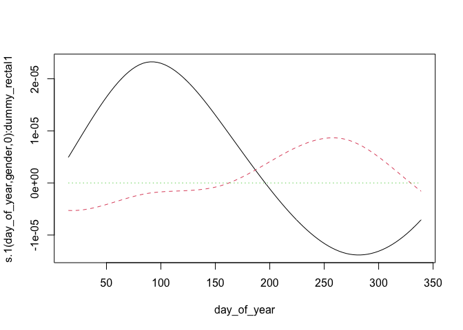

<style type="text/css">
.main-container {
  max-width: 1800px !important;
  margin-left: auto;
  margin-right: auto;
}
</style>

This document summarizes model diagnostics and checks.

First, we set up by loading packages and generated R objects.


```r
knitr::opts_chunk$set(echo = TRUE)
library(targets)
library(mgcv)
library(gt)
options(width = 250)
```


```r
tar_load(c(
  multinomial_model,
  multinomial_model_alt,
  gam_posterior,
  posterior_stats,
  dat_prepped
))
```

## Model Summary


```r
summary(multinomial_model)
```

```
## 
## Family: multinom 
## Link function: 
## 
## Formula:
## outcome ~ s(sample_type, bs = "re", by = dummy_rectal) + s(day, 
##     bs = "tp", k = 5, by = sample_type, m = 2) + s(day, gender_age, 
##     bs = "fs", k = 5, xt = list(bs = "tp"), by = dummy_rectal, 
##     m = 1) + s(day, gender, bs = "fs", k = 5, xt = list(bs = "tp"), 
##     by = dummy_rectal, m = 1) + s(day, age, bs = "fs", k = 5, 
##     xt = list(bs = "tp"), by = dummy_rectal, m = 1) + s(day_of_year, 
##     bs = "cc", by = sample_type, k = 5, m = 2) + s(day_of_year, 
##     gender_age, bs = "fs", xt = list(bs = "cc"), k = 5, by = dummy_rectal, 
##     m = 1) + s(day_of_year, gender, bs = "fs", k = 5, xt = list(bs = "cc"), 
##     by = dummy_rectal, m = 1) + s(day_of_year, age, bs = "fs", 
##     k = 5, xt = list(bs = "cc"), by = dummy_rectal, m = 1) + 
##     s(fmi_normalized, k = 5, bs = "tp", by = dummy_rectal) + 
##     s(reproductive_condition, bs = "re", by = dummy_repro)
## <environment: 0x7f81a414c8c8>
## ~s(sample_type, bs = "re", by = dummy_rectal) + s(day, bs = "tp", 
##     k = 5, by = sample_type, m = 2) + s(day, gender_age, bs = "fs", 
##     k = 5, xt = list(bs = "tp"), by = dummy_rectal, m = 1) + 
##     s(day, gender, bs = "fs", k = 5, xt = list(bs = "tp"), by = dummy_rectal, 
##         m = 1) + s(day, age, bs = "fs", k = 5, xt = list(bs = "tp"), 
##     by = dummy_rectal, m = 1) + s(day_of_year, bs = "cc", by = sample_type, 
##     k = 5, m = 2) + s(day_of_year, gender_age, bs = "fs", xt = list(bs = "cc"), 
##     k = 5, by = dummy_rectal, m = 1) + s(day_of_year, gender, 
##     bs = "fs", k = 5, xt = list(bs = "cc"), by = dummy_rectal, 
##     m = 1) + s(day_of_year, age, bs = "fs", k = 5, xt = list(bs = "cc"), 
##     by = dummy_rectal, m = 1) + s(fmi_normalized, k = 5, bs = "tp", 
##     by = dummy_rectal) + s(reproductive_condition, bs = "re", 
##     by = dummy_repro)
## <environment: 0x7f81a414c8c8>
## ~s(sample_type, bs = "re", by = dummy_rectal) + s(day, bs = "tp", 
##     k = 5, by = sample_type, m = 2) + s(day_of_year, bs = "cc", 
##     by = sample_type, k = 5, m = 2)
## <environment: 0x7f81a414c8c8>
## 
## Parametric coefficients:
##               Estimate Std. Error z value Pr(>|z|)    
## (Intercept)    -3.7049     0.2333 -15.880   <2e-16 ***
## (Intercept).1  -2.4323     0.1530 -15.902   <2e-16 ***
## (Intercept).2  -6.0083     0.6685  -8.987   <2e-16 ***
## ---
## Signif. codes:  0 '***' 0.001 '**' 0.01 '*' 0.05 '.' 0.1 ' ' 1
## 
## Approximate significance of smooth terms:
##                                                 edf Ref.df Chi.sq  p-value    
## s(sample_type):dummy_rectal1              9.644e-02  1.000  0.118  0.24941    
## s(day):sample_typeFecal                   1.024e+00  1.047  0.028  0.93373    
## s(day):sample_typeRectal                  1.000e+00  1.000  0.279  0.59732    
## s(day,gender_age):dummy_rectal1           1.272e-04 21.000  0.000  0.91597    
## s(day,gender):dummy_rectal1               1.185e-04 10.000  0.000  0.91115    
## s(day,age):dummy_rectal1                  2.331e-01 10.000  0.251  0.29685    
## s(day_of_year):sample_typeFecal           2.110e+00  3.000 22.328 9.66e-06 ***
## s(day_of_year):sample_typeRectal          1.263e+00  3.000  3.329  0.05470 .  
## s(day_of_year,gender_age):dummy_rectal1   2.134e-04 16.000  0.000  0.93041    
## s(day_of_year,gender):dummy_rectal1       9.047e-02  8.000  0.067  0.42981    
## s(day_of_year,age):dummy_rectal1          2.312e-02  8.000  0.015  0.47548    
## s(fmi_normalized):dummy_rectal1           1.000e+00  1.000  2.952  0.08578 .  
## s(reproductive_condition):dummy_repro1    1.525e-04  3.000  0.000  0.87671    
## s.1(sample_type):dummy_rectal1            1.760e-04  1.000  0.000  0.60270    
## s.1(day):sample_typeFecal                 2.331e+00  2.681 13.822  0.00137 ** 
## s.1(day):sample_typeRectal                2.221e+00  2.414  2.516  0.50264    
## s.1(day,gender_age):dummy_rectal1         1.211e-04 20.000  0.000  0.95722    
## s.1(day,gender):dummy_rectal1             1.604e-04 10.000  0.000  0.99355    
## s.1(day,age):dummy_rectal1                1.457e+00 10.000  3.201  0.04168 *  
## s.1(day_of_year):sample_typeFecal         2.414e+00  3.000 37.765  < 2e-16 ***
## s.1(day_of_year):sample_typeRectal        1.563e+00  3.000  3.809  0.00171 ** 
## s.1(day_of_year,gender_age):dummy_rectal1 4.410e-04 16.000  0.000  0.79915    
## s.1(day_of_year,gender):dummy_rectal1     4.751e-04  8.000  0.000  0.94760    
## s.1(day_of_year,age):dummy_rectal1        1.610e+00  8.000  2.346  0.06867 .  
## s.1(fmi_normalized):dummy_rectal1         1.000e+00  1.001  1.807  0.17885    
## s.1(reproductive_condition):dummy_repro1  1.466e+00  3.000  3.373  0.06813 .  
## s.2(sample_type):dummy_rectal1            1.353e-05  1.000  0.000  0.76680    
## s.2(day):sample_typeFecal                 1.000e+00  1.000  0.011  0.91642    
## s.2(day):sample_typeRectal                1.005e+00  1.009  0.347  0.55771    
## s.2(day_of_year):sample_typeFecal         2.071e+00  3.000 18.048 4.35e-05 ***
## s.2(day_of_year):sample_typeRectal        1.466e+00  3.000  4.573  0.03630 *  
## ---
## Signif. codes:  0 '***' 0.001 '**' 0.01 '*' 0.05 '.' 0.1 ' ' 1
## 
## Deviance explained = 14.4%
## -REML = -571.34  Scale est. = 1         n = 1430
```

### Alterate Model Summary

This is an alternate model fomulation with simple singel random effects of age/sex category
rather than time-varying ones.  This is used to check if there age/sex effects are
just insignificant because of the high complexity of the time-varying smooths.


```r
summary(multinomial_model_alt)
```

```
## 
## Family: multinom 
## Link function: 
## 
## Formula:
## outcome ~ s(sample_type, bs = "re", by = dummy_rectal) + s(day, 
##     bs = "tp", k = 5, by = sample_type, m = 2) + s(day_of_year, 
##     bs = "cc", by = sample_type, k = 5, m = 2) + s(gender_age, 
##     bs = "re", by = dummy_rectal) + s(fmi_normalized, k = 5, 
##     bs = "tp", by = dummy_rectal) + s(reproductive_condition, 
##     bs = "re", by = dummy_repro)
## <environment: 0x7f81122708a8>
## ~s(sample_type, bs = "re", by = dummy_rectal) + s(day, bs = "tp", 
##     k = 5, by = sample_type, m = 2) + s(day_of_year, bs = "cc", 
##     by = sample_type, k = 5, m = 2) + s(gender_age, bs = "re", 
##     by = dummy_rectal) + s(fmi_normalized, k = 5, bs = "tp", 
##     by = dummy_rectal) + s(reproductive_condition, bs = "re", 
##     by = dummy_repro)
## <environment: 0x7f81122708a8>
## ~s(sample_type, bs = "re", by = dummy_rectal) + s(day, bs = "tp", 
##     k = 5, by = sample_type, m = 2) + s(day_of_year, bs = "cc", 
##     by = sample_type, k = 5, m = 2)
## <environment: 0x7f81122708a8>
## 
## Parametric coefficients:
##               Estimate Std. Error z value Pr(>|z|)    
## (Intercept)    -3.8528     0.2441 -15.782   <2e-16 ***
## (Intercept).1  -2.4051     0.1467 -16.391   <2e-16 ***
## (Intercept).2  -6.0192     0.6724  -8.953   <2e-16 ***
## ---
## Signif. codes:  0 '***' 0.001 '**' 0.01 '*' 0.05 '.' 0.1 ' ' 1
## 
## Approximate significance of smooth terms:
##                                                edf Ref.df Chi.sq  p-value    
## s(sample_type):dummy_rectal1             2.109e-04  2.000  0.000 0.516073    
## s(day):sample_typeFecal                  2.575e+00  2.886  4.878 0.172907    
## s(day):sample_typeRectal                 1.000e+00  1.000  0.160 0.688800    
## s(day_of_year):sample_typeFecal          2.247e+00  3.000 24.725 7.50e-07 ***
## s(day_of_year):sample_typeRectal         1.351e+00  3.000  3.923 0.048417 *  
## s(gender_age):dummy_rectal1              1.742e-04  4.000  0.000 0.976698    
## s(fmi_normalized):dummy_rectal1          1.000e+00  1.000  3.184 0.074371 .  
## s(reproductive_condition):dummy_repro1   9.877e-05  3.000  0.000 0.911349    
## s.1(sample_type):dummy_rectal1           2.896e-04  1.000  0.000 0.458759    
## s.1(day):sample_typeFecal                2.339e+00  2.689 13.628 0.001508 ** 
## s.1(day):sample_typeRectal               2.629e+00  2.873  6.909 0.055847 .  
## s.1(day_of_year):sample_typeFecal        2.412e+00  3.000 38.196  < 2e-16 ***
## s.1(day_of_year):sample_typeRectal       2.075e+00  3.000  9.863 0.000529 ***
## s.1(gender_age):dummy_rectal1            7.434e-04  4.000  0.000 0.659272    
## s.1(fmi_normalized):dummy_rectal1        1.000e+00  1.000  1.927 0.165131    
## s.1(reproductive_condition):dummy_repro1 1.833e+00  3.000  5.754 0.025432 *  
## s.2(sample_type):dummy_rectal1           1.858e-05  1.000  0.000 0.758138    
## s.2(day):sample_typeFecal                1.000e+00  1.000  0.009 0.923646    
## s.2(day):sample_typeRectal               1.000e+00  1.000  0.345 0.557247    
## s.2(day_of_year):sample_typeFecal        2.073e+00  3.000 18.059 4.35e-05 ***
## s.2(day_of_year):sample_typeRectal       1.478e+00  3.000  4.624 0.036270 *  
## ---
## Signif. codes:  0 '***' 0.001 '**' 0.01 '*' 0.05 '.' 0.1 ' ' 1
## 
## Deviance explained = 14.6%
## -REML = -571.32  Scale est. = 1         n = 1430
```

## GAM Checks

`gam.check()` provides convergence diagnostics. Basis dimension (k) results should all be above 0.05 to indicate
that there are not systematic patterns in the model residuals.  Four diagnostic
plot are provided. In the first (Q-Q) plot, we should see residuals and quantiles
line up on the 1-1 line.  Other plots are difficult to interpret in the multinomial
case. 


```r
gam.check(multinomial_model)
```

<!-- -->

```
## 
## Method: REML   Optimizer: efs
## $iter
## [1] 15
## 
## $score.hist
##  [1] -545.0242 -559.4286 -565.0663 -567.0706 -568.2477 -569.1585 -569.8345 -570.2909 -570.6003 -570.8226 -570.9904 -571.1189 -571.2158 -571.2871 -571.3386
## 
## $conv
## [1] "full convergence"
## 
## Model rank =  265 / 265 
## 
## Basis dimension (k) checking results. Low p-value (k-index<1) may
## indicate that k is too low, especially if edf is close to k'.
## 
##                                                 k'      edf k-index p-value
## s(sample_type):dummy_rectal1              2.00e+00 9.64e-02      NA      NA
## s(day):sample_typeFecal                   4.00e+00 1.02e+00    0.95    0.13
## s(day):sample_typeRectal                  4.00e+00 1.00e+00    0.95    0.23
## s(day,gender_age):dummy_rectal1           2.50e+01 1.27e-04    0.95    0.14
## s(day,gender):dummy_rectal1               1.50e+01 1.18e-04    0.95    0.20
## s(day,age):dummy_rectal1                  1.50e+01 2.33e-01    0.95    0.17
## s(day_of_year):sample_typeFecal           3.00e+00 2.11e+00    0.95    0.19
## s(day_of_year):sample_typeRectal          3.00e+00 1.26e+00    0.95    0.17
## s(day_of_year,gender_age):dummy_rectal1   2.00e+01 2.13e-04    0.95    0.20
## s(day_of_year,gender):dummy_rectal1       1.20e+01 9.05e-02    0.95    0.17
## s(day_of_year,age):dummy_rectal1          1.20e+01 2.31e-02    0.95    0.20
## s(fmi_normalized):dummy_rectal1           4.00e+00 1.00e+00    0.97    0.42
## s(reproductive_condition):dummy_repro1    4.00e+00 1.52e-04      NA      NA
## s.1(sample_type):dummy_rectal1            2.00e+00 1.76e-04      NA      NA
## s.1(day):sample_typeFecal                 4.00e+00 2.33e+00    0.95    0.20
## s.1(day):sample_typeRectal                4.00e+00 2.22e+00    0.95    0.20
## s.1(day,gender_age):dummy_rectal1         2.50e+01 1.21e-04    0.95    0.17
## s.1(day,gender):dummy_rectal1             1.50e+01 1.60e-04    0.95    0.14
## s.1(day,age):dummy_rectal1                1.50e+01 1.46e+00    0.95    0.14
## s.1(day_of_year):sample_typeFecal         3.00e+00 2.41e+00    0.95    0.23
## s.1(day_of_year):sample_typeRectal        3.00e+00 1.56e+00    0.95    0.18
## s.1(day_of_year,gender_age):dummy_rectal1 2.00e+01 4.41e-04    0.95    0.17
## s.1(day_of_year,gender):dummy_rectal1     1.20e+01 4.75e-04    0.95    0.18
## s.1(day_of_year,age):dummy_rectal1        1.20e+01 1.61e+00    0.95    0.16
## s.1(fmi_normalized):dummy_rectal1         4.00e+00 1.00e+00    0.97    0.39
## s.1(reproductive_condition):dummy_repro1  4.00e+00 1.47e+00      NA      NA
## s.2(sample_type):dummy_rectal1            2.00e+00 1.35e-05      NA      NA
## s.2(day):sample_typeFecal                 4.00e+00 1.00e+00    0.95    0.18
## s.2(day):sample_typeRectal                4.00e+00 1.01e+00    0.95    0.21
## s.2(day_of_year):sample_typeFecal         3.00e+00 2.07e+00    0.95    0.18
## s.2(day_of_year):sample_typeRectal        3.00e+00 1.47e+00    0.95    0.17
```

## Individual Smooth terms

These are plots of the indivudal smooths in the model on the linear scale.
Inspect for strange behavior and check that their shape corresponds with
significance terms in in the model summary.


```r
for (i in seq_len(length(multinomial_model$smooth) + sum(multinomial_model$nsdf) - 3)) {
  plot(multinomial_model, scale = 0, select = i, all.terms = TRUE)
}
```



## MCMC diagnostics

These are acceptance ratios from the 4 MCMC chains
run.  

From `?gam.mh`:

> The function reports the acceptance rate of the two types of step. If the 
> random walk acceptance probability (`$rw.accept`) is higher than a quarter then `rw.step` 
> should probably be increased. Similarly if the acceptance rate (`$accept`) is too low,
> it should be decreased. The random walk steps can be turned off altogether
> (see above), but it is important to check the chains for stuck sections if
> this is done.


```r
attributes(gam_posterior)[c("accept", "rw.accept")]
```

```
## $accept
## [1] 0.15710 0.15540 0.15735 0.14535
## 
## $rw.accept
## [1] 0.07110 0.06835 0.06720 0.06695
```

Here is a summary of the dimensions of the MCMC chain output

```r
tibble::tibble(
  dimension = names(dimnames(gam_posterior)),
  value = dim(gam_posterior)
)
```

```
## # A tibble: 3 × 2
##   dimension value
##   <chr>     <int>
## 1 Iteration   100
## 2 Chain         4
## 3 Parameter   265
```


Here are Stan-type per-parameter chain diagnostics.  `Rhat` should be at or near
1 to indicate that the multiple MCMC chains are well-mixed.  `ess_bulk` and 
`ess_tail` are the effective sample sizes for posterior samples from the parameter
distributions and the tails of those distributions, respectively. From the Stan
manual:

> We recommend running at least four chains by default and only using the sample
> if R-hat is less than 1.05....
>
> Both bulk-ESS and tail-ESS should be at least 100 (approximately) per
> Markov Chain in order to be reliable and indicate that estimates of respective
> posterior quantiles are reliable

Note that for coefficient values < 1e-6, mixing isn't very relevant.


```r
options(scipen=12)
posterior_stats |> 
  mutate(across(c("ess_bulk", "ess_tail"), round)) |> 
  mutate(across(2:7, \(x) signif(x, 2))) |> 
  mutate(rhat = signif(rhat, 3)) |> 
  mutate(across(2:8, \(x) gt:::align_to_char(as.character(x)))) |> 
  knitr::kable(format.args = list(scientific = FALSE))
```


|variable                                     |mean        |median      |sd      |mad     |q5      |q95     |rhat  | ess_bulk| ess_tail|
|:--------------------------------------------|:-----------|:-----------|:-------|:-------|:-------|:-------|:-----|--------:|--------:|
|(Intercept)                                  |-3.8        |-3.8        |0.22    |0.22    |-4.2    |-3.5    |1.01  |      378|      368|
|s(sample_type):dummy_rectal1.1               |-0.0011     |-0.0022     |0.14    |0.15    |-0.22   | 0.22   |0.999 |      399|      372|
|s(sample_type):dummy_rectal1.2               |-0.051      |-0.052      |0.14    |0.14    |-0.28   | 0.17   |1     |      342|      369|
|s(day):sample_typeFecal.1                    | 0.0077     | 0.004      |0.084   |0.081   |-0.12   | 0.15   |1.01  |      343|      371|
|s(day):sample_typeFecal.2                    |-0.01       |-0.012      |0.15    |0.17    |-0.26   | 0.23   |1.03  |      366|      375|
|s(day):sample_typeFecal.3                    |-0.039      |-0.018      |0.28    |0.27    |-0.51   | 0.4    |1.02  |      359|      409|
|s(day):sample_typeFecal.4                    |-0.036      |-0.04       |0.23    |0.23    |-0.43   | 0.35   |1     |      464|      408|
|s(day):sample_typeRectal.1                   |-0.00023    |-0.00028    |0.0033  |0.0035  |-0.0056 | 0.0049 |1     |      296|      398|
|s(day):sample_typeRectal.2                   | 0.00031    | 0.00021    |0.0051  |0.0052  |-0.0077 | 0.0088 |0.993 |      482|      415|
|s(day):sample_typeRectal.3                   | 0.00061    | 0.00015    |0.0095  |0.0097  |-0.014  | 0.017  |0.992 |      423|      362|
|s(day):sample_typeRectal.4                   |-0.17       |-0.17       |0.39    |0.38    |-0.81   | 0.47   |1     |      399|      375|
|s(day,gender_age):dummy_rectal1.1            | 0.000025   | 0.000061   |0.0016  |0.0016  |-0.0027 | 0.0026 |1     |      351|      313|
|s(day,gender_age):dummy_rectal1.2            | 0.00003    | 0.000056   |0.0016  |0.0016  |-0.0025 | 0.0027 |0.998 |      490|      430|
|s(day,gender_age):dummy_rectal1.3            |-0.00019    |-0.00016    |0.0016  |0.0016  |-0.0027 | 0.0026 |1.02  |      325|      336|
|s(day,gender_age):dummy_rectal1.4            |-0.0000013  | 0.000021   |0.0015  |0.0016  |-0.0024 | 0.0026 |0.998 |      401|      313|
|s(day,gender_age):dummy_rectal1.5            |-0.000014   |-0.000045   |0.0018  |0.0019  |-0.0029 | 0.0028 |0.995 |      347|      260|
|s(day,gender_age):dummy_rectal1.6            |-0.00024    |-0.00027    |0.0017  |0.0015  |-0.003  | 0.0025 |1.01  |      361|      417|
|s(day,gender_age):dummy_rectal1.7            |-0.0001     |-0.000053   |0.0017  |0.0016  |-0.003  | 0.0026 |1     |      444|      374|
|s(day,gender_age):dummy_rectal1.8            | 0.0000034  |-0.000025   |0.0016  |0.0016  |-0.0026 | 0.0025 |1     |      387|      373|
|s(day,gender_age):dummy_rectal1.9            | 0.00019    | 0.00018    |0.0017  |0.0017  |-0.0025 | 0.003  |1     |      423|      359|
|s(day,gender_age):dummy_rectal1.10           | 0.000017   | 0.000033   |0.0018  |0.0017  |-0.003  | 0.0029 |0.998 |      352|      338|
|s(day,gender_age):dummy_rectal1.11           | 0.000022   |-0.00012    |0.0016  |0.0015  |-0.0023 | 0.0028 |1.02  |      333|      408|
|s(day,gender_age):dummy_rectal1.12           |-0.000057   | 0.000029   |0.0016  |0.0016  |-0.0027 | 0.0025 |1.01  |      361|      375|
|s(day,gender_age):dummy_rectal1.13           |-0.000096   |-0.00014    |0.0016  |0.0016  |-0.0026 | 0.0025 |1     |      341|      464|
|s(day,gender_age):dummy_rectal1.14           | 0.000027   | 0.00014    |0.0017  |0.0016  |-0.0029 | 0.0027 |1.01  |      379|      400|
|s(day,gender_age):dummy_rectal1.15           | 0.000054   | 0.0000075  |0.0018  |0.0018  |-0.0029 | 0.0031 |1     |      358|      368|
|s(day,gender_age):dummy_rectal1.16           | 0.00011    | 0.000072   |0.0016  |0.0016  |-0.0025 | 0.0028 |1.02  |      334|      326|
|s(day,gender_age):dummy_rectal1.17           | 0.000093   | 0.00018    |0.0017  |0.0016  |-0.0025 | 0.0029 |1     |      411|      462|
|s(day,gender_age):dummy_rectal1.18           | 0.000039   | 0.000042   |0.0016  |0.0017  |-0.0025 | 0.0029 |1     |      349|      354|
|s(day,gender_age):dummy_rectal1.19           |-0.000016   | 0.000037   |0.0016  |0.0015  |-0.0027 | 0.0027 |1     |      386|      371|
|s(day,gender_age):dummy_rectal1.20           | 0.0000062  | 0.000034   |0.0018  |0.002   |-0.0027 | 0.0027 |1     |      390|      402|
|s(day,gender_age):dummy_rectal1.21           |-0.00011    |-0.00029    |0.0017  |0.0015  |-0.0026 | 0.0027 |1.01  |      462|      375|
|s(day,gender_age):dummy_rectal1.22           | 0.00008    | 0.000041   |0.0017  |0.0017  |-0.0027 | 0.0028 |1.01  |      310|      335|
|s(day,gender_age):dummy_rectal1.23           | 0.00011    | 0.000094   |0.0017  |0.0017  |-0.0027 | 0.0027 |0.996 |      371|      342|
|s(day,gender_age):dummy_rectal1.24           | 0.00011    | 0.000094   |0.0016  |0.0016  |-0.0023 | 0.0028 |0.999 |      413|      341|
|s(day,gender_age):dummy_rectal1.25           |-0.000055   |-0.0001     |0.0018  |0.0019  |-0.0031 | 0.0026 |1.01  |      303|      333|
|s(day,gender):dummy_rectal1.1                | 0.00015    | 0.00018    |0.0015  |0.0016  |-0.0024 | 0.0026 |1.01  |      308|      279|
|s(day,gender):dummy_rectal1.2                |-0.000021   |-0.0001     |0.0015  |0.0016  |-0.0025 | 0.0025 |0.998 |      416|      463|
|s(day,gender):dummy_rectal1.3                | 0.000047   | 0.000065   |0.0017  |0.0017  |-0.003  | 0.0028 |1.01  |      388|      375|
|s(day,gender):dummy_rectal1.4                | 0.000051   |-0.000031   |0.0016  |0.0017  |-0.0027 | 0.0027 |1.01  |      347|      309|
|s(day,gender):dummy_rectal1.5                |-0.00014    |-0.000056   |0.0021  |0.0021  |-0.0036 | 0.0032 |1.01  |      464|      409|
|s(day,gender):dummy_rectal1.6                |-0.000068   |-0.000033   |0.0016  |0.0017  |-0.0026 | 0.0025 |0.997 |      369|      376|
|s(day,gender):dummy_rectal1.7                | 0.00003    |-0.000031   |0.0018  |0.0019  |-0.0027 | 0.0028 |0.999 |      335|      341|
|s(day,gender):dummy_rectal1.8                |-0.000087   |-0.000029   |0.0016  |0.0015  |-0.003  | 0.0027 |0.996 |      452|      407|
|s(day,gender):dummy_rectal1.9                |-0.0000077  | 0.000047   |0.0017  |0.0015  |-0.0029 | 0.0026 |1.01  |      259|      328|
|s(day,gender):dummy_rectal1.10               |-0.00011    |-0.000067   |0.002   |0.0022  |-0.0033 | 0.0029 |1     |      371|      408|
|s(day,gender):dummy_rectal1.11               |-0.0002     |-0.00027    |0.0017  |0.0016  |-0.003  | 0.0027 |0.999 |      397|      271|
|s(day,gender):dummy_rectal1.12               | 0.000045   | 0.00005    |0.0016  |0.0016  |-0.0026 | 0.0029 |0.995 |      407|      391|
|s(day,gender):dummy_rectal1.13               | 0.000069   | 0.000067   |0.0016  |0.0016  |-0.0027 | 0.0026 |1     |      431|      416|
|s(day,gender):dummy_rectal1.14               |-0.000084   |-0.00014    |0.0017  |0.0016  |-0.0028 | 0.0026 |0.996 |      403|      412|
|s(day,gender):dummy_rectal1.15               |-0.00011    |-0.00002    |0.0021  |0.0021  |-0.0035 | 0.0031 |1     |      411|      375|
|s(day,age):dummy_rectal1.1                   |-0.012      |-0.012      |0.11    |0.11    |-0.19   | 0.18   |1.01  |      283|      320|
|s(day,age):dummy_rectal1.2                   | 0.01       | 0.01       |0.11    |0.11    |-0.17   | 0.19   |1     |      346|      313|
|s(day,age):dummy_rectal1.3                   |-0.013      |-0.0071     |0.11    |0.11    |-0.19   | 0.16   |1     |      339|      338|
|s(day,age):dummy_rectal1.4                   |-0.034      |-0.032      |0.11    |0.11    |-0.21   | 0.13   |1     |      286|      248|
|s(day,age):dummy_rectal1.5                   | 0.00031    | 0.00027    |0.0052  |0.0052  |-0.0081 | 0.0083 |1     |      386|      373|
|s(day,age):dummy_rectal1.6                   | 0.0063     | 0.0064     |0.11    |0.11    |-0.19   | 0.2    |0.998 |      368|      328|
|s(day,age):dummy_rectal1.7                   | 0.00051    |-0.0014     |0.1     |0.11    |-0.17   | 0.18   |1     |      398|      360|
|s(day,age):dummy_rectal1.8                   |-0.0063     |-0.0023     |0.11    |0.12    |-0.19   | 0.17   |1.01  |      359|      375|
|s(day,age):dummy_rectal1.9                   |-0.0031     |-0.0022     |0.12    |0.11    |-0.2    | 0.2    |1     |      449|      307|
|s(day,age):dummy_rectal1.10                  | 0.00016    |-0.000028   |0.0051  |0.0048  |-0.0086 | 0.0085 |1     |      314|      293|
|s(day,age):dummy_rectal1.11                  | 0.013      | 0.011      |0.11    |0.11    |-0.17   | 0.19   |1.01  |      459|      361|
|s(day,age):dummy_rectal1.12                  |-0.0097     |-0.012      |0.11    |0.12    |-0.21   | 0.17   |1     |      412|      373|
|s(day,age):dummy_rectal1.13                  | 0.0019     | 0.0053     |0.12    |0.12    |-0.2    | 0.2    |0.997 |      353|      368|
|s(day,age):dummy_rectal1.14                  | 0.04       | 0.038      |0.1     |0.11    |-0.13   | 0.21   |1     |      346|      374|
|s(day,age):dummy_rectal1.15                  |-0.00021    |-0.00018    |0.005   |0.0047  |-0.0085 | 0.0079 |1     |      338|      413|
|s(day_of_year):sample_typeFecal.1            | 0.19       | 0.2        |0.39    |0.39    |-0.39   | 0.85   |1     |      424|      399|
|s(day_of_year):sample_typeFecal.2            |-1.8        |-1.8        |0.67    |0.65    |-2.9    |-0.7    |1.01  |      289|      282|
|s(day_of_year):sample_typeFecal.3            |-1.7        |-1.6        |0.48    |0.47    |-2.4    |-0.82   |1     |      388|      404|
|s(day_of_year):sample_typeRectal.1           | 0.23       | 0.25       |0.35    |0.34    |-0.34   | 0.82   |1.01  |      423|      337|
|s(day_of_year):sample_typeRectal.2           |-0.44       |-0.43       |0.44    |0.44    |-1.2    | 0.24   |1     |      411|      313|
|s(day_of_year):sample_typeRectal.3           |-0.65       |-0.65       |0.41    |0.41    |-1.3    | 0.059  |0.996 |      464|      374|
|s(day_of_year,gender_age):dummy_rectal1.1    | 0.00004    | 0.000052   |0.0022  |0.0023  |-0.0037 | 0.0036 |1     |      391|      416|
|s(day_of_year,gender_age):dummy_rectal1.2    | 0.000011   | 0.000047   |0.0021  |0.002   |-0.0035 | 0.0034 |1.01  |      409|      399|
|s(day_of_year,gender_age):dummy_rectal1.3    | 0.00011    | 0.000045   |0.002   |0.002   |-0.0032 | 0.0035 |1     |      343|      371|
|s(day_of_year,gender_age):dummy_rectal1.4    | 0.000046   |-0.000071   |0.0025  |0.0022  |-0.0039 | 0.0041 |1.01  |      412|      372|
|s(day_of_year,gender_age):dummy_rectal1.5    | 0.000036   |-0.000032   |0.0021  |0.002   |-0.0037 | 0.0036 |1.01  |      369|      375|
|s(day_of_year,gender_age):dummy_rectal1.6    |-0.000054   |-0.000037   |0.0021  |0.0021  |-0.0035 | 0.0036 |0.999 |      363|      373|
|s(day_of_year,gender_age):dummy_rectal1.7    |-0.000063   |-0.00014    |0.002   |0.0021  |-0.0034 | 0.0035 |1     |      319|      332|
|s(day_of_year,gender_age):dummy_rectal1.8    |-0.00032    |-0.00041    |0.0026  |0.0026  |-0.0046 | 0.0039 |1     |      410|      375|
|s(day_of_year,gender_age):dummy_rectal1.9    | 0.000053   | 0.000077   |0.0021  |0.002   |-0.0035 | 0.0035 |1.01  |      351|      375|
|s(day_of_year,gender_age):dummy_rectal1.10   | 0.000024   | 0.000052   |0.002   |0.0019  |-0.0033 | 0.0032 |0.999 |      392|      248|
|s(day_of_year,gender_age):dummy_rectal1.11   |-0.000083   |-0.00017    |0.0021  |0.0022  |-0.0037 | 0.0034 |1.01  |      368|      299|
|s(day_of_year,gender_age):dummy_rectal1.12   | 0.00014    | 0.000055   |0.0025  |0.0028  |-0.0039 | 0.0039 |1     |      391|      413|
|s(day_of_year,gender_age):dummy_rectal1.13   | 0.000017   |-0.000048   |0.0021  |0.0022  |-0.0034 | 0.0034 |1     |      364|      359|
|s(day_of_year,gender_age):dummy_rectal1.14   | 0.000063   |-0.000064   |0.0019  |0.0018  |-0.0029 | 0.0032 |0.998 |      416|      340|
|s(day_of_year,gender_age):dummy_rectal1.15   | 0.00013    | 0.00013    |0.0021  |0.002   |-0.0033 | 0.0037 |1     |      460|      373|
|s(day_of_year,gender_age):dummy_rectal1.16   | 0.000065   | 0.000015   |0.0026  |0.0024  |-0.0042 | 0.0043 |1.01  |      344|      335|
|s(day_of_year,gender_age):dummy_rectal1.17   | 0.000055   |-0.000069   |0.0021  |0.0022  |-0.0033 | 0.0037 |1.01  |      360|      361|
|s(day_of_year,gender_age):dummy_rectal1.18   | 0.00017    | 0.00018    |0.0021  |0.0021  |-0.0033 | 0.0035 |0.993 |      337|      291|
|s(day_of_year,gender_age):dummy_rectal1.19   |-0.000026   | 0.000031   |0.0021  |0.0023  |-0.0036 | 0.0034 |1     |      412|      415|
|s(day_of_year,gender_age):dummy_rectal1.20   | 0.00013    |-0.000022   |0.0024  |0.0024  |-0.0036 | 0.0041 |0.999 |      452|      374|
|s(day_of_year,gender):dummy_rectal1.1        |-0.0016     | 0.00081    |0.057   |0.058   |-0.089  | 0.093  |1.01  |      367|      355|
|s(day_of_year,gender):dummy_rectal1.2        | 0.0042     | 0.0059     |0.056   |0.056   |-0.087  | 0.095  |1     |      277|      255|
|s(day_of_year,gender):dummy_rectal1.3        |-0.0061     |-0.0069     |0.058   |0.058   |-0.1    | 0.091  |0.998 |      363|      459|
|s(day_of_year,gender):dummy_rectal1.4        | 0.00021    | 0.000079   |0.0027  |0.0026  |-0.004  | 0.0046 |0.996 |      362|      357|
|s(day_of_year,gender):dummy_rectal1.5        |-0.00055    | 0.0018     |0.059   |0.058   |-0.098  | 0.089  |1     |      456|      337|
|s(day_of_year,gender):dummy_rectal1.6        |-0.016      |-0.015      |0.057   |0.057   |-0.11   | 0.078  |1     |      318|      337|
|s(day_of_year,gender):dummy_rectal1.7        |-0.0046     |-0.00075    |0.057   |0.06    |-0.11   | 0.089  |0.997 |      338|      339|
|s(day_of_year,gender):dummy_rectal1.8        |-0.00018    |-0.00019    |0.0026  |0.0026  |-0.0044 | 0.0041 |0.996 |      365|      399|
|s(day_of_year,gender):dummy_rectal1.9        |-0.00063    | 0.00084    |0.058   |0.061   |-0.09   | 0.086  |0.996 |      396|      406|
|s(day_of_year,gender):dummy_rectal1.10       | 0.0037     | 0.0037     |0.057   |0.056   |-0.092  | 0.097  |1.01  |      230|      228|
|s(day_of_year,gender):dummy_rectal1.11       | 0.0028     | 0.003      |0.059   |0.054   |-0.1    | 0.1    |1.01  |      443|      337|
|s(day_of_year,gender):dummy_rectal1.12       |-0.00023    |-0.00036    |0.0026  |0.0026  |-0.0043 | 0.0042 |1.01  |      347|      340|
|s(day_of_year,age):dummy_rectal1.1           |-0.0017     |-0.002      |0.033   |0.031   |-0.058  | 0.054  |1     |      392|      343|
|s(day_of_year,age):dummy_rectal1.2           |-0.0022     |-0.0019     |0.032   |0.031   |-0.054  | 0.049  |1.01  |      348|      336|
|s(day_of_year,age):dummy_rectal1.3           |-0.0004     | 0.0007     |0.031   |0.033   |-0.049  | 0.052  |1.01  |      365|      375|
|s(day_of_year,age):dummy_rectal1.4           | 0.000027   |-0.000081   |0.003   |0.003   |-0.0048 | 0.005  |0.998 |      305|      295|
|s(day_of_year,age):dummy_rectal1.5           |-0.0007     |-0.00025    |0.031   |0.032   |-0.053  | 0.049  |1.01  |      310|      391|
|s(day_of_year,age):dummy_rectal1.6           |-0.00035    |-0.0018     |0.032   |0.033   |-0.051  | 0.053  |1.01  |      445|      411|
|s(day_of_year,age):dummy_rectal1.7           | 0.0015     | 0.0033     |0.033   |0.032   |-0.051  | 0.055  |1     |      364|      265|
|s(day_of_year,age):dummy_rectal1.8           |-0.0002     |-0.00041    |0.003   |0.003   |-0.0049 | 0.0046 |1     |      402|      416|
|s(day_of_year,age):dummy_rectal1.9           | 0.0013     | 0.002      |0.032   |0.031   |-0.053  | 0.056  |1     |      429|      346|
|s(day_of_year,age):dummy_rectal1.10          | 0.00016    | 0.00093    |0.032   |0.03    |-0.053  | 0.051  |0.999 |      395|      374|
|s(day_of_year,age):dummy_rectal1.11          | 0.00094    | 0.0015     |0.032   |0.031   |-0.049  | 0.054  |1.01  |      423|      291|
|s(day_of_year,age):dummy_rectal1.12          | 0.00024    | 0.0003     |0.0029  |0.0031  |-0.0046 | 0.0052 |1.01  |      363|      393|
|s(fmi_normalized):dummy_rectal1.1            | 0.000092   | 0.00016    |0.0015  |0.0014  |-0.0025 | 0.0027 |1.02  |      319|      308|
|s(fmi_normalized):dummy_rectal1.2            | 0.000027   | 0.000003   |0.00093 |0.00087 |-0.0015 | 0.0015 |0.998 |      395|      417|
|s(fmi_normalized):dummy_rectal1.3            |-0.0011     |-0.0011     |0.0099  |0.0097  |-0.018  | 0.015  |1     |      374|      398|
|s(fmi_normalized):dummy_rectal1.4            |-0.27       |-0.27       |0.16    |0.16    |-0.54   |-0.01   |1     |      476|      412|
|s(reproductive_condition):dummy_repro1.1     | 0.00036    | 0.00079    |0.0078  |0.0077  |-0.013  | 0.013  |1.01  |      392|      277|
|s(reproductive_condition):dummy_repro1.2     | 0.000061   |-0.00033    |0.0079  |0.0077  |-0.013  | 0.013  |0.997 |      400|      372|
|s(reproductive_condition):dummy_repro1.3     |-0.00044    |-0.00054    |0.0081  |0.0083  |-0.015  | 0.012  |1.01  |      447|      416|
|s(reproductive_condition):dummy_repro1.4     |-0.00053    |-0.00033    |0.0077  |0.008   |-0.013  | 0.012  |1     |      363|      375|
|(Intercept).1                                |-2.5        |-2.5        |0.16    |0.17    |-2.7    |-2.2    |0.997 |      427|      427|
|s.1(sample_type):dummy_rectal1.1             | 0.00016    | 0.00009    |0.0049  |0.0047  |-0.008  | 0.0085 |1     |      347|      412|
|s.1(sample_type):dummy_rectal1.2             |-0.000062   |-0.00017    |0.005   |0.005   |-0.0082 | 0.0084 |0.996 |      362|      374|
|s.1(day):sample_typeFecal.1                  | 0.3        | 0.32       |0.57    |0.6     |-0.64   | 1.2    |1     |      425|      404|
|s.1(day):sample_typeFecal.2                  | 0.2        | 0.24       |1.3     |1.3     |-2      | 2.2    |1     |      366|      375|
|s.1(day):sample_typeFecal.3                  | 1.5        | 1.6        |1.6     |1.7     |-1.1    | 4.1    |0.997 |      396|      366|
|s.1(day):sample_typeFecal.4                  |-0.47       |-0.52       |0.63    |0.62    |-1.4    | 0.61   |0.998 |      391|      363|
|s.1(day):sample_typeRectal.1                 |-1.1        |-1.1        |1       |0.99    |-3      | 0.45   |1     |      451|      371|
|s.1(day):sample_typeRectal.2                 |-1.3        |-1.3        |2.1     |2.3     |-4.7    | 1.9    |1     |      406|      373|
|s.1(day):sample_typeRectal.3                 |-1.5        |-1.5        |3.1     |3.2     |-6.3    | 3.2    |1     |      416|      339|
|s.1(day):sample_typeRectal.4                 | 0.94       | 0.87       |1.4     |1.3     |-1.1    | 3.3    |1     |      492|      411|
|s.1(day,gender_age):dummy_rectal1.1          |-0.000012   |-0.000048   |0.00074 |0.00074 |-0.0012 | 0.0012 |0.997 |      372|      354|
|s.1(day,gender_age):dummy_rectal1.2          |-0.0000083  | 0.000016   |0.00074 |0.00071 |-0.0012 | 0.0012 |1     |      449|      371|
|s.1(day,gender_age):dummy_rectal1.3          | 0.000049   | 0.000058   |0.00075 |0.00072 |-0.0013 | 0.0011 |1.02  |      410|      346|
|s.1(day,gender_age):dummy_rectal1.4          | 0.000033   | 0.0000037  |0.00075 |0.00077 |-0.0011 | 0.0014 |1.01  |      425|      411|
|s.1(day,gender_age):dummy_rectal1.5          |-0.000025   | 0.0000029  |0.0012  |0.0012  |-0.0022 | 0.0019 |1     |      391|      360|
|s.1(day,gender_age):dummy_rectal1.6          |-0.00006    |-0.000041   |0.00071 |0.00074 |-0.0013 | 0.0011 |1.01  |      374|      280|
|s.1(day,gender_age):dummy_rectal1.7          | 0.000019   | 0.000033   |0.00074 |0.00072 |-0.0012 | 0.0013 |0.998 |      434|      416|
|s.1(day,gender_age):dummy_rectal1.8          |-0.000077   |-0.000082   |0.00072 |0.0007  |-0.0012 | 0.0011 |1.01  |      355|      283|
|s.1(day,gender_age):dummy_rectal1.9          | 0.0000096  | 0.000028   |0.00072 |0.00075 |-0.0012 | 0.0012 |0.997 |      346|      289|
|s.1(day,gender_age):dummy_rectal1.10         | 0.00001    | 0.000014   |0.0013  |0.0012  |-0.0021 | 0.002  |0.998 |      360|      370|
|s.1(day,gender_age):dummy_rectal1.11         |-0.000019   |-0.000047   |0.00074 |0.00072 |-0.0012 | 0.0013 |1.01  |      487|      335|
|s.1(day,gender_age):dummy_rectal1.12         |-0.000027   | 0.0000072  |0.00073 |0.00071 |-0.0012 | 0.0011 |1.01  |      371|      372|
|s.1(day,gender_age):dummy_rectal1.13         | 0.000025   |-0.0000015  |0.00078 |0.00077 |-0.0012 | 0.0014 |1     |      390|      313|
|s.1(day,gender_age):dummy_rectal1.14         | 0.0000071  |-0.000024   |0.00074 |0.00076 |-0.0012 | 0.0012 |1.01  |      328|      328|
|s.1(day,gender_age):dummy_rectal1.15         |-0.000025   |-0.000045   |0.0013  |0.0013  |-0.002  | 0.0021 |1     |      344|      372|
|s.1(day,gender_age):dummy_rectal1.16         |-0.000042   |-0.000095   |0.00075 |0.00077 |-0.0011 | 0.0012 |1.02  |      274|      414|
|s.1(day,gender_age):dummy_rectal1.17         | 0.000035   | 0.000048   |0.00069 |0.00068 |-0.0011 | 0.0012 |0.995 |      390|      397|
|s.1(day,gender_age):dummy_rectal1.18         |-0.00001    |-0.000048   |0.00072 |0.0007  |-0.0011 | 0.0012 |1.02  |      443|      467|
|s.1(day,gender_age):dummy_rectal1.19         |-0.000058   |-0.0000077  |0.00074 |0.0007  |-0.0014 | 0.0011 |1.01  |      483|      410|
|s.1(day,gender_age):dummy_rectal1.20         | 0.00007    | 0.000054   |0.0012  |0.0013  |-0.002  | 0.0021 |0.999 |      458|      415|
|s.1(day,gender_age):dummy_rectal1.21         |-0.000015   |-0.000022   |0.00075 |0.00076 |-0.0012 | 0.0013 |0.999 |      384|      374|
|s.1(day,gender_age):dummy_rectal1.22         | 0.000033   | 0.000013   |0.00079 |0.00075 |-0.0013 | 0.0013 |1     |      415|      374|
|s.1(day,gender_age):dummy_rectal1.23         |-0.000013   |-0.000031   |0.0007  |0.00069 |-0.0012 | 0.0011 |0.995 |      365|      380|
|s.1(day,gender_age):dummy_rectal1.24         | 0.000026   | 0.000029   |0.00076 |0.00074 |-0.0012 | 0.0014 |1.01  |      355|      403|
|s.1(day,gender_age):dummy_rectal1.25         |-0.000011   |-0.000011   |0.0012  |0.0013  |-0.002  | 0.002  |0.999 |      422|      407|
|s.1(day,gender):dummy_rectal1.1              |-0.000024   |-0.0000043  |0.001   |0.001   |-0.0018 | 0.0017 |1     |      381|      333|
|s.1(day,gender):dummy_rectal1.2              |-0.0000073  |-0.000087   |0.0011  |0.001   |-0.0018 | 0.0017 |1.01  |      304|      357|
|s.1(day,gender):dummy_rectal1.3              |-0.000039   |-0.00014    |0.001   |0.00094 |-0.0016 | 0.0018 |1     |      350|      375|
|s.1(day,gender):dummy_rectal1.4              |-0.0000084  |-0.000024   |0.001   |0.0011  |-0.0017 | 0.0017 |0.999 |      390|      415|
|s.1(day,gender):dummy_rectal1.5              | 0.000059   | 0.000089   |0.0011  |0.001   |-0.0018 | 0.0019 |1.01  |      472|      307|
|s.1(day,gender):dummy_rectal1.6              | 0.000037   | 0.0000099  |0.001   |0.0011  |-0.0017 | 0.0017 |1     |      407|      329|
|s.1(day,gender):dummy_rectal1.7              |-0.00007    |-0.00015    |0.001   |0.00099 |-0.0018 | 0.0018 |1     |      410|      416|
|s.1(day,gender):dummy_rectal1.8              |-0.000062   |-0.000077   |0.001   |0.0011  |-0.0018 | 0.0015 |1     |      363|      455|
|s.1(day,gender):dummy_rectal1.9              |-0.000051   |-0.00013    |0.0011  |0.00098 |-0.0018 | 0.0019 |1.01  |      374|      333|
|s.1(day,gender):dummy_rectal1.10             |-0.000028   | 0.00008    |0.0011  |0.0012  |-0.0019 | 0.0016 |1     |      365|      338|
|s.1(day,gender):dummy_rectal1.11             |-0.000017   |-0.0000047  |0.001   |0.0011  |-0.0016 | 0.0016 |0.999 |      387|      414|
|s.1(day,gender):dummy_rectal1.12             | 0.0000082  |-0.000015   |0.00098 |0.0011  |-0.0016 | 0.0016 |0.999 |      333|      282|
|s.1(day,gender):dummy_rectal1.13             | 0.0001     | 0.00012    |0.001   |0.0011  |-0.0016 | 0.0018 |1.02  |      282|      370|
|s.1(day,gender):dummy_rectal1.14             | 0.0000075  | 0.000069   |0.001   |0.00091 |-0.0016 | 0.0017 |1.01  |      324|      375|
|s.1(day,gender):dummy_rectal1.15             | 0.00012    | 0.00013    |0.001   |0.0011  |-0.0016 | 0.0018 |1     |      341|      395|
|s.1(day,age):dummy_rectal1.1                 | 0.0037     |-0.0044     |0.2     |0.22    |-0.3    | 0.33   |1.01  |      411|      373|
|s.1(day,age):dummy_rectal1.2                 | 0.021      | 0.034      |0.21    |0.21    |-0.33   | 0.34   |0.998 |      400|      366|
|s.1(day,age):dummy_rectal1.3                 |-0.048      |-0.047      |0.18    |0.18    |-0.35   | 0.22   |0.999 |      354|      375|
|s.1(day,age):dummy_rectal1.4                 | 0.11       | 0.11       |0.17    |0.18    |-0.16   | 0.38   |1.01  |      356|      362|
|s.1(day,age):dummy_rectal1.5                 |-0.08       |-0.083      |0.21    |0.22    |-0.42   | 0.26   |1.01  |      443|      373|
|s.1(day,age):dummy_rectal1.6                 | 0.0013     |-0.0037     |0.21    |0.19    |-0.33   | 0.36   |1.01  |      395|      392|
|s.1(day,age):dummy_rectal1.7                 |-0.0025     |-0.0085     |0.21    |0.21    |-0.35   | 0.33   |1     |      411|      307|
|s.1(day,age):dummy_rectal1.8                 | 0.015      | 0.013      |0.19    |0.19    |-0.31   | 0.35   |1.01  |      381|      374|
|s.1(day,age):dummy_rectal1.9                 |-0.0029     |-0.018      |0.2     |0.2     |-0.35   | 0.33   |1     |      460|      415|
|s.1(day,age):dummy_rectal1.10                |-0.0054     |-0.0046     |0.22    |0.23    |-0.35   | 0.36   |1     |      366|      282|
|s.1(day,age):dummy_rectal1.11                | 0.0074     | 0.016      |0.21    |0.22    |-0.33   | 0.34   |1.03  |      199|      279|
|s.1(day,age):dummy_rectal1.12                | 0.058      | 0.064      |0.19    |0.18    |-0.24   | 0.35   |1.01  |      282|      373|
|s.1(day,age):dummy_rectal1.13                | 0.042      | 0.038      |0.19    |0.2     |-0.28   | 0.34   |0.999 |      385|      321|
|s.1(day,age):dummy_rectal1.14                |-0.14       |-0.14       |0.17    |0.18    |-0.4    | 0.15   |1.01  |      313|      255|
|s.1(day,age):dummy_rectal1.15                | 0.13       | 0.13       |0.19    |0.18    |-0.17   | 0.43   |1.01  |      424|      378|
|s.1(day_of_year):sample_typeFecal.1          | 1.6        | 1.6        |0.33    |0.31    | 1.1    | 2.2    |1.01  |      362|      196|
|s.1(day_of_year):sample_typeFecal.2          | 0.59       | 0.6        |0.37    |0.39    |-0.065  | 1.2    |0.994 |      360|      268|
|s.1(day_of_year):sample_typeFecal.3          |-1.4        |-1.4        |0.38    |0.39    |-2      |-0.77   |1     |      369|      358|
|s.1(day_of_year):sample_typeRectal.1         | 0.74       | 0.75       |0.4     |0.38    | 0.09   | 1.4    |0.998 |      390|      331|
|s.1(day_of_year):sample_typeRectal.2         | 0.27       | 0.29       |0.49    |0.47    |-0.58   | 1.1    |1     |      328|      332|
|s.1(day_of_year):sample_typeRectal.3         |-0.26       |-0.26       |0.45    |0.42    |-0.98   | 0.46   |1     |      391|      416|
|s.1(day_of_year,gender_age):dummy_rectal1.1  |-0.000062   |-0.00014    |0.0018  |0.0018  |-0.003  | 0.003  |1.02  |      365|      362|
|s.1(day_of_year,gender_age):dummy_rectal1.2  | 0.0000033  |-0.00011    |0.0018  |0.0019  |-0.0028 | 0.003  |1     |      350|      397|
|s.1(day_of_year,gender_age):dummy_rectal1.3  |-0.00002    |-0.000047   |0.0018  |0.0019  |-0.003  | 0.0029 |0.995 |      395|      406|
|s.1(day_of_year,gender_age):dummy_rectal1.4  |-0.0001     |-0.00016    |0.0018  |0.0019  |-0.0032 | 0.0028 |1     |      374|      389|
|s.1(day_of_year,gender_age):dummy_rectal1.5  | 0.00005    |-0.000072   |0.0018  |0.0018  |-0.0027 | 0.0028 |1     |      345|      373|
|s.1(day_of_year,gender_age):dummy_rectal1.6  | 0.00017    | 0.00033    |0.002   |0.0021  |-0.0032 | 0.0032 |1     |      464|      352|
|s.1(day_of_year,gender_age):dummy_rectal1.7  |-0.00016    |-0.00018    |0.0019  |0.0021  |-0.0035 | 0.0029 |0.996 |      378|      446|
|s.1(day_of_year,gender_age):dummy_rectal1.8  | 0.00007    | 0.00022    |0.0018  |0.0017  |-0.003  | 0.0029 |1     |      404|      363|
|s.1(day_of_year,gender_age):dummy_rectal1.9  | 0.00008    |-0.000042   |0.0018  |0.0018  |-0.0027 | 0.003  |1.01  |      397|      415|
|s.1(day_of_year,gender_age):dummy_rectal1.10 | 0.000057   | 0.000093   |0.0019  |0.002   |-0.0031 | 0.0028 |0.995 |      376|      363|
|s.1(day_of_year,gender_age):dummy_rectal1.11 |-0.000025   | 0.000026   |0.0017  |0.0017  |-0.003  | 0.0028 |1.01  |      346|      410|
|s.1(day_of_year,gender_age):dummy_rectal1.12 | 0.00000047 | 0.00004    |0.0017  |0.0017  |-0.0026 | 0.0025 |1.01  |      339|      253|
|s.1(day_of_year,gender_age):dummy_rectal1.13 | 0.000021   | 0.000036   |0.0018  |0.0016  |-0.0031 | 0.0028 |1     |      393|      281|
|s.1(day_of_year,gender_age):dummy_rectal1.14 | 0.0002     | 0.00024    |0.0019  |0.0018  |-0.0028 | 0.0032 |1     |      373|      310|
|s.1(day_of_year,gender_age):dummy_rectal1.15 |-0.000085   |-0.00011    |0.0018  |0.0019  |-0.003  | 0.0028 |1     |      392|      295|
|s.1(day_of_year,gender_age):dummy_rectal1.16 |-0.00014    |-0.000006   |0.0017  |0.0016  |-0.003  | 0.0025 |0.996 |      377|      360|
|s.1(day_of_year,gender_age):dummy_rectal1.17 |-0.000037   |-0.00006    |0.0018  |0.0018  |-0.0031 | 0.0029 |1     |      306|      408|
|s.1(day_of_year,gender_age):dummy_rectal1.18 |-0.000028   |-0.000065   |0.0019  |0.0019  |-0.0029 | 0.0031 |1     |      341|      415|
|s.1(day_of_year,gender_age):dummy_rectal1.19 |-0.000092   |-0.000081   |0.0018  |0.0018  |-0.003  | 0.0027 |1     |      419|      401|
|s.1(day_of_year,gender_age):dummy_rectal1.20 | 0.000044   | 0.000017   |0.0017  |0.0017  |-0.0029 | 0.0028 |1     |      398|      379|
|s.1(day_of_year,gender):dummy_rectal1.1      |-0.000098   |-0.00016    |0.0018  |0.0018  |-0.0029 | 0.0028 |1     |      408|      338|
|s.1(day_of_year,gender):dummy_rectal1.2      |-0.00006    |-0.0000087  |0.0017  |0.0017  |-0.003  | 0.0026 |1.01  |      385|      374|
|s.1(day_of_year,gender):dummy_rectal1.3      |-0.00011    |-0.000064   |0.0017  |0.0017  |-0.003  | 0.0025 |1.02  |      371|      337|
|s.1(day_of_year,gender):dummy_rectal1.4      |-0.00012    |-0.00022    |0.0023  |0.0022  |-0.0037 | 0.0036 |0.996 |      488|      416|
|s.1(day_of_year,gender):dummy_rectal1.5      |-0.00016    |-0.00025    |0.0018  |0.0017  |-0.0032 | 0.0028 |1     |      366|      407|
|s.1(day_of_year,gender):dummy_rectal1.6      |-0.0000032  | 0.00000096 |0.0019  |0.0018  |-0.0031 | 0.003  |1     |      312|      391|
|s.1(day_of_year,gender):dummy_rectal1.7      |-0.00015    |-0.00012    |0.0017  |0.0017  |-0.0031 | 0.0026 |1.02  |      214|      339|
|s.1(day_of_year,gender):dummy_rectal1.8      | 0.00021    | 0.00025    |0.0025  |0.0023  |-0.004  | 0.0042 |1     |      377|      347|
|s.1(day_of_year,gender):dummy_rectal1.9      | 0.000035   | 0.000097   |0.0019  |0.0017  |-0.0032 | 0.0027 |1.01  |      228|      388|
|s.1(day_of_year,gender):dummy_rectal1.10     | 0.000046   |-0.000027   |0.0018  |0.0019  |-0.0027 | 0.0031 |1.01  |      385|      341|
|s.1(day_of_year,gender):dummy_rectal1.11     |-0.00021    |-0.0002     |0.0016  |0.0015  |-0.0028 | 0.0025 |1     |      430|      375|
|s.1(day_of_year,gender):dummy_rectal1.12     |-0.000011   |-0.000076   |0.0024  |0.0022  |-0.0037 | 0.0042 |0.996 |      387|      371|
|s.1(day_of_year,age):dummy_rectal1.1         |-0.086      |-0.084      |0.19    |0.17    |-0.41   | 0.24   |0.999 |      377|      304|
|s.1(day_of_year,age):dummy_rectal1.2         | 0.11       | 0.094      |0.18    |0.17    |-0.18   | 0.41   |1     |      395|      362|
|s.1(day_of_year,age):dummy_rectal1.3         | 0.044      | 0.028      |0.19    |0.2     |-0.26   | 0.35   |1.01  |      352|      341|
|s.1(day_of_year,age):dummy_rectal1.4         |-0.084      |-0.098      |0.19    |0.19    |-0.38   | 0.25   |1     |      294|      417|
|s.1(day_of_year,age):dummy_rectal1.5         |-0.004      | 0.011      |0.22    |0.22    |-0.39   | 0.34   |0.998 |      351|      374|
|s.1(day_of_year,age):dummy_rectal1.6         |-0.016      |-0.0078     |0.2     |0.21    |-0.34   | 0.3    |1.01  |      375|      465|
|s.1(day_of_year,age):dummy_rectal1.7         |-0.00045    | 0.0054     |0.21    |0.22    |-0.35   | 0.33   |1     |      337|      367|
|s.1(day_of_year,age):dummy_rectal1.8         |-0.015      |-0.012      |0.21    |0.22    |-0.34   | 0.35   |1     |      375|      356|
|s.1(day_of_year,age):dummy_rectal1.9         |-0.077      |-0.082      |0.21    |0.22    |-0.42   | 0.25   |1     |      429|      295|
|s.1(day_of_year,age):dummy_rectal1.10        |-0.052      |-0.053      |0.17    |0.15    |-0.33   | 0.25   |1     |      378|      364|
|s.1(day_of_year,age):dummy_rectal1.11        |-0.16       |-0.17       |0.18    |0.19    |-0.45   | 0.15   |1     |      362|      332|
|s.1(day_of_year,age):dummy_rectal1.12        | 0.097      | 0.11       |0.18    |0.19    |-0.22   | 0.38   |1.02  |      334|      317|
|s.1(fmi_normalized):dummy_rectal1.1          |-0.000017   | 0.00017    |0.0028  |0.0025  |-0.0048 | 0.005  |1     |      484|      406|
|s.1(fmi_normalized):dummy_rectal1.2          | 0.000025   |-0.000082   |0.0015  |0.0016  |-0.0023 | 0.0028 |1     |      353|      372|
|s.1(fmi_normalized):dummy_rectal1.3          |-0.00017    | 0.000068   |0.018   |0.018   |-0.028  | 0.029  |1.01  |      416|      373|
|s.1(fmi_normalized):dummy_rectal1.4          |-0.12       |-0.12       |0.091   |0.09    |-0.27   | 0.031  |1     |      368|      416|
|s.1(reproductive_condition):dummy_repro1.1   | 0.05       | 0.094      |0.99    |1       |-1.6    | 1.6    |1     |      417|      397|
|s.1(reproductive_condition):dummy_repro1.2   |-0.61       |-0.56       |0.89    |0.89    |-2.1    | 0.72   |0.995 |      477|      373|
|s.1(reproductive_condition):dummy_repro1.3   |-0.6        |-0.56       |0.73    |0.69    |-1.8    | 0.64   |1     |      347|      262|
|s.1(reproductive_condition):dummy_repro1.4   |-1.1        |-1.1        |0.61    |0.62    |-2.2    |-0.19   |1.01  |      389|      383|
|(Intercept).2                                |-6.6        |-6.6        |0.76    |0.74    |-7.9    |-5.5    |1     |      355|      204|
|s.2(sample_type):dummy_rectal1.1             | 0.00018    | 0.000024   |0.0049  |0.0046  |-0.008  | 0.0084 |1     |      376|      400|
|s.2(sample_type):dummy_rectal1.2             |-0.000014   |-0.00014    |0.0049  |0.005   |-0.0077 | 0.0079 |0.999 |      413|      244|
|s.2(day):sample_typeFecal.1                  |-0.00028    |-0.00036    |0.003   |0.0031  |-0.0048 | 0.0048 |1.02  |      328|      416|
|s.2(day):sample_typeFecal.2                  | 0.0004     | 0.00041    |0.0052  |0.0053  |-0.0086 | 0.0092 |1     |      421|      417|
|s.2(day):sample_typeFecal.3                  | 0.00058    | 0.00052    |0.0091  |0.0092  |-0.013  | 0.015  |1     |      410|      416|
|s.2(day):sample_typeFecal.4                  | 0.026      | 0.028      |0.35    |0.36    |-0.57   | 0.56   |1.02  |      312|      368|
|s.2(day):sample_typeRectal.1                 | 0.013      | 0.013      |0.12    |0.12    |-0.19   | 0.22   |1.01  |      374|      292|
|s.2(day):sample_typeRectal.2                 |-0.0031     | 0.005      |0.21    |0.22    |-0.36   | 0.33   |0.999 |      403|      452|
|s.2(day):sample_typeRectal.3                 | 0.021      | 0.018      |0.4     |0.42    |-0.66   | 0.63   |1.01  |      367|      328|
|s.2(day):sample_typeRectal.4                 |-0.85       |-0.86       |1.1     |1.2     |-2.6    | 0.82   |1     |      382|      359|
|s.2(day_of_year):sample_typeFecal.1          |-1.5        |-1.4        |1.3     |1.2     |-3.5    | 0.73   |1.01  |      319|      340|
|s.2(day_of_year):sample_typeFecal.2          | 3.2        | 3.2        |0.89    |0.82    | 1.8    | 4.7    |1     |      401|      226|
|s.2(day_of_year):sample_typeFecal.3          | 3.7        | 3.7        |1       |1       | 2.1    | 5.5    |1     |      345|      290|
|s.2(day_of_year):sample_typeRectal.1         |-0.27       |-0.35       |0.95    |1.1     |-1.8    | 1.3    |0.998 |      396|      406|
|s.2(day_of_year):sample_typeRectal.2         | 2          | 1.9        |1.1     |1.1     | 0.22   | 3.9    |1.01  |      333|      310|
|s.2(day_of_year):sample_typeRectal.3         | 1.7        | 1.7        |1       |1       | 0.17   | 3.4    |1.01  |      345|      361|

