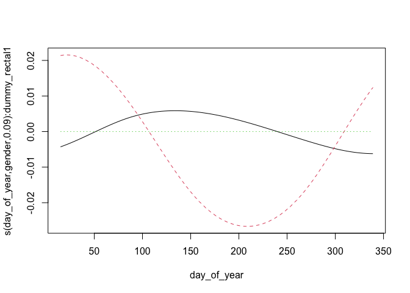
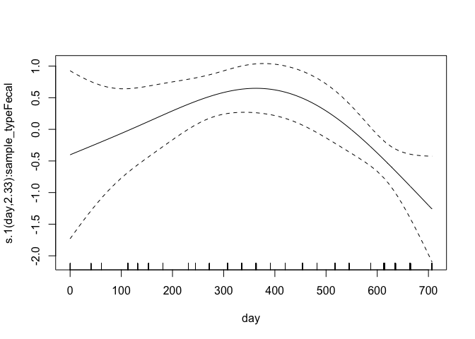
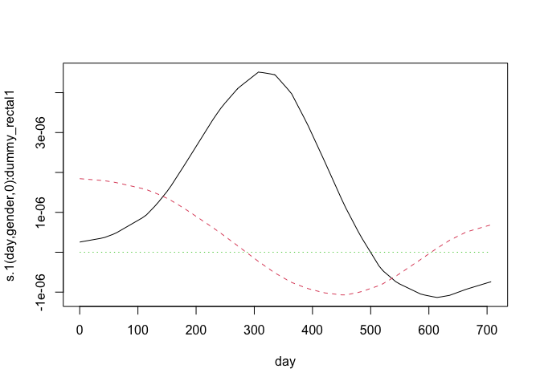

<style type="text/css">
.main-container {
  max-width: 1800px !important;
  margin-left: auto;
  margin-right: auto;
}
</style>

This document summarizes model diagnostics and checks.

First, we set up by loading packages and generated R objects.


```r
knitr::opts_chunk$set(echo = TRUE)
library(targets)
library(mgcv)
library(gt)
options(width = 250)
```


```r
tar_load(c(
  multinomial_model,
  multinomial_model_alt,
  gam_posterior,
  posterior_stats,
  dat_prepped
))
```

## Model Summary


```r
summary(multinomial_model)
```

```
## 
## Family: multinom 
## Link function: 
## 
## Formula:
## outcome ~ s(sample_type, bs = "re", by = dummy_rectal) + s(day, 
##     bs = "tp", k = 5, by = sample_type, m = 2) + s(day, gender_age, 
##     bs = "fs", k = 5, xt = list(bs = "tp"), by = dummy_rectal, 
##     m = 1) + s(day_of_year, bs = "cc", by = sample_type, k = 5, 
##     m = 2) + s(day_of_year, gender_age, bs = "fs", xt = list(bs = "cc"), 
##     k = 5, by = dummy_rectal, m = 1) + s(fmi_normalized, k = 5, 
##     bs = "tp", by = dummy_rectal) + s(reproductive_condition, 
##     bs = "re", by = dummy_repro)
## <environment: 0x7f87dd1492a8>
## ~s(sample_type, bs = "re", by = dummy_rectal) + s(day, bs = "tp", 
##     k = 5, by = sample_type, m = 2) + s(day, gender_age, bs = "fs", 
##     k = 5, xt = list(bs = "tp"), by = dummy_rectal, m = 1) + 
##     s(day_of_year, bs = "cc", by = sample_type, k = 5, m = 2) + 
##     s(day_of_year, gender_age, bs = "fs", xt = list(bs = "cc"), 
##         k = 5, by = dummy_rectal, m = 1) + s(fmi_normalized, 
##     k = 5, bs = "tp", by = dummy_rectal) + s(reproductive_condition, 
##     bs = "re", by = dummy_repro)
## <environment: 0x7f87dd1492a8>
## ~s(sample_type, bs = "re", by = dummy_rectal) + s(day, bs = "tp", 
##     k = 5, by = sample_type, m = 2) + s(day_of_year, bs = "cc", 
##     by = sample_type, k = 5, m = 2)
## <environment: 0x7f87dd1492a8>
## 
## Parametric coefficients:
##               Estimate Std. Error z value Pr(>|z|)    
## (Intercept)    -3.8526     0.2441 -15.784   <2e-16 ***
## (Intercept).1  -2.4051     0.1467 -16.391   <2e-16 ***
## (Intercept).2  -6.0192     0.6724  -8.953   <2e-16 ***
## ---
## Signif. codes:  0 '***' 0.001 '**' 0.01 '*' 0.05 '.' 0.1 ' ' 1
## 
## Approximate significance of smooth terms:
##                                                 edf Ref.df Chi.sq  p-value    
## s(sample_type):dummy_rectal1              1.807e-04  1.000  0.000 0.515589    
## s(day):sample_typeFecal                   2.574e+00  2.885  4.874 0.173261    
## s(day):sample_typeRectal                  1.000e+00  1.000  0.161 0.688685    
## s(day,gender_age):dummy_rectal1           1.219e-04 22.000  0.000 0.905557    
## s(day_of_year):sample_typeFecal           2.247e+00  3.000 24.721 7.52e-07 ***
## s(day_of_year):sample_typeRectal          1.351e+00  3.000  3.923 0.048421 *  
## s(day_of_year,gender_age):dummy_rectal1   1.902e-04 16.000  0.000 0.900047    
## s(fmi_normalized):dummy_rectal1           1.000e+00  1.000  3.184 0.074388 .  
## s(reproductive_condition):dummy_repro1    1.019e-04  3.000  0.000 0.911317    
## s.1(sample_type):dummy_rectal1            7.222e-05  1.000  0.000 0.458759    
## s.1(day):sample_typeFecal                 2.339e+00  2.689 13.628 0.001508 ** 
## s.1(day):sample_typeRectal                2.629e+00  2.873  6.911 0.055820 .  
## s.1(day,gender_age):dummy_rectal1         2.112e-04 20.000  0.000 0.866381    
## s.1(day_of_year):sample_typeFecal         2.412e+00  3.000 38.195  < 2e-16 ***
## s.1(day_of_year):sample_typeRectal        2.074e+00  3.000  9.862 0.000529 ***
## s.1(day_of_year,gender_age):dummy_rectal1 5.080e-04 16.000  0.000 0.802830    
## s.1(fmi_normalized):dummy_rectal1         1.000e+00  1.000  1.927 0.165134    
## s.1(reproductive_condition):dummy_repro1  1.833e+00  3.000  5.754 0.025429 *  
## s.2(sample_type):dummy_rectal1            1.475e-05  1.000  0.000 0.758139    
## s.2(day):sample_typeFecal                 1.000e+00  1.000  0.009 0.923636    
## s.2(day):sample_typeRectal                1.000e+00  1.000  0.344 0.557249    
## s.2(day_of_year):sample_typeFecal         2.073e+00  3.000 18.059 4.35e-05 ***
## s.2(day_of_year):sample_typeRectal        1.478e+00  3.000  4.624 0.036269 *  
## ---
## Signif. codes:  0 '***' 0.001 '**' 0.01 '*' 0.05 '.' 0.1 ' ' 1
## 
## Deviance explained = 14.6%
## -REML = -571.32  Scale est. = 1         n = 1430
```

### Alterate Model Summary

This is an alternate model fomulation with simple singel random effects of age/sex category
rather than time-varying ones.  This is used to check if there age/sex effects are
just insignificant because of the high complexity of the time-varying smooths.


```r
summary(multinomial_model_alt)
```

```
## 
## Family: multinom 
## Link function: 
## 
## Formula:
## outcome ~ s(sample_type, bs = "re", by = dummy_rectal) + s(day, 
##     bs = "tp", k = 5, by = sample_type, m = 2) + s(day_of_year, 
##     bs = "cc", by = sample_type, k = 5, m = 2) + s(gender_age, 
##     bs = "re", by = dummy_rectal) + s(fmi_normalized, k = 5, 
##     bs = "tp", by = dummy_rectal) + s(reproductive_condition, 
##     bs = "re", by = dummy_repro)
## <environment: 0x7f88e3eec110>
## ~s(sample_type, bs = "re", by = dummy_rectal) + s(day, bs = "tp", 
##     k = 5, by = sample_type, m = 2) + s(day_of_year, bs = "cc", 
##     by = sample_type, k = 5, m = 2) + s(gender_age, bs = "re", 
##     by = dummy_rectal) + s(fmi_normalized, k = 5, bs = "tp", 
##     by = dummy_rectal) + s(reproductive_condition, bs = "re", 
##     by = dummy_repro)
## <environment: 0x7f88e3eec110>
## ~s(sample_type, bs = "re", by = dummy_rectal) + s(day, bs = "tp", 
##     k = 5, by = sample_type, m = 2) + s(day_of_year, bs = "cc", 
##     by = sample_type, k = 5, m = 2)
## <environment: 0x7f88e3eec110>
## 
## Parametric coefficients:
##               Estimate Std. Error z value Pr(>|z|)    
## (Intercept)    -3.8528     0.2441 -15.782   <2e-16 ***
## (Intercept).1  -2.4051     0.1467 -16.391   <2e-16 ***
## (Intercept).2  -6.0192     0.6724  -8.953   <2e-16 ***
## ---
## Signif. codes:  0 '***' 0.001 '**' 0.01 '*' 0.05 '.' 0.1 ' ' 1
## 
## Approximate significance of smooth terms:
##                                                edf Ref.df Chi.sq  p-value    
## s(sample_type):dummy_rectal1             2.109e-04  2.000  0.000 0.516073    
## s(day):sample_typeFecal                  2.575e+00  2.886  4.878 0.172907    
## s(day):sample_typeRectal                 1.000e+00  1.000  0.160 0.688800    
## s(day_of_year):sample_typeFecal          2.247e+00  3.000 24.725 7.50e-07 ***
## s(day_of_year):sample_typeRectal         1.351e+00  3.000  3.923 0.048417 *  
## s(gender_age):dummy_rectal1              1.742e-04  4.000  0.000 0.976698    
## s(fmi_normalized):dummy_rectal1          1.000e+00  1.000  3.184 0.074371 .  
## s(reproductive_condition):dummy_repro1   9.877e-05  3.000  0.000 0.911349    
## s.1(sample_type):dummy_rectal1           2.896e-04  1.000  0.000 0.458759    
## s.1(day):sample_typeFecal                2.339e+00  2.689 13.628 0.001508 ** 
## s.1(day):sample_typeRectal               2.629e+00  2.873  6.909 0.055847 .  
## s.1(day_of_year):sample_typeFecal        2.412e+00  3.000 38.196  < 2e-16 ***
## s.1(day_of_year):sample_typeRectal       2.075e+00  3.000  9.863 0.000529 ***
## s.1(gender_age):dummy_rectal1            7.434e-04  4.000  0.000 0.659272    
## s.1(fmi_normalized):dummy_rectal1        1.000e+00  1.000  1.927 0.165131    
## s.1(reproductive_condition):dummy_repro1 1.833e+00  3.000  5.754 0.025432 *  
## s.2(sample_type):dummy_rectal1           1.858e-05  1.000  0.000 0.758138    
## s.2(day):sample_typeFecal                1.000e+00  1.000  0.009 0.923646    
## s.2(day):sample_typeRectal               1.000e+00  1.000  0.345 0.557247    
## s.2(day_of_year):sample_typeFecal        2.073e+00  3.000 18.059 4.35e-05 ***
## s.2(day_of_year):sample_typeRectal       1.478e+00  3.000  4.624 0.036270 *  
## ---
## Signif. codes:  0 '***' 0.001 '**' 0.01 '*' 0.05 '.' 0.1 ' ' 1
## 
## Deviance explained = 14.6%
## -REML = -571.32  Scale est. = 1         n = 1430
```

## GAM Checks

`gam.check()` provides convergence diagnostics. Basis dimension (k) results should all be above 0.05 to indicate
that there are not systematic patterns in the model residuals.  Four diagnostic
plot are provided. In the first (Q-Q) plot, we should see residuals and quantiles
line up on the 1-1 line.  Other plots are difficult to interpret in the multinomial
case. 


```r
gam.check(multinomial_model)
```

<!-- -->

```
## 
## Method: REML   Optimizer: efs
## $iter
## [1] 51
## 
## $score.hist
##  [1] -544.2658 -557.4188 -562.9083 -565.1258 -566.6785 -567.9323 -568.8746 -569.5572 -570.0543 -570.4158 -570.6714 -570.8419 -570.9473 -571.0080 -571.0413 -571.0592 -571.0687 -571.0738 -571.0768 -571.0786 -571.0799 -571.0811 -571.0822 -571.0835
## [25] -571.0850 -571.0868 -571.0888 -571.0913 -571.0942 -571.0977 -571.1019 -571.1070 -571.1131 -571.1206 -571.1296 -571.1405 -571.1536 -571.1693 -571.1874 -571.2077 -571.2293 -571.2507 -571.2699 -571.2855 -571.2971 -571.3049 -571.3098 -571.3127
## [49] -571.3144 -571.3152 -571.3160
## 
## $conv
## [1] "full convergence"
## 
## Model rank =  157 / 157 
## 
## Basis dimension (k) checking results. Low p-value (k-index<1) may
## indicate that k is too low, especially if edf is close to k'.
## 
##                                                 k'      edf k-index p-value
## s(sample_type):dummy_rectal1              2.00e+00 1.81e-04      NA      NA
## s(day):sample_typeFecal                   4.00e+00 2.57e+00    0.95    0.15
## s(day):sample_typeRectal                  4.00e+00 1.00e+00    0.95    0.25
## s(day,gender_age):dummy_rectal1           2.50e+01 1.22e-04    0.95    0.14
## s(day_of_year):sample_typeFecal           3.00e+00 2.25e+00    0.95    0.21
## s(day_of_year):sample_typeRectal          3.00e+00 1.35e+00    0.95    0.18
## s(day_of_year,gender_age):dummy_rectal1   2.00e+01 1.90e-04    0.95    0.20
## s(fmi_normalized):dummy_rectal1           4.00e+00 1.00e+00    0.97    0.39
## s(reproductive_condition):dummy_repro1    4.00e+00 1.02e-04      NA      NA
## s.1(sample_type):dummy_rectal1            2.00e+00 7.22e-05      NA      NA
## s.1(day):sample_typeFecal                 4.00e+00 2.34e+00    0.95    0.22
## s.1(day):sample_typeRectal                4.00e+00 2.63e+00    0.95    0.18
## s.1(day,gender_age):dummy_rectal1         2.50e+01 2.11e-04    0.95    0.21
## s.1(day_of_year):sample_typeFecal         3.00e+00 2.41e+00    0.95    0.18
## s.1(day_of_year):sample_typeRectal        3.00e+00 2.07e+00    0.95    0.21
## s.1(day_of_year,gender_age):dummy_rectal1 2.00e+01 5.08e-04    0.95    0.21
## s.1(fmi_normalized):dummy_rectal1         4.00e+00 1.00e+00    0.97    0.43
## s.1(reproductive_condition):dummy_repro1  4.00e+00 1.83e+00      NA      NA
## s.2(sample_type):dummy_rectal1            2.00e+00 1.48e-05      NA      NA
## s.2(day):sample_typeFecal                 4.00e+00 1.00e+00    0.95    0.16
## s.2(day):sample_typeRectal                4.00e+00 1.00e+00    0.95    0.15
## s.2(day_of_year):sample_typeFecal         3.00e+00 2.07e+00    0.95    0.24
## s.2(day_of_year):sample_typeRectal        3.00e+00 1.48e+00    0.95    0.20
```

## Individual Smooth terms

These are plots of the indivudal smooths in the model on the linear scale.
Inspect for strange behavior and check that their shape corresponds with
significance terms in in the model summary.


```r
for (i in seq_len(length(multinomial_model$smooth) + sum(multinomial_model$nsdf) - 3)) {
  plot(multinomial_model, scale = 0, select = i, all.terms = TRUE)
}
```



## MCMC diagnostics

These are acceptance ratios from the 4 MCMC chains
run.  

From `?gam.mh`:

> The function reports the acceptance rate of the two types of step. If the 
> random walk acceptance probability (`$rw.accept`) is higher than a quarter then `rw.step` 
> should probably be increased. Similarly if the acceptance rate (`$accept`) is too low,
> it should be decreased. The random walk steps can be turned off altogether
> (see above), but it is important to check the chains for stuck sections if
> this is done.


```r
attributes(gam_posterior)[c("accept", "rw.accept")]
```

```
## $accept
## [1] 0.18280 0.15795 0.15805 0.17980
## 
## $rw.accept
## [1] 0.16045 0.16250 0.15910 0.15660
```

Here is a summary of the dimensions of the MCMC chain output

```r
tibble::tibble(
  dimension = names(dimnames(gam_posterior)),
  value = dim(gam_posterior)
)
```

```
## # A tibble: 3 × 2
##   dimension value
##   <chr>     <int>
## 1 Iteration   100
## 2 Chain         4
## 3 Parameter   157
```


Here are Stan-type per-parameter chain diagnostics.  `Rhat` should be at or near
1 to indicate that the multiple MCMC chains are well-mixed.  `ess_bulk` and 
`ess_tail` are the effective sample sizes for posterior samples from the parameter
distributions and the tails of those distributions, respectively. From the Stan
manual:

> We recommend running at least four chains by default and only using the sample
> if R-hat is less than 1.05....
>
> Both bulk-ESS and tail-ESS should be at least 100 (approximately) per
> Markov Chain in order to be reliable and indicate that estimates of respective
> posterior quantiles are reliable

Note that for coefficient values < 1e-6, mixing isn't very relevant.


```r
options(scipen=12)
posterior_stats |> 
  mutate(across(c("ess_bulk", "ess_tail"), round)) |> 
  mutate(across(2:7, \(x) signif(x, 2))) |> 
  mutate(rhat = signif(rhat, 3)) |> 
  mutate(across(2:8, \(x) gt:::align_to_char(as.character(x)))) |> 
  knitr::kable(format.args = list(scientific = FALSE))
```


|variable                                     |mean       |median      |sd      |mad     |q5      |q95      |rhat  | ess_bulk| ess_tail|
|:--------------------------------------------|:----------|:-----------|:-------|:-------|:-------|:--------|:-----|--------:|--------:|
|(Intercept)                                  |-4         |-4          |0.27    |0.25    |-4.5    |-3.6     |1.01  |      447|      376|
|s(sample_type):dummy_rectal1.1               | 0.00024   | 0.00034    |0.0068  |0.0062  |-0.011  | 0.012   |0.995 |      451|      416|
|s(sample_type):dummy_rectal1.2               | 0.00014   | 0.00051    |0.0068  |0.0067  |-0.011  | 0.012   |1     |      415|      340|
|s(day):sample_typeFecal.1                    | 2.2       | 2.2        |1.2     |1.2     | 0.19   | 4.1     |1     |      399|      368|
|s(day):sample_typeFecal.2                    | 0.067     |-0.036      |2.8     |2.9     |-4.6    | 4.8     |1     |      493|      402|
|s(day):sample_typeFecal.3                    |-1.4       |-1.4        |3.6     |3.6     |-7.6    | 4.4     |1     |      536|      416|
|s(day):sample_typeFecal.4                    |-2.6       |-2.6        |1.4     |1.4     |-4.6    |-0.29    |1     |      394|      368|
|s(day):sample_typeRectal.1                   |-0.000075  |-0.00009    |0.0033  |0.0035  |-0.0053 | 0.0054  |1     |      349|      415|
|s(day):sample_typeRectal.2                   |-0.00014   |-0.00021    |0.0054  |0.0057  |-0.0096 | 0.008   |0.997 |      337|      340|
|s(day):sample_typeRectal.3                   | 0.000016  |-0.000033   |0.01    |0.0099  |-0.018  | 0.016   |0.999 |      319|      395|
|s(day):sample_typeRectal.4                   |-0.09      |-0.11       |0.35    |0.34    |-0.64   | 0.49    |0.999 |      436|      365|
|s(day,gender_age):dummy_rectal1.1            | 0.000083  | 0.00015    |0.0015  |0.0015  |-0.0024 | 0.0026  |1.01  |      408|      290|
|s(day,gender_age):dummy_rectal1.2            |-0.000087  |-0.00008    |0.0015  |0.0017  |-0.0025 | 0.0025  |0.994 |      415|      370|
|s(day,gender_age):dummy_rectal1.3            |-0.000014  |-0.0000062  |0.0015  |0.0015  |-0.0025 | 0.0024  |1.02  |      492|      391|
|s(day,gender_age):dummy_rectal1.4            |-0.000051  |-0.000023   |0.0016  |0.0015  |-0.0028 | 0.0024  |1     |      323|      340|
|s(day,gender_age):dummy_rectal1.5            |-0.00014   |-0.000087   |0.002   |0.0021  |-0.0033 | 0.003   |1     |      339|      324|
|s(day,gender_age):dummy_rectal1.6            | 0.000019  |-0.000093   |0.0016  |0.0015  |-0.0024 | 0.0026  |1     |      402|      398|
|s(day,gender_age):dummy_rectal1.7            |-0.0000049 | 0.000046   |0.0015  |0.0015  |-0.0025 | 0.0024  |0.996 |      441|      376|
|s(day,gender_age):dummy_rectal1.8            |-0.000012  | 0.000054   |0.0015  |0.0015  |-0.0025 | 0.0024  |0.999 |      395|      416|
|s(day,gender_age):dummy_rectal1.9            |-0.000049  |-0.000084   |0.0016  |0.0015  |-0.0027 | 0.0026  |0.996 |      422|      397|
|s(day,gender_age):dummy_rectal1.10           | 0.00012   | 0.00016    |0.0021  |0.0023  |-0.0034 | 0.0033  |1.01  |      379|      458|
|s(day,gender_age):dummy_rectal1.11           |-0.00014   |-0.00017    |0.0015  |0.0015  |-0.0025 | 0.0023  |1.02  |      345|      407|
|s(day,gender_age):dummy_rectal1.12           | 0.0000061 | 0.0000027  |0.0016  |0.0017  |-0.0025 | 0.0027  |0.997 |      385|      330|
|s(day,gender_age):dummy_rectal1.13           | 0.000045  | 0.00011    |0.0016  |0.0015  |-0.0026 | 0.0026  |1     |      381|      374|
|s(day,gender_age):dummy_rectal1.14           | 0.000086  | 0.000047   |0.0015  |0.0014  |-0.0022 | 0.0024  |0.998 |      433|      412|
|s(day,gender_age):dummy_rectal1.15           |-0.00018   |-0.00019    |0.0021  |0.0023  |-0.0038 | 0.0032  |1     |      411|      415|
|s(day,gender_age):dummy_rectal1.16           | 0.000086  | 0.000043   |0.0016  |0.0016  |-0.0025 | 0.0028  |1     |      454|      373|
|s(day,gender_age):dummy_rectal1.17           |-0.00003   | 0.000076   |0.0015  |0.0015  |-0.0025 | 0.0023  |1.01  |      372|      375|
|s(day,gender_age):dummy_rectal1.18           | 0.0000071 | 0.000021   |0.0015  |0.0016  |-0.0024 | 0.0024  |0.996 |      367|      342|
|s(day,gender_age):dummy_rectal1.19           |-0.000059  |-0.000024   |0.0015  |0.0016  |-0.0024 | 0.0023  |1.01  |      397|      365|
|s(day,gender_age):dummy_rectal1.20           |-0.000048  |-0.00014    |0.0021  |0.0021  |-0.0033 | 0.0035  |0.999 |      434|      373|
|s(day,gender_age):dummy_rectal1.21           | 0.000082  |-0.0000064  |0.0015  |0.0014  |-0.0024 | 0.0026  |1.02  |      334|      389|
|s(day,gender_age):dummy_rectal1.22           |-0.000021  | 0.0000095  |0.0016  |0.0015  |-0.0027 | 0.0025  |1.02  |      406|      339|
|s(day,gender_age):dummy_rectal1.23           | 0.000033  |-0.0000094  |0.0015  |0.0015  |-0.0024 | 0.0026  |1.01  |      337|      347|
|s(day,gender_age):dummy_rectal1.24           |-0.000079  |-0.000065   |0.0016  |0.0016  |-0.0026 | 0.0025  |1     |      369|      340|
|s(day,gender_age):dummy_rectal1.25           | 0.000066  |-0.000047   |0.002   |0.002   |-0.003  | 0.0034  |0.996 |      476|      410|
|s(day_of_year):sample_typeFecal.1            | 0.64      | 0.64       |0.53    |0.52    |-0.2    | 1.5     |1     |      384|      269|
|s(day_of_year):sample_typeFecal.2            |-2.4       |-2.3        |0.84    |0.86    |-3.8    |-1.1     |1     |      433|      409|
|s(day_of_year):sample_typeFecal.3            |-2         |-2          |0.53    |0.55    |-2.9    |-1.2     |1     |      485|      362|
|s(day_of_year):sample_typeRectal.1           | 0.22      | 0.23       |0.4     |0.41    |-0.42   | 0.83    |1     |      513|      346|
|s(day_of_year):sample_typeRectal.2           |-0.44      |-0.47       |0.47    |0.5     |-1.2    | 0.3     |1     |      479|      360|
|s(day_of_year):sample_typeRectal.3           |-0.71      |-0.72       |0.44    |0.41    |-1.4    | 0.0084  |1     |      436|      354|
|s(day_of_year,gender_age):dummy_rectal1.1    |-0.000063  | 0.000079   |0.0022  |0.002   |-0.0041 | 0.0037  |0.998 |      398|      402|
|s(day_of_year,gender_age):dummy_rectal1.2    |-0.0000054 | 0.00003    |0.0021  |0.002   |-0.0036 | 0.0034  |1     |      401|      308|
|s(day_of_year,gender_age):dummy_rectal1.3    |-0.000022  | 0.000031   |0.0021  |0.002   |-0.0038 | 0.0034  |1     |      418|      443|
|s(day_of_year,gender_age):dummy_rectal1.4    |-0.000066  |-0.00014    |0.0023  |0.0022  |-0.0039 | 0.0038  |0.995 |      422|      366|
|s(day_of_year,gender_age):dummy_rectal1.5    |-0.00011   |-0.00022    |0.002   |0.002   |-0.0035 | 0.0032  |1     |      420|      391|
|s(day_of_year,gender_age):dummy_rectal1.6    |-0.00021   |-0.00021    |0.0022  |0.0021  |-0.0037 | 0.0033  |1.01  |      439|      308|
|s(day_of_year,gender_age):dummy_rectal1.7    |-0.000012  | 0.000013   |0.0021  |0.0021  |-0.0034 | 0.0035  |0.998 |      556|      367|
|s(day_of_year,gender_age):dummy_rectal1.8    | 0.00017   | 0.00028    |0.0021  |0.002   |-0.0031 | 0.0037  |0.999 |      479|      373|
|s(day_of_year,gender_age):dummy_rectal1.9    | 0.000089  | 0.000036   |0.0021  |0.002   |-0.0038 | 0.0036  |1     |      460|      401|
|s(day_of_year,gender_age):dummy_rectal1.10   |-0.000039  |-0.000064   |0.0022  |0.0021  |-0.0033 | 0.0037  |1.02  |      306|      299|
|s(day_of_year,gender_age):dummy_rectal1.11   | 0.00012   | 0.000078   |0.0021  |0.0022  |-0.0032 | 0.0037  |0.997 |      424|      346|
|s(day_of_year,gender_age):dummy_rectal1.12   |-0.00016   |-0.00011    |0.0022  |0.0023  |-0.0038 | 0.0032  |1     |      352|      298|
|s(day_of_year,gender_age):dummy_rectal1.13   | 0.000089  | 0.000071   |0.0022  |0.0022  |-0.0036 | 0.0037  |0.998 |      433|      357|
|s(day_of_year,gender_age):dummy_rectal1.14   |-0.000055  |-0.000075   |0.0022  |0.0023  |-0.0034 | 0.0034  |1     |      424|      282|
|s(day_of_year,gender_age):dummy_rectal1.15   |-0.0001    |-0.00011    |0.0022  |0.0023  |-0.0038 | 0.0034  |1     |      446|      396|
|s(day_of_year,gender_age):dummy_rectal1.16   | 0.00003   |-0.000014   |0.0021  |0.002   |-0.0035 | 0.0033  |0.998 |      390|      411|
|s(day_of_year,gender_age):dummy_rectal1.17   | 0.0000025 |-0.000023   |0.0022  |0.0023  |-0.0036 | 0.0035  |0.999 |      448|      466|
|s(day_of_year,gender_age):dummy_rectal1.18   | 0.00017   | 0.00023    |0.0023  |0.0024  |-0.0035 | 0.0041  |1.01  |      394|      326|
|s(day_of_year,gender_age):dummy_rectal1.19   |-0.000087  | 0.000038   |0.0022  |0.0022  |-0.0036 | 0.0034  |1.01  |      350|      306|
|s(day_of_year,gender_age):dummy_rectal1.20   |-0.000031  | 0.00000027 |0.002   |0.0022  |-0.0033 | 0.0033  |1     |      377|      411|
|s(fmi_normalized):dummy_rectal1.1            |-0.000055  |-0.000011   |0.0014  |0.0014  |-0.0022 | 0.0022  |1.01  |      444|      371|
|s(fmi_normalized):dummy_rectal1.2            | 0.0000093 |-0.000025   |0.00067 |0.00061 |-0.0011 | 0.0011  |0.999 |      306|      413|
|s(fmi_normalized):dummy_rectal1.3            |-0.00051   | 0.000048   |0.0081  |0.0081  |-0.014  | 0.012   |0.999 |      464|      401|
|s(fmi_normalized):dummy_rectal1.4            |-0.29      |-0.29       |0.17    |0.17    |-0.56   |-0.006   |1     |      385|      329|
|s(reproductive_condition):dummy_repro1.1     |-0.00024   |-0.000083   |0.0067  |0.0065  |-0.012  | 0.011   |1.01  |      337|      263|
|s(reproductive_condition):dummy_repro1.2     |-0.00025   |-0.00037    |0.0069  |0.0069  |-0.011  | 0.012   |1.01  |      381|      281|
|s(reproductive_condition):dummy_repro1.3     |-0.000032  |-0.00043    |0.0069  |0.0064  |-0.012  | 0.011   |0.998 |      407|      412|
|s(reproductive_condition):dummy_repro1.4     | 0.00034   | 0.00043    |0.0065  |0.0059  |-0.011  | 0.011   |1     |      344|      370|
|(Intercept).1                                |-2.5       |-2.5        |0.15    |0.15    |-2.7    |-2.2     |1     |      345|      414|
|s.1(sample_type):dummy_rectal1.1             | 0.00023   | 0.00014    |0.0028  |0.0029  |-0.0042 | 0.0048  |0.999 |      389|      374|
|s.1(sample_type):dummy_rectal1.2             | 0.0000096 |-0.00011    |0.0031  |0.0033  |-0.0046 | 0.0049  |1.01  |      409|      373|
|s.1(day):sample_typeFecal.1                  | 0.33      | 0.34       |0.55    |0.53    |-0.56   | 1.2     |1.01  |      342|      416|
|s.1(day):sample_typeFecal.2                  | 0.27      | 0.27       |1.1     |1.2     |-1.7    | 2.1     |1     |      358|      293|
|s.1(day):sample_typeFecal.3                  | 1.6       | 1.6        |1.5     |1.6     |-0.79   | 4       |1.01  |      353|      341|
|s.1(day):sample_typeFecal.4                  |-0.49      |-0.48       |0.58    |0.57    |-1.4    | 0.48    |1     |      397|      295|
|s.1(day):sample_typeRectal.1                 |-2.1       |-2.1        |1.3     |1.3     |-4.2    | 0.11    |0.996 |      441|      401|
|s.1(day):sample_typeRectal.2                 |-2.1       |-2.1        |3.4     |3.3     |-8      | 3.9     |1.01  |      459|      406|
|s.1(day):sample_typeRectal.3                 |-1         |-1          |4.8     |4.5     |-9      | 6.8     |1.01  |      433|      397|
|s.1(day):sample_typeRectal.4                 | 2.1       | 2.2        |1.7     |1.6     |-0.65   | 5       |1     |      413|      374|
|s.1(day,gender_age):dummy_rectal1.1          | 0.000057  | 0.0001     |0.00093 |0.00096 |-0.0015 | 0.0015  |0.997 |      420|      409|
|s.1(day,gender_age):dummy_rectal1.2          | 0.000024  |-0.000017   |0.00095 |0.00094 |-0.0015 | 0.0016  |1.01  |      507|      416|
|s.1(day,gender_age):dummy_rectal1.3          |-0.000052  | 0.0000044  |0.00098 |0.00098 |-0.0017 | 0.0016  |1     |      488|      416|
|s.1(day,gender_age):dummy_rectal1.4          |-0.000046  |-0.00012    |0.00092 |0.00091 |-0.0017 | 0.0015  |1     |      484|      454|
|s.1(day,gender_age):dummy_rectal1.5          |-0.000097  |-0.00018    |0.0014  |0.0013  |-0.0022 | 0.0021  |1     |      320|      283|
|s.1(day,gender_age):dummy_rectal1.6          | 0.000064  | 0.000042   |0.00097 |0.00092 |-0.0015 | 0.0016  |1     |      415|      466|
|s.1(day,gender_age):dummy_rectal1.7          | 0.000023  | 0.000044   |0.001   |0.00096 |-0.0017 | 0.0017  |1     |      458|      413|
|s.1(day,gender_age):dummy_rectal1.8          | 0.000015  | 0.00005    |0.00095 |0.00087 |-0.0016 | 0.0016  |1.01  |      447|      341|
|s.1(day,gender_age):dummy_rectal1.9          |-0.000085  |-0.000081   |0.00093 |0.00087 |-0.0017 | 0.0014  |1     |      431|      340|
|s.1(day,gender_age):dummy_rectal1.10         |-0.000024  |-0.00003    |0.0013  |0.0013  |-0.0021 | 0.0022  |1     |      381|      417|
|s.1(day,gender_age):dummy_rectal1.11         |-0.000057  |-0.000074   |0.00095 |0.0011  |-0.0017 | 0.0016  |1.01  |      370|      432|
|s.1(day,gender_age):dummy_rectal1.12         |-0.00002   | 0.0000004  |0.00095 |0.00094 |-0.0016 | 0.0015  |1.01  |      411|      417|
|s.1(day,gender_age):dummy_rectal1.13         | 0.000068  | 0.0001     |0.00093 |0.00093 |-0.0016 | 0.0016  |1.02  |      347|      367|
|s.1(day,gender_age):dummy_rectal1.14         |-0.000025  |-0.000015   |0.00095 |0.00098 |-0.0016 | 0.0014  |1     |      441|      442|
|s.1(day,gender_age):dummy_rectal1.15         | 0.000073  | 0.000043   |0.0014  |0.0015  |-0.0023 | 0.0022  |1     |      394|      374|
|s.1(day,gender_age):dummy_rectal1.16         |-0.00003   |-0.000018   |0.00093 |0.00087 |-0.0016 | 0.0015  |1.01  |      443|      393|
|s.1(day,gender_age):dummy_rectal1.17         | 0.000059  | 0.0001     |0.00098 |0.00096 |-0.0017 | 0.0016  |1.01  |      437|      409|
|s.1(day,gender_age):dummy_rectal1.18         |-0.000037  |-0.000011   |0.00098 |0.00099 |-0.0016 | 0.0015  |1.01  |      375|      409|
|s.1(day,gender_age):dummy_rectal1.19         | 0.00002   | 0.000041   |0.00099 |0.0011  |-0.0015 | 0.0015  |0.996 |      429|      357|
|s.1(day,gender_age):dummy_rectal1.20         |-0.00021   |-0.00018    |0.0014  |0.0014  |-0.0023 | 0.0018  |1.01  |      402|      313|
|s.1(day,gender_age):dummy_rectal1.21         | 0.000083  | 0.00006    |0.00091 |0.0009  |-0.0014 | 0.0016  |0.995 |      426|      417|
|s.1(day,gender_age):dummy_rectal1.22         |-0.000014  |-0.000047   |0.00092 |0.00098 |-0.0015 | 0.0016  |1     |      428|      372|
|s.1(day,gender_age):dummy_rectal1.23         |-0.000056  |-0.000012   |0.00096 |0.00094 |-0.0019 | 0.0014  |0.995 |      428|      429|
|s.1(day,gender_age):dummy_rectal1.24         | 0.000071  | 0.000089   |0.00095 |0.00093 |-0.0015 | 0.0016  |0.997 |      416|      374|
|s.1(day,gender_age):dummy_rectal1.25         |-0.000031  | 0.000032   |0.0014  |0.0013  |-0.0024 | 0.0022  |0.999 |      354|      417|
|s.1(day_of_year):sample_typeFecal.1          | 1.6       | 1.6        |0.29    |0.29    | 1.1    | 2.1     |1.01  |      394|      359|
|s.1(day_of_year):sample_typeFecal.2          | 0.59      | 0.59       |0.34    |0.34    | 0.015  | 1.2     |1     |      345|      400|
|s.1(day_of_year):sample_typeFecal.3          |-1.4       |-1.4        |0.39    |0.38    |-2.1    |-0.78    |1     |      407|      373|
|s.1(day_of_year):sample_typeRectal.1         | 0.97      | 0.97       |0.39    |0.39    | 0.36   | 1.7     |1     |      467|      452|
|s.1(day_of_year):sample_typeRectal.2         | 0.0082    | 0.022      |0.53    |0.54    |-0.9    | 0.89    |0.999 |      479|      461|
|s.1(day_of_year):sample_typeRectal.3         |-0.47      |-0.45       |0.41    |0.36    |-1.2    | 0.18    |0.999 |      455|      414|
|s.1(day_of_year,gender_age):dummy_rectal1.1  | 0.00015   | 0.00018    |0.0017  |0.0017  |-0.0026 | 0.003   |0.996 |      462|      342|
|s.1(day_of_year,gender_age):dummy_rectal1.2  | 0.000021  | 0.000023   |0.0017  |0.0018  |-0.0027 | 0.0029  |1     |      458|      411|
|s.1(day_of_year,gender_age):dummy_rectal1.3  | 0.000053  | 0.000075   |0.0016  |0.0016  |-0.0027 | 0.0027  |0.999 |      436|      409|
|s.1(day_of_year,gender_age):dummy_rectal1.4  | 0.0000004 | 0.000052   |0.0022  |0.0024  |-0.0033 | 0.0036  |1     |      366|      414|
|s.1(day_of_year,gender_age):dummy_rectal1.5  |-0.000094  |-0.0001     |0.0017  |0.0016  |-0.0029 | 0.0027  |1     |      390|      416|
|s.1(day_of_year,gender_age):dummy_rectal1.6  |-0.00012   |-0.0001     |0.0016  |0.0017  |-0.0029 | 0.0024  |0.995 |      595|      365|
|s.1(day_of_year,gender_age):dummy_rectal1.7  | 0.000053  |-0.000016   |0.0016  |0.0016  |-0.0024 | 0.0028  |0.996 |      500|      450|
|s.1(day_of_year,gender_age):dummy_rectal1.8  |-0.000038  | 0.000024   |0.002   |0.0021  |-0.0034 | 0.0031  |0.999 |      396|      414|
|s.1(day_of_year,gender_age):dummy_rectal1.9  |-0.000042  |-0.000012   |0.0017  |0.0017  |-0.0028 | 0.0028  |1     |      375|      330|
|s.1(day_of_year,gender_age):dummy_rectal1.10 |-0.000035  |-0.000031   |0.0017  |0.0017  |-0.0029 | 0.0028  |1     |      388|      321|
|s.1(day_of_year,gender_age):dummy_rectal1.11 |-0.000063  |-0.000059   |0.0017  |0.0016  |-0.0028 | 0.0029  |0.995 |      450|      359|
|s.1(day_of_year,gender_age):dummy_rectal1.12 |-0.00011   | 0.000055   |0.0021  |0.002   |-0.0034 | 0.0029  |0.998 |      332|      304|
|s.1(day_of_year,gender_age):dummy_rectal1.13 | 0.000023  | 0.00002    |0.0017  |0.0016  |-0.0029 | 0.0028  |1.01  |      446|      417|
|s.1(day_of_year,gender_age):dummy_rectal1.14 |-0.000023  |-0.000079   |0.0016  |0.0016  |-0.0027 | 0.0027  |0.998 |      391|      416|
|s.1(day_of_year,gender_age):dummy_rectal1.15 |-0.00002   |-0.000069   |0.0017  |0.0017  |-0.0027 | 0.0027  |0.998 |      396|      410|
|s.1(day_of_year,gender_age):dummy_rectal1.16 |-0.000083  |-0.00011    |0.0021  |0.002   |-0.0038 | 0.0036  |0.995 |      456|      410|
|s.1(day_of_year,gender_age):dummy_rectal1.17 |-0.00022   |-0.00022    |0.0017  |0.0018  |-0.0031 | 0.0025  |1.01  |      378|      459|
|s.1(day_of_year,gender_age):dummy_rectal1.18 |-0.000046  |-0.000085   |0.0017  |0.0017  |-0.0028 | 0.003   |1     |      416|      393|
|s.1(day_of_year,gender_age):dummy_rectal1.19 | 0.000043  | 0.000071   |0.0017  |0.0016  |-0.0027 | 0.0026  |1     |      390|      354|
|s.1(day_of_year,gender_age):dummy_rectal1.20 |-0.0000085 | 0.000049   |0.0022  |0.0022  |-0.0038 | 0.0038  |1     |      373|      287|
|s.1(fmi_normalized):dummy_rectal1.1          | 0.0000063 | 0.000032   |0.0013  |0.0013  |-0.0021 | 0.0021  |1.01  |      388|      401|
|s.1(fmi_normalized):dummy_rectal1.2          |-0.000035  |-0.000039   |0.00064 |0.00066 |-0.0011 | 0.00097 |1     |      348|      414|
|s.1(fmi_normalized):dummy_rectal1.3          | 0.00032   |-0.0002     |0.0074  |0.0075  |-0.012  | 0.012   |1     |      406|      302|
|s.1(fmi_normalized):dummy_rectal1.4          |-0.13      |-0.13       |0.092   |0.097   |-0.27   | 0.026   |0.999 |      344|      464|
|s.1(reproductive_condition):dummy_repro1.1   |-0.037     |-0.061      |1.3     |1.2     |-2.1    | 2.3     |1     |      380|      305|
|s.1(reproductive_condition):dummy_repro1.2   |-1.1       |-1.1        |0.97    |1       |-2.6    | 0.49    |0.999 |      345|      200|
|s.1(reproductive_condition):dummy_repro1.3   |-0.7       |-0.61       |0.75    |0.81    |-1.9    | 0.47    |1     |      352|      337|
|s.1(reproductive_condition):dummy_repro1.4   |-1.5       |-1.4        |0.67    |0.63    |-2.7    |-0.46    |0.997 |      337|      331|
|(Intercept).2                                |-6.6       |-6.6        |0.75    |0.75    |-8      |-5.4     |1.01  |      440|      413|
|s.2(sample_type):dummy_rectal1.1             | 0.000027  | 0.0003     |0.0052  |0.0053  |-0.0094 | 0.0083  |0.999 |      385|      361|
|s.2(sample_type):dummy_rectal1.2             | 0.000031  | 0.00011    |0.0053  |0.0053  |-0.0091 | 0.0086  |1.01  |      363|      376|
|s.2(day):sample_typeFecal.1                  | 0.000038  | 0.00014    |0.0031  |0.0031  |-0.0052 | 0.0049  |1.01  |      411|      390|
|s.2(day):sample_typeFecal.2                  | 0.00007   | 0.00027    |0.0052  |0.0056  |-0.0085 | 0.0086  |1     |      434|      372|
|s.2(day):sample_typeFecal.3                  |-0.00051   |-0.00072    |0.0094  |0.0093  |-0.017  | 0.014   |0.999 |      395|      372|
|s.2(day):sample_typeFecal.4                  | 0.0075    | 0.022      |0.35    |0.35    |-0.55   | 0.57    |1     |      376|      347|
|s.2(day):sample_typeRectal.1                 | 0.000034  | 0.000063   |0.0061  |0.0061  |-0.01   | 0.01    |0.997 |      464|      328|
|s.2(day):sample_typeRectal.2                 | 0.0014    | 0.0013     |0.01    |0.0094  |-0.015  | 0.018   |1.01  |      341|      411|
|s.2(day):sample_typeRectal.3                 | 0.0024    | 0.0027     |0.019   |0.018   |-0.031  | 0.034   |1.01  |      402|      372|
|s.2(day):sample_typeRectal.4                 |-0.82      |-0.81       |1.1     |1.1     |-2.8    | 0.87    |1     |      399|      373|
|s.2(day_of_year):sample_typeFecal.1          |-1.4       |-1.4        |1.3     |1.3     |-3.6    | 0.88    |1     |      345|      409|
|s.2(day_of_year):sample_typeFecal.2          | 3.2       | 3.3        |0.83    |0.81    | 1.9    | 4.7     |0.998 |      455|      371|
|s.2(day_of_year):sample_typeFecal.3          | 3.6       | 3.6        |0.99    |1       | 2.1    | 5.2     |0.999 |      494|      435|
|s.2(day_of_year):sample_typeRectal.1         |-0.31      |-0.3        |0.92    |0.89    |-1.8    | 1.1     |0.997 |      393|      360|
|s.2(day_of_year):sample_typeRectal.2         | 1.9       | 1.9        |1.1     |1.1     | 0.2    | 3.8     |1     |      415|      416|
|s.2(day_of_year):sample_typeRectal.3         | 1.7       | 1.8        |1       |1.1     |-0.086  | 3.3     |1     |      442|      415|

